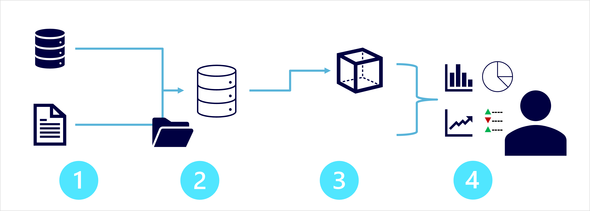

Large-scale data analytics architecture can vary, as can the specific technologies used to implement it; but in general, the following elements are included:

1. **Data ingestion and processing** – data from one or more transactional data stores, files, real-time streams, or other sources is loaded into a data lake or a relational data warehouse. The load operation usually involves an *extract, transform, and load* (ETL) or *extract, load, and transform* (ELT) process in which the data is cleaned, filtered, and restructured for analysis. In ETL processes, the data is transformed before being loaded into an analytical store, while in an ELT process the data is copied to the store and then transformed. Either way, the resulting data structure is optimized for analytical queries. The data processing is often performed by distributed systems that can process high volumes of data in parallel using multi-node clusters. Data ingestion includes both batch processing of static data and real-time processing of streaming data.
1. **Analytical data store** – data stores for large scale analytics include relational *data warehouses*, file-system based *data lakes*, and hybrid architectures that combine features of data warehouses and data lakes (sometimes called *data lakehouses* or *lake databases*). We'll discuss these in more depth later.
1. **Analytical data model** – while data analysts and data scientists can work with the data directly in the analytical data store, it’s common to create one or more data models that pre-aggregate the data to make it easier to produce reports, dashboards, and interactive visualizations. Often these data models are described as *cubes*, in which numeric data values are aggregated across one or more dimensions (for example, to determine total sales by product and region). The model encapsulates the relationships between data values and dimensional entities to support "drill-up/drill-down" analysis.
1. **Data visualization** – data analysts consume data from analytical models, and directly from analytical stores to create reports, dashboards, and other visualizations. Additionally, users in an organization who may not be technology professionals might perform self-service data analysis and reporting. The visualizations from the data show trends, comparisons, and key performance indicators (KPIs) for a business or other organization, and can take the form of printed reports, graphs and charts in documents or PowerPoint presentations, web-based dashboards, and interactive environments in which users can explore data visually.
