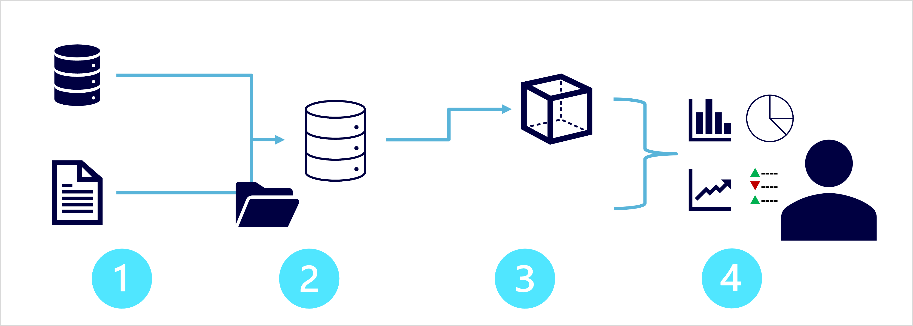

Large-scale data analytics architecture can vary, as can the specific technologies used to implement it; but in general, the following elements are included:

1. **Data ingestion and processing** – data from one or more transactional data stores, files, real-time streams, or other sources is loaded into a data lake or a relational data warehouse. The load operation usually involves an *extract, transform, and load* (ETL) or *extract, load, and transform* (ELT) process in which the data is cleaned, filtered, and restructured for analysis. In ETL processes, the data is transformed before being loaded into an analytical store, while in an ELT process the data is copied to the store and then transformed. Either way, the resulting data structure is optimized for analytical queries. The data processing is often performed by distributed systems that can process high volumes of data in parallel using multi-node clusters. Data ingestion includes both batch processing of static data and real-time processing of streaming data.
1. **Analytical data store** – data stores for large scale analytics include relational *data warehouses*, file-system based *data lakes*, and hybrid architectures that combine features of data warehouses and data lakes (sometimes called *data lakehouses* or *lake databases*). We'll discuss these in more depth later.
1. **Analytical data model** – while data analysts and data scientists can work with the data directly in the analytical data store, it’s common to create one or more data models that pre-aggregate the data to make it easier to produce reports, dashboards, and interactive visualizations. Often these data models are described as *cubes*, in which numeric data values are aggregated across one or more dimensions (for example, to determine total sales by product and region). The model encapsulates the relationships between data values and dimensional entities to support "drill-up/drill-down" analysis.
1. **Data visualization** – data analysts consume data from analytical models, and directly from analytical stores to create reports, dashboards, and other visualizations. Additionally, users in an organization who may not be technology professionals might perform self-service data analysis and reporting. The visualizations from the data show trends, comparisons, and key performance indicators (KPIs) for a business or other organization, and can take the form of printed reports, graphs and charts in documents or PowerPoint presentations, web-based dashboards, and interactive environments in which users can explore data visually.

## The modern analytics stack on Azure

Microsoft Fabric organizes all of these layers into a single unified workspace. Storage is provided by **OneLake** — a tenant-wide data lake that every Fabric workload shares. Instead of copying data between storage silos, every Fabric service reads from and writes to OneLake directly, using **Delta Lake** as the standard open-source format for lakehouse data.

Within a Fabric workspace, the core components map to the architecture layers above:

- **Fabric Lakehouse** — combines data lake storage with SQL querying; data is stored in Delta Lake format and exposed through a SQL analytics endpoint.
- **Fabric Warehouse** — a fully managed, SQL Server–compatible relational data warehouse for structured analytics with strong schema enforcement.
- **Fabric Data Factory** — builds and schedules pipelines and low-code transformations for data ingestion and movement.

When Power BI reports are connected to Fabric data, **Direct Lake** mode lets reports read Delta tables directly from OneLake — no data import or scheduled refresh required, even over large datasets.

## Lakehouse vs warehouse — which should you choose?

For most organizations, the choice depends on data structure and query patterns:

- Choose a **Fabric Warehouse** when your data is structured and relational, your team writes SQL, and you need strong schema enforcement and support for many simultaneous users.
- Choose a **Fabric Lakehouse** when you work with a mix of structured and semi-structured data, run machine-learning workloads in notebooks, and want flexibility to evolve your schema over time.

Many organizations use both: raw and semi-processed data lives in the Lakehouse, and curated, report-ready data is promoted to the Warehouse.

Microsoft Fabric includes AI experiences across Data Engineering, Data Warehouse, Data Science, and Real-Time Intelligence, so you can build pipelines, write SQL, and explore data using natural language.
