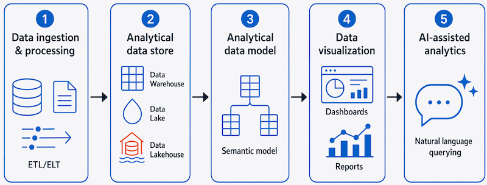

Large-scale data analytics architecture can vary, as can the specific technologies used to implement it; but in general, the following elements are included:

1. **Data ingestion and processing**: data from one or more transactional data stores, files, real-time streams, or other sources are loaded into a data lake or a relational data warehouse. The load operation usually involves an *extract, transform, and load* (ETL) or *extract, load, and transform* (ELT) process in which the data is cleaned, filtered, and restructured for analysis. In ETL processes, the data is transformed before being loaded into an analytical store, while in an ELT process the data is copied to the store and then transformed. Either way, the resulting data structure is optimized for analytical queries. The data processing is often performed by distributed systems that can process high volumes of data in parallel using multi-node clusters. Data ingestion includes both batch processing of static data and real-time processing of streaming data.

1. **Analytical data store**: data stores for large scale analytics include relational *data warehouses*, file-system based *data lakes*, and hybrid architectures that combine features of data warehouses and data lakes (sometimes called *data lakehouses* or *lake databases*). We'll discuss these in more depth later.

1. **Analytical data model**: while data analysts and data scientists can work with the data directly in the analytical data store, it's common to create one or more data models to make it easier to produce reports, dashboards, and interactive visualizations. Historically, these models were described as *cubes*, in which numeric data values were pre-aggregated across one or more dimensions (for example, total sales by product and region) using technologies like SQL Server Analysis Services (SSAS) Multidimensional. Today, the preferred approach is a **semantic model**—the tabular model that underpins Power BI and Microsoft Fabric. A semantic model defines tables, relationships, hierarchies, and measures written in DAX (Data Analysis Expressions—a formula language used to define calculations), with aggregations computed at query time rather than stored in advance. In Microsoft Fabric, semantic models can use **Direct Lake** mode to read Delta tables from OneLake directly, without importing or pre-aggregating data at all.

1. **Data visualization**: data analysts consume data from analytical models, and directly from analytical stores to create reports, dashboards, and other visualizations. Additionally, users in an organization who may not be technology professionals might perform self-service data analysis and reporting. The visualizations from the data show trends, comparisons, and key performance indicators (KPIs) for a business or other organization, and can take the form of printed reports, graphs, and charts in documents or PowerPoint presentations, web-based dashboards, and interactive environments in which users can explore data visually.

1. **AI-assisted analytics**: organizations increasingly extend the analytics stack with natural language and AI capabilities. In Power BI, the **Q&A** feature allows users to type questions in plain English and receive chart responses. **Copilot in Microsoft Fabric** allows users to describe what they want in natural language; Copilot then generates DAX measures, writes SQL queries, summarizes reports, and explains data trends. In Azure Databricks, **Genie** provides similar functionality over Delta Lake data: users ask natural language questions in a conversational interface and Genie generates and runs the SQL. These features extend analytical self-service to users who do not write queries or build reports.

## The modern analytics stack on Azure

Azure provides two leading platforms for large-scale analytics: **Microsoft Fabric** and **Azure Databricks**. Both support the full analytics architecture described above, but they take different approaches.

### Microsoft Fabric

Microsoft Fabric organizes all of these layers into a single unified SaaS workspace. Storage is provided by **OneLake**—a tenant-wide data lake that every Fabric workload shares. Instead of copying data between storage silos, every Fabric service reads from and writes to OneLake directly, using **Delta Lake** as the standard open-source format for lakehouse data.

Within a Fabric workspace, the core components map to the architecture layers above:

- **Fabric Lakehouse**: combines data lake storage with SQL querying; data is stored in Delta Lake format and exposed through a SQL analytics endpoint.
- **Fabric Warehouse**: a fully managed, SQL Server–compatible relational data warehouse for structured analytics with strong schema enforcement.
- **Fabric Data Factory**: builds and schedules pipelines and low-code transformations for data ingestion and movement.
- **Power BI**: delivers reports, dashboards, and semantic models; **Direct Lake** mode reads Delta tables from OneLake directly without data import or scheduled refresh.

### Azure Databricks

Azure Databricks is a cloud analytics platform built on Apache Spark, optimized for large-scale data engineering, data science, and SQL analytics. It runs as a managed service inside your Azure subscription and uses **Delta Lake** as its native open storage format.

The core components in Azure Databricks are:

- **Databricks Lakehouse**: a unified storage layer built on Delta Lake that supports both SQL analytics and machine learning workloads in the same environment.
- **Databricks SQL**: a serverless SQL warehouse for running analytical queries directly against Delta tables, with built-in query history, dashboards, and alerts.
- **Databricks Notebooks**: collaborative Python, SQL, Scala, and R notebooks for data engineering pipelines, exploratory analysis, and machine learning.
- **Unity Catalog**: a unified governance layer for data and AI assets across the Databricks workspace, providing fine-grained access control, data lineage, and discovery.
- **Genie**: an AI-powered conversational interface that lets users ask natural language questions about their data; Genie generates and executes SQL automatically, returning results without requiring any query writing.