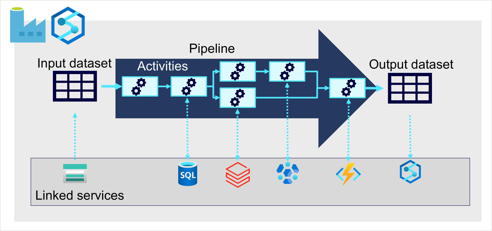

Now that you understand a little about the architecture of a large-scale data warehousing solution, and some of the distributed processing technologies that can be used to handle large volumes of data, it's time to explore how data is ingested into an analytical data store from one or more sources.

On Azure, large-scale data ingestion is best implemented by creating *pipelines* that orchestrate ETL processes. You can create and run pipelines using [Azure Data Factory](https://azure.microsoft.com/services/data-factory?azure-portal=true), or you can use a similar pipeline engine in [Azure Synapse Analytics](https://azure.microsoft.com/services/synapse-analytics?azure-portal=true) or [Microsoft Fabric](/fabric/data-factory/data-factory-overview) if you want to manage all of the components of your data analytics solution in a unified workspace.

In either case, pipelines consist of one or more *activities* that operate on data. An input dataset provides the source data, and activities can be defined as a data flow that incrementally manipulates the data until an output dataset is produced. Pipelines can connect to external data sources to integrate with a wide variety of data services.
