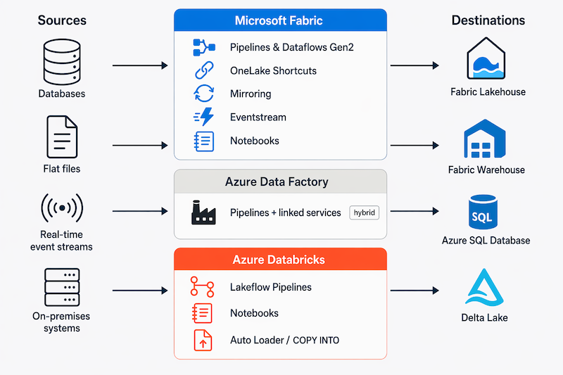

::: zone pivot="video"

>[!VIDEO https://learn-video.azurefd.net/vod/player?id=1045562c-10ae-4819-a0bc-7474f194049e]

> [!TIP]
> See the **Text and images** tab for more details!

::: zone-end

::: zone pivot="text"

Now that you understand the architecture of a large-scale data warehousing solution, it's time to explore how data is ingested into an analytical data store from one or more sources.

## Microsoft Fabric

Microsoft Fabric offers multiple ways to bring data into OneLake, covering everything from pipeline-based ETL to zero-copy federation and real-time streaming.

### Fabric Data Factory

**Fabric Data Factory** is the recommended starting point for pipeline-based ingestion. It offers two complementary tools:

- **Pipelines**: orchestrate multi-step data movement and transformation workflows, chaining activities that run in sequence or in parallel.
- **Dataflows Gen2**: a low-code, visual experience for building reusable data transformation logic using Power Query, without writing code.

Pipelines consist of one or more *activities* that operate on data. An input dataset provides the source data, and activities can be defined as a data flow that incrementally manipulates the data until an output dataset is produced. Pipelines use *linked services* to connect to sources and destinations—enabling you to load data, run stored procedures, invoke notebooks, and apply custom logic in a single workflow. You can save the output to a Microsoft Fabric Lakehouse or Warehouse, or to any other supported destination. Pipelines can also include built-in activities that don't require a linked service.

### OneLake Shortcuts

A **shortcut** is a live reference to external storage—ADLS Gen2, Amazon S3, Google Cloud Storage, or another OneLake location. Instead of copying data into Fabric, a shortcut makes external data appear as if it's already in your Lakehouse. No pipelines, no movement, no duplication. This is particularly useful when data must stay in its original location for compliance or cost reasons, but still needs to be queryable from Fabric.

### Mirroring

**Fabric Mirroring** continuously replicates an external database—Azure SQL Database, Snowflake, Azure Cosmos DB, and others—directly into OneLake in near-real-time. You configure the source connection once and Fabric handles change tracking and replication automatically, without any pipeline authoring. The replicated data lands in Delta Lake format and is immediately queryable through the Lakehouse SQL analytics endpoint.

### Eventstream

For real-time streaming ingestion, **Fabric Eventstream** connects to event sources such as Azure Event Hubs, Apache Kafka, Azure IoT Hub, and custom endpoints. It routes, filters, and transforms streaming events before landing them in a Fabric Lakehouse, KQL database (a time-series optimized store queried with Kusto Query Language), or Real-Time Intelligence destination—enabling near-real-time analytics on continuously arriving data.

### Fabric Notebooks

**Fabric Notebooks** (powered by Apache Spark) are a code-first option for data ingestion when no built-in connector exists or when you need custom transformation logic. You can write PySpark, Python, Scala, R, or SQL to read from REST APIs, databases, files, or any reachable endpoint, and then write the results directly to a Lakehouse Delta table or Warehouse. Notebooks can be run interactively or scheduled as part of a pipeline, making them a flexible escape hatch for scenarios that other Fabric tools can't cover out of the box.

## Azure Data Factory

**Azure Data Factory** is the standalone Azure service for building data integration pipelines outside of Fabric—for example, when your destination is Azure SQL Database or an external service, or when you're connecting to on-premises data sources in a hybrid environment. Like Fabric Data Factory, it uses the same pipeline-based model with linked services, so skills transfer between the two.

## Azure Databricks

Azure Databricks provides several ingestion approaches, ranging from declarative pipelines to ad-hoc notebooks and specialized file-loading mechanisms.

### Lakeflow Declarative Pipelines

**Lakeflow Spark Declarative Pipelines** offers a declarative framework for building reliable, incrementally updated pipelines on **Delta Lake**. You define what the output tables should contain; Databricks handles execution ordering, dependency tracking, and incremental processing automatically. This is the recommended approach for production-grade, continuously running ingestion pipelines.

### Databricks Notebooks

**Databricks Notebooks** support PySpark, Python, Scala, SQL, and R, and are a natural fit for ad-hoc or exploratory ingestion work—reading from REST APIs, JDBC sources, cloud storage, or streaming sources and writing to Delta Lake tables. Notebooks can also be operationalized by scheduling them as jobs or embedding them inside a Lakeflow pipeline as a transformation step.

> [!NOTE]
> Azure Databricks offers additional specialized ingestion mechanisms beyond those covered here. 

::: zone-end
