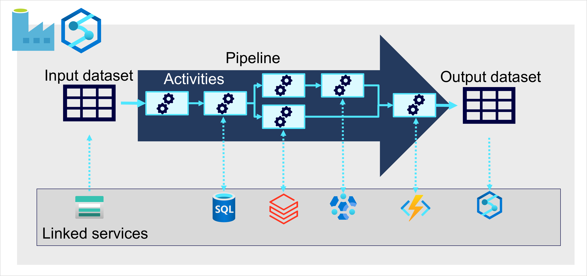

Now that you understand the architecture of a large-scale data warehousing solution, it's time to explore how data is ingested into an analytical data store from one or more sources.

## Fabric Data Factory

**Fabric Data Factory** is the recommended starting point when you're building an integrated analytics solution in Microsoft Fabric. It offers two complementary tools:

- **Pipelines** — orchestrate multi-step data movement and transformation workflows, chaining activities that run in sequence or in parallel.
- **Dataflows Gen2** — a low-code, visual experience for building reusable data transformation logic using Power Query, without writing code.

Pipelines consist of one or more *activities* that operate on data. An input dataset provides the source data, and activities can be defined as a data flow that incrementally manipulates the data until an output dataset is produced. Pipelines use *linked services* to connect to sources and destinations — enabling you to load data, run stored procedures, invoke notebooks, and apply custom logic in a single workflow. You can save the output to a Microsoft Fabric Lakehouse or Warehouse, or to any other supported destination. Pipelines can also include built-in activities that don't require a linked service.

## Azure Data Factory

**Azure Data Factory** is the standalone Azure service for building data integration pipelines outside of Fabric — for example, when your destination is Azure SQL Database or an external service, or when you're connecting to on-premises data sources in a hybrid environment. Like Fabric Data Factory, it uses the same pipeline-based model with linked services, so skills transfer between the two.

## Azure Databricks pipelines

For teams that prefer code-first, notebook-driven workflows, **Lakeflow Spark Declarative Pipelines** (Azure Databricks) offers a declarative framework for building reliable, incrementally updated pipelines on **Delta Lake**. You define what the output tables should contain; Databricks handles execution ordering, dependency tracking, and incremental processing automatically.
