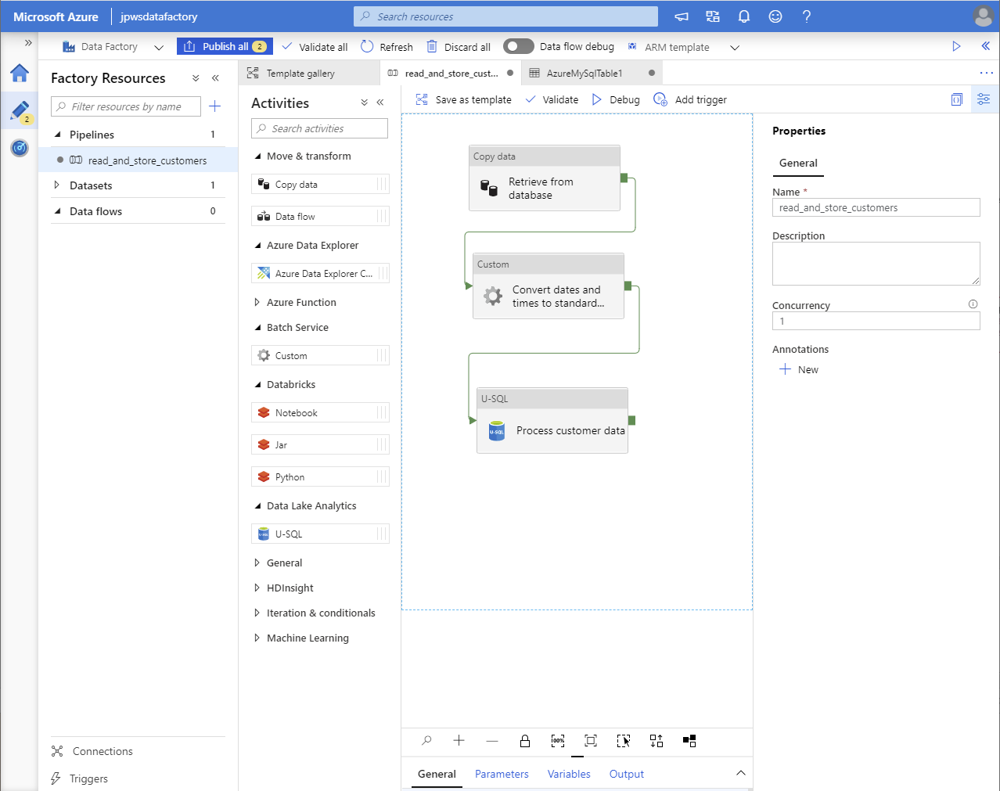
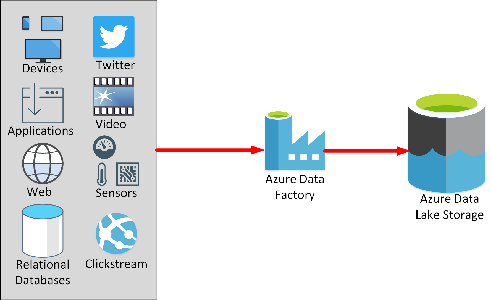
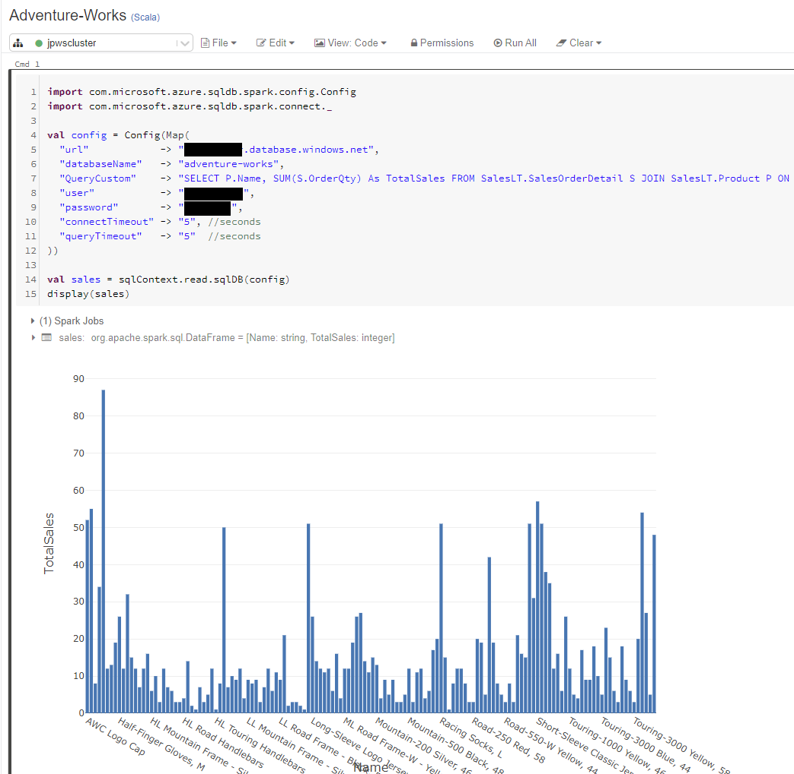
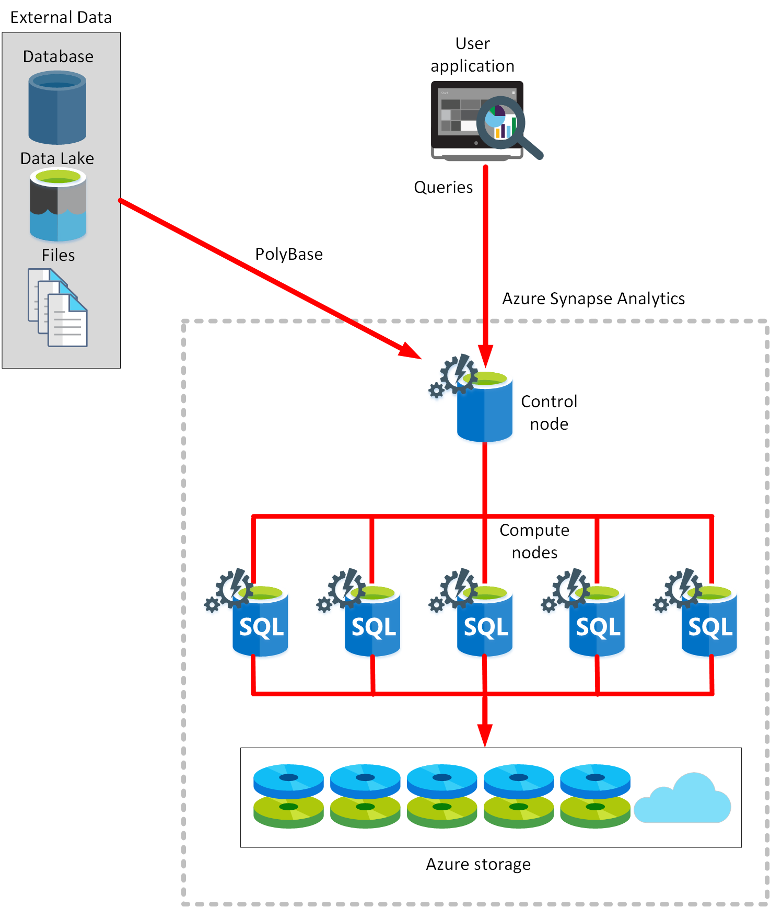
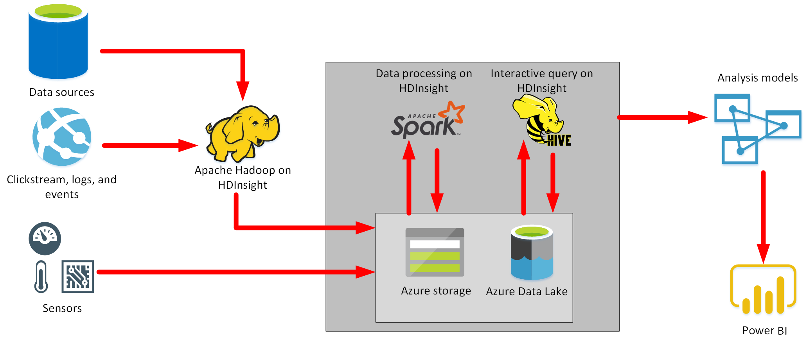

As a data engineer working at an organization with a large manufacturing operation, you want to understand more about the components that form a modern data warehouse. This information will help you determine which elements most closely meet your organization's requirements.

In this unit, you'll learn more about the data services that Azure provides. These services enable you to combine data from multiple sources, reformat it into analytical models, and save these models for subsequent querying, reporting, and visualization.

## What is Azure Data Factory?

Azure Data Factory is described as a *data integration service*. The purpose of Azure Data Factory is to retrieve data from one or more data sources, and convert it into a format that you process. The data sources might present data in different ways, and contain *noise* that you need to filter out. Azure Data Factory enables you to extract the interesting data, and discard the rest. The *interesting* data might not be in a suitable format for processing by the other services in your warehouse solution, so you can transform it. For example, your data might contain dates and times formatted in different ways in different data sources. You can use Azure Data Factory to transform these items into a single uniform structure. Azure Data Factory can then write the ingested data to a data store for subsequent processing.

You define the work performed by Azure Data Factory as a pipeline of operations. A pipeline can run continuously, as data is received from the various data sources. You can create pipelines using the graphical user interface provided by Microsoft, or by writing your own code. The image below shows the pipeline editor in Azure Data Factory.

> [!div class="mx-imgBorder"]
> 

## What is Azure Data Lake Storage?

A data lake is a repository for large quantities of raw data. Because the data is raw and unprocessed, it's very fast to load and update, but the data hasn't been put into a structure suitable for efficient analysis. You can think of a data lake as a staging point for your ingested data, before it's massaged and converted into a format suitable for performing analytics. 

> [!NOTE]
> A data warehouse also stores large quantities of data, but the data in a warehouse has been processed to convert it into a format for efficient analysis. A data lake holds *raw data*, but a data warehouse holds *structured information*.

Azure Data Lake Storage combines the hierarchical directory structure and file system semantics of a traditional file system with security and scalability provided by Azure. Azure Data Lake Storage is essentially an extension of Azure Blob storage, organized as a near-infinite file system. It has the following characteristics:

* Data Lake Storage organizes your files into directories and subdirectories for improved file organization. Blob storage can only mimic a directory structure.
* Data Lake Storage supports the Portable Operating System Interface (POSIX) file and directory permissions to enable granular Role-Based Access Control (RBAC) on your data.
* Azure Data Lake Storage is compatible with the Hadoop Distributed File System (HDFS). Hadoop is highly flexible and programmable analysis service, used by many organizations to examine large quantities of data. All Apache Hadoop environments can access data in Azure Data Lake Storage Gen2.

In an Azure Data Services data warehouse solution, data is typically loaded into Azure Data Lake Storage before being processed into a structure that enables efficient analysis in Azure Synapse Analytics. You can use a service such as Azure Data Factory (described above) to ingest and load the data from a variety of sources into Azure Data Lake Storage.

> [!div class="mx-imgBorder"]
> 

## What is Azure Databricks?

Azure Databricks is an Apache Spark environment running on Azure to provide big data processing, streaming, and machine learning. Apache Spark is a highly efficient data processing engine that can consume and process large amounts of data very quickly. There are a significant number of Spark libraries you can use to perform tasks such as SQL processing, aggregations, and to build and train machine learning models using your data. 

Azure Databricks provides a graphical user interface where you can define and test your processing step by step, before submitting it as a set of batch tasks. You can create Databricks scripts and query data using languages such as R, Python, and Scala. You write your Spark code using *notebooks*. A notebook contains *cells*, each of which contains a separate block of code. When you run a notebook, the code in each cell is passed to Spark in turn for execution. The image below shows a cell in a workbook that runs a query and generates a graph.

> [!div class="mx-imgBorder"]
> 

Azure Databricks also supports structured stream processing. In this model, Databricks performs your computations incrementally, and continuously updates the result as streaming data arrives.

## What is Azure Synapse Analytics?

Azure Synapse Analytics is an analytics engine. It's designed to process large amounts of data very quickly. 

Using Synapse Analytics, you can ingest data from external sources, such as flat files, Azure Data Lake, or other database management systems, and then transform and aggregate this data into a format suitable for analytics processing. You can perform complex queries over this data and generate reports, graphs, and charts.

Reading and transforming data from an external source can consume considerable resources. Azure Synapse Analytics enables you to store the data you have read in and processed locally, within the service (this is described later). This approach enables you to repeatedly query the same data without the overhead of fetching and converting it each time. You can also use this data as input to further analytical processing, using Azure Analysis Services.

Azure Synapse Analytics leverages a massively parallel processing (MPP) architecture. This architecture includes a control node and a pool of compute nodes. 

The *Control* node is the brain of the architecture. It's the front end that interacts with all applications. The MPP engine runs on the Control node to optimize and coordinate parallel queries. When you submit a processing request, the Control node transforms it into smaller requests that run against distinct subsets of the data in parallel.

The *Compute* nodes provide the computational power. The data to be processed is distributed evenly across the nodes. Users and applications send processing requests to the control node. The control node sends the queries to compute nodes, which run the queries over the portion of the data that they each hold. When each node has finished its processing, the results are sent back to the control node where they're combined into an overall result. 

Azure Synapse Analytics supports two computational models: SQL pools and Spark pools.

In a SQL pool, each compute node uses an Azure SQL Database and Azure Storage to handle a portion of the data. 

> [!div class="mx-imgBorder"]
> 

You submit queries in the form of Transact-SQL statements, and Azure Synapse Analytics runs them. However, unlike an ordinary SQL Server database engine, Azure Synapse Analytics can receive data from a wide variety of sources. To do this, Azure Synapse Analytics uses a technology named [PolyBase](https://docs.microsoft.com/sql/relational-databases/polybase/polybase-guide). PolyBase enables you to retrieve data from relational and non-relational sources, such as delimited text files, Azure Blob Storage, and Azure Data Lake Storage. You can save the data read in as SQL tables within the Synapse Analytics service.

You specify the number of nodes when you create a SQL pool. You can scale the SQL pool manually to add or remove compute nodes as necessary.

> [!NOTE]
> You can only scale a SQL pool when it's not running a Transact-SQL query.

In a Spark pool, the nodes are replaced with a Spark cluster. You run Spark jobs comprising code written in Notebooks, in the same way as Azure Databricks. You can write the code for  notebook in C#, Python, Scala, or Spark SQL (a different dialect of SQL from Transact-SQL). As with a SQL pool, the Spark cluster splits the work out into a series of parallel tasks that can be performed concurrently. You can save data generated by your notebooks in Azure Storage or Data Lake Storage.

> [!NOTE]
> Spark is optimized for in-memory processing. A Spark job can load and cache data into memory and query it repeatedly. In-memory computing is much faster than disk-based applications, but requires additional memory resources.

You specify the number of nodes when you create the Spark cluster. Spark pools can have autoscaling enabled, so that pools scale by adding or removing nodes as needed. Autoscaling can occur while processing is active. 

> [!NOTE]
> Azure Synapse Analytics can consume a lot of resources. If you aren't planning on performing any processing for a while, you can pause the service. This action releases the resources in the pool to other users, and reduces your costs.

## What is Azure Analysis Services?

Azure Analysis Services enables you to build tabular models to support online analytical processing (OLAP) queries. You can combine data from multiple sources, including Azure SQL Database, Azure Synapse Analytics, Azure Data Lake store, Azure Cosmos DB, and many others. You use these data sources to build models that incorporate your business knowledge. A model is essentially a set of queries and expressions that retrieve data from the various data sources and generate results. The results can be cached in-memory for later use, or they can be calculated dynamically, directly from the underlying data sources.

Analysis Services includes a graphical designer to help you connect data sources together and define queries that combine, filter, and aggregate data. You can explore this data from within Analysis Services, or you can use a tool such as Microsoft Power BI to visualize the data presented by these models.

### Compare Analysis Services with Synapse Analytics

Azure Analysis Services has significant functional overlap with Azure Synapse Analytics, but it's more suited for processing on a smaller scale. 

Use Azure Synapse Analytics for:

- Very high volumes of data (multi-terabyte to petabyte sized datasets).
- Very complex queries and aggregations.
- Data mining, and data exploration.
- Complex ETL operations. *ETL* stands for *Extract, Transform, and Load*, and refers to the way in which you can retrieve raw data from multiple sources, convert this data into a standard format, and store it. 
- Low to mid concurrency (128 users or fewer).

Use Azure Analysis Services for:

- Smaller volumes of data (a few terabytes).
- Multiple sources that can be correlated.
- High read concurrency (thousands of users).
- Detailed analysis, and drilling into data, using functions in Power BI.
- Rapid dashboard development from tabular data.

### Combine Analysis Services with Synapse Analytics

Many scenarios can benefit from using Synapse Analytics and Analysis Services together. If you have large amounts of ingested data that require preprocessing, you can use Synapse Analytics to read this data and manipulate it into a model that contains business information rather than a large amount of raw data. The scalability of Synapse Analytics gives it the ability to process and reduce many terabytes of data down into a smaller, succinct dataset that summarizes and aggregates much of this data. You can then use Analysis Services to perform detailed interrogation of this information, and visualize the results of these inquiries with Power BI.

## What is Azure HDInsight?

Azure HDInsight is a big data processing service, that provides the platform for technologies such as Spark in an Azure environment. HDInsight implements a clustered model that distributes processing across a set of computers. This model is similar to that used by Synapse Analytics, except that the nodes are running the Spark processing engine rather than Azure SQL Database.

You can use Azure HDInsight in conjunction with, or instead of, Azure Synapse Analytics. As well as Spark, HDInsight supports streaming technologies such as Apache Kafka, and the Apache Hadoop processing model. The image below shows where you might use the components of HDInsight in a data warehousing solution. 

> [!NOTE] 
> In this image, *Hadoop* is an open source framework that breaks large data processing problems down into smaller chunks and distributes them across a cluster of servers, similar to the way in which Synapse Analytics operates.
>
> *Hive* is a SQL-like query facility that you can use with an HDInsight cluster to examine data held in a variety of formats. You can use it to create, load, and query external tables, in a manner similar to PolyBase for Azure Synapse Analytics

> [!div class="mx-imgBorder"]
> 