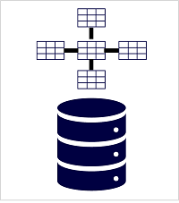

There are two common types of analytical data store.

## Data warehouses

A *data warehouse* is a relational database in which the data is stored in a schema that is optimized for data analytics rather than transactional workloads. Commonly, the data from a transactional store is transformed into a schema in which numeric values are stored in central *fact* tables, which are related to one or more *dimension* tables that represent entities by which the data can be aggregated. For example  a fact table might contain sales order data, which can be aggregated by customer, product, store, and time dimensions (enabling you, for example, to easily find monthly total sales revenue by product for each store). This kind of fact and dimension table schema is called a *star schema*; though it's often extended into a *snowflake schema* by adding additional tables related to the dimension tables to represent dimensional hierarchies (for example, product might be related to product categories). A data warehouse is a great choice when you have transactional data that can be organized into a structured schema of tables, and you want to use SQL to query them.

## Data lakehouses

A *data lake* is a file store, usually on a distributed file system for high performance data access. Technologies like Spark or Hadoop are often used to process queries on the stored files and return data for reporting and analytics. These systems often apply a *schema-on-read* approach to define tabular schemas on semi-structured data files at the point where the data is read for analysis, without applying constraints when it's stored. Data lakes are great for supporting a mix of structured, semi-structured, and even unstructured data that you want to analyze without the need for schema enforcement when the data is written to the store.

You can use a hybrid approach that combines features of data lakes and data warehouses in a *lake database* or *data lakehouse*. The raw data is stored as files in a data lake, and a relational storage layer abstracts the underlying files and expose them as tables, which can be queried using SQL. SQL pools in Azure Synapse Analytics include *PolyBase*, which enables you to define external tables based on files in a data lake (and other sources) and query them using SQL. Synapse Analytics also supports a Lake Database approach in which you can use database templates to define the relational schema of your data warehouse, while storing the underlying data in data lake storage – separating the storage and compute for your data warehousing solution. Data lakehouses are a relatively new approach in Spark-based systems, and are enabled through technologies like *Delta Lake*; which adds relational storage capabilities to Spark, so you can define tables that enforce schemas and transactional consistency, support batch-loaded and streaming data sources, and provide a SQL API for querying.
