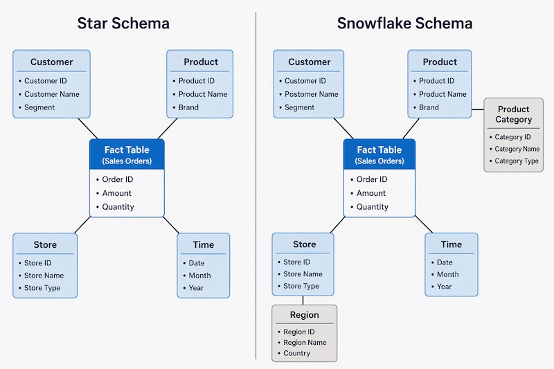
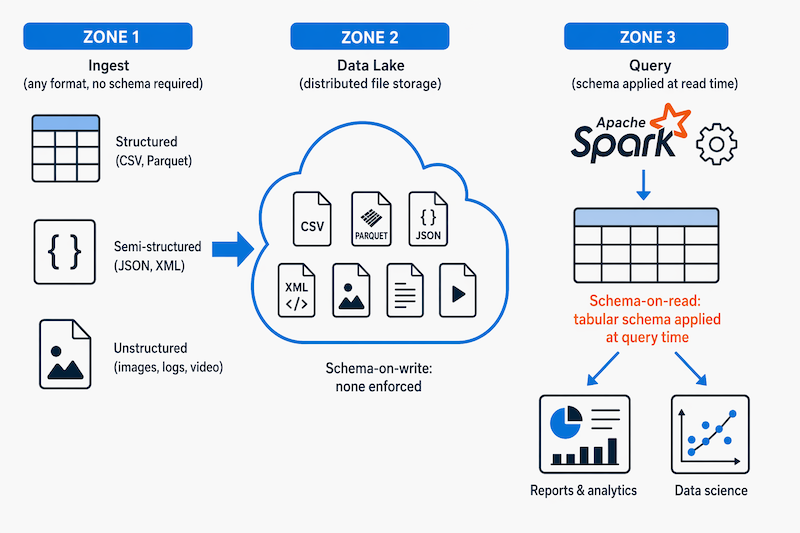
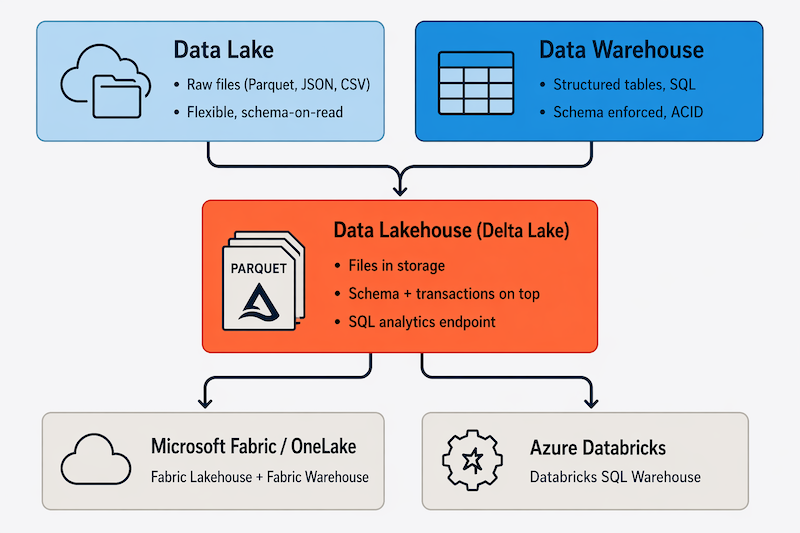

There are two common types of analytical data store.

## Data warehouses

A *data warehouse* is a relational database in which the data is stored in a schema that's optimized for data analytics rather than transactional workloads. Commonly, the data from a transactional store is transformed into a schema in which numeric values are stored in central **fact** tables, which are related to one or more **dimension** tables that represent entities by which the data can be aggregated. For example a fact table might contain sales order data, which can be aggregated by customer, product, store, and time dimensions (enabling you, for example, to easily find monthly total sales revenue by product for each store). This kind of fact and dimension table schema is named a **star schema**; though it's often extended into a **snowflake schema** by adding additional tables related to the dimension tables to represent dimensional hierarchies (for example, product might be related to product categories). 

A data warehouse is a great choice when you have transactional data that can be organized into a structured schema of tables, and you want to use SQL to query them.

## Data lakes

A **data lake** is a file store, usually on a distributed file system for high performance data access. Cloud-native distributed processing engines like **Apache Spark** are used to process queries on the stored files and return data for reporting and analytics. These systems often apply a **schema-on-read** approach to define tabular schemas on semi-structured data files at the point where the data is read for analysis, without applying constraints when it's stored. 

Data lakes are great for supporting a mix of structured, semi-structured, and even unstructured data that you want to analyze without the need for schema enforcement when the data is written to the store.

### Hybrid approaches

You can use a hybrid approach that combines features of data lakes and data warehouses in a **data lakehouse**. The raw data is stored as files in a data lake, and a SQL analytics endpoint exposes those files as tables you can query with SQL. Data lakehouses are enabled through **Delta Lake**—the standard open-source lakehouse format used by both Microsoft Fabric and Azure Databricks. Delta Lake adds relational storage capabilities on top of Parquet files, so you can define tables that enforce schemas and transactional consistency, support batch-loaded and streaming data sources, and provide a SQL API for querying.

In Microsoft Fabric, all lakehouse data is stored in **OneLake**—a single, tenant-wide storage layer shared across every Fabric workload. When you create a Fabric Lakehouse, a SQL analytics endpoint is created automatically. When you create a Fabric Warehouse, your data lives in OneLake too, giving both experiences a unified storage foundation.

## Azure services for analytical stores

On Azure, there are several services that you can use to implement a large-scale analytical store including:

**[Microsoft Fabric](https://www.microsoft.com/microsoft-fabric)** is a unified, end-to-end SaaS analytics platform built on **OneLake**. It offers two primary analytical store experiences:

- **Fabric Lakehouse**: stores data in Delta Lake format on OneLake, supports notebooks and Spark for data science workloads, and exposes a SQL analytics endpoint for structured querying. It's the right choice when you work with mixed or semi-structured data or run machine-learning workflows.
- **Fabric Warehouse**: a fully managed, SQL Server–compatible relational data warehouse also backed by OneLake. It's the right choice when your data is structured, your team writes SQL, and you need strong schema enforcement and concurrency for many simultaneous users.

Fabric also includes built-in data pipelines (Fabric Data Factory) for data ingestion and transformation, and native Real-Time Intelligence for log and telemetry analytics. **Fabric Mirroring** lets you continuously replicate data from operational systems—including Azure Cosmos DB, Azure SQL Database, and Snowflake—directly into OneLake without building custom pipelines.

**[Azure Databricks](https://azure.microsoft.com/services/databricks?azure-portal=true)** is a cloud analytics platform built on Apache Spark, optimized for large-scale data engineering, data science, and SQL analytics. It uses **Delta Lake** as its native storage format, giving every table transaction support, schema enforcement, and versioning. For SQL-based reporting and business intelligence, Azure Databricks provides a **Databricks SQL Warehouse**—a dedicated SQL endpoint optimized for BI tools and concurrent query workloads. Databricks is a common choice when you need code-first Spark workflows, multicloud portability, or existing organizational expertise with the platform.

Both Fabric and Azure Databricks include AI assistant experiences for writing SQL and generating notebook code.

> [!NOTE]
> Each of these services can be thought of as an analytical data *store*, in the sense that they provide a schema and interface through which the data can be queried. In many cases, the data is actually stored in a data lake and the service processes the data and runs queries. Some solutions combine both services: an ELT ingestion process might copy data into the data lake, use a notebook running in Azure Databricks to process a large volume of data, and then load the results into tables in a Microsoft Fabric Warehouse.