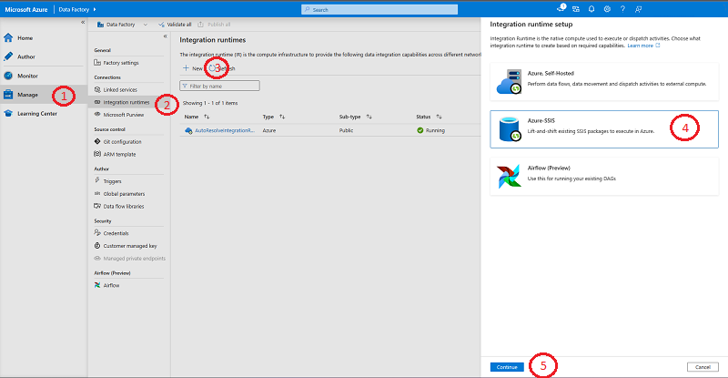
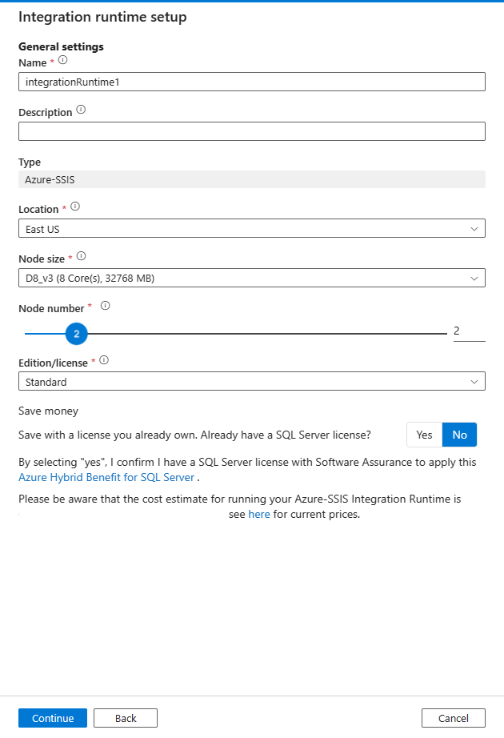
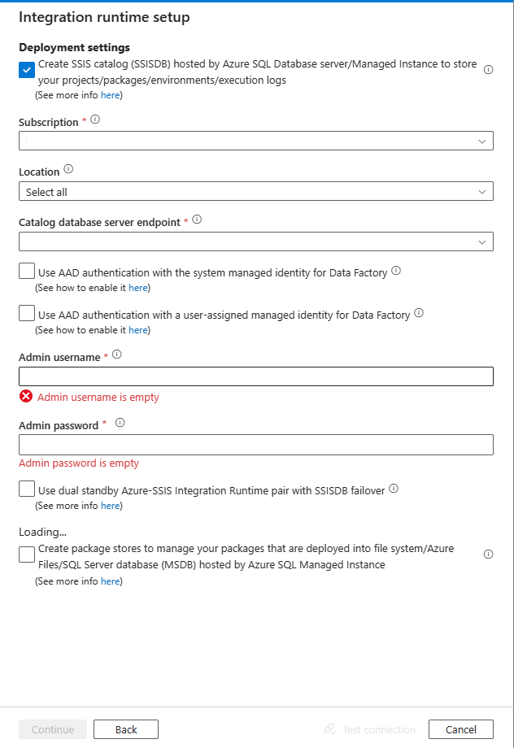

Perform the following steps to set up an Integration Runtime

## Set up an Azure-SSIS Integration Runtime

1. In the Azure Data Factory designer, select the **Manage** tab.
1. in the **General** panel. Click on the **Integration Runtimes** tab to view existing Integration Runtimes in your data factory.

    

1. Click  **+ New** to create an Azure-SSIS IR and open the **Integration Runtime setup** pane.
1. In the **Integration Runtime setup** pane, select the **Azure-SSIS: Lift-and-shift existing SSIS packages to execute in Azure** tile.
1. Select the **Continue** button at the bottom of the panel.

### General settings page

1. On the **General settings** page of **Integration Runtime setup** pane, complete the following steps.

    > 

1. In **Name**, enter the name of your Integration Runtime.

1. For **Description**, enter the description of your Integration Runtime.

1. For **Location**, select the location of your Integration Runtime. It is recommended that you select the same location of your database server to host SSISDB.

1. For **Node Size**, select the size of node in your Integration Runtime cluster.

1. For **Node Number**, select the number of nodes in your Integration Runtime cluster.

1. For **Edition/License**, select the SQL Server edition for your Integration Runtime.

1. For **Save Money**, select the Azure Hybrid Benefit option for your Integration Runtime: Select **Yes** if you want to bring your own SQL Server license with Software Assurance to benefit from cost savings with hybrid use.

1. Select **Next**.

### Deployment settings page
1. On the **Deployment settings** page of **Integration Runtime setup** pane, complete the following steps.

1. Click the **Create SSIS catalog (SSISDB) hosted by Azure SQL Database server/Managed Instance to store your projects/packages/environments/execution logs** check box to choose the package deployment mode.

    

1. For **Subscription**, select the Azure subscription that has your database server to host SSISDB.

1. For **Location**, select the location of your database server to host SSISDB. We recommend that you select the same location of your Integration Runtime.

1. For **Catalog Database Server Endpoint**, select the endpoint of your database server to host SSISDB.

1. Select the **Use Azure Active Directory authentication with the managed identity for your ADF** check box to choose the authentication method for your database server to host SSISDB.

1. For **Admin Username**, enter the SQL authentication username for your database server to host SSISDB.

1. For **Admin Password**, enter the SQL authentication password for your database server to host SSISDB.

1. For **Catalog Database Service Tier**, select the service tier for your database server to host SSISDB. Select the Basic, Standard, or Premium tier, or select an elastic pool name.

The alternative approach is to:

1. Select the **Create package stores to manage your packages that are deployed into file system/Azure Files/SQL Server database (MSDB) hosted by Azure SQL Managed Instance** check box to choose whether you want to manage your packages that are deployed into MSDB, file system, or Azure Files (Package Deployment Model) with Azure-SSIS IR package stores.

    

1. On the **Add package store** pane, complete the following steps.

1. For **Package store name**, enter the name of your package store.

1. For **Package store linked service**, select your existing linked service that stores the access information for file system/Azure Files/Azure SQL Managed Instance where your packages are deployed or create a new one by selecting **New**. On the **New linked service** pane, complete the following steps.

    > [!div class="mx-imgBorder"]
    > 

1. For **Name**, enter the name of your linked service.

1. For **Description**, enter the description of your linked service.

1. For **Type**, select **Azure File Storage**, **Azure SQL Managed Instance**, or **File System**.

1. You can ignore **Connect via Integration Runtime**, since we always use your Azure-SSIS IR to fetch the access information for package stores.

1. If you select **Azure File Storage**, complete the following steps.

1. For **Account selection method**, select **From Azure subscription** or **Enter manually**.

1. If you select **From Azure subscription**, select the relevant **Azure subscription**, **Storage account name**, and **File share**.

1. If you select **Enter manually**, enter `\\<storage account name>.file.core.windows.net\<file share name>` for **Host**, `Azure\<storage account name>` for **Username**, and `<storage account key>` for **Password** or select your **Azure Key Vault** where it's stored as a secret.

    > [!NOTE]
    > There are different settings if you select **Azure SQL Managed Instance**, or **File System**

1. Select **Test connection** when applicable and if it's successful, select **Next**.
 
### Advanced settings page

1. On the **Advanced settings** page of **Integration Runtime setup** pane, complete the following steps.

    > [!div class="mx-imgBorder"]
    > 

1. For **Maximum Parallel Executions Per Node**, select the maximum number of packages to run concurrently per node in your Integration Runtime cluster. 

1. Select the **Customize your Azure-SSIS Integration Runtime with additional system configurations/component installations** check box to choose whether you want to add standard/express custom setups on your Azure-SSIS IR. 

1. Select the **Select a VNet for your Azure-SSIS Integration Runtime to join, allow ADF to create certain network resources, and optionally bring your own static public IP addresses** check box to choose whether you want to join your Azure-SSIS IR to a virtual network.

1. Select the **Setup Self-Hosted Integration Runtime as a proxy for your Azure-SSIS Integration Runtime** check box to choose whether you want to configure a self-hosted IR as proxy for your Azure-SSIS IR.

1. Click **Continue**.

1. On the **Summary**, review all provisioning settings, and select **Finish** to start the creation of your Integration Runtime.

1. On the **Connections** pane of **Manage** hub, switch to the **Integration Runtimes** page and select **Refresh**.

    

