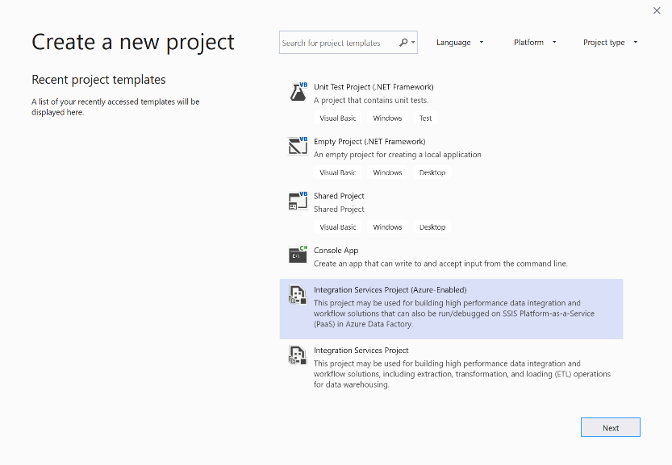
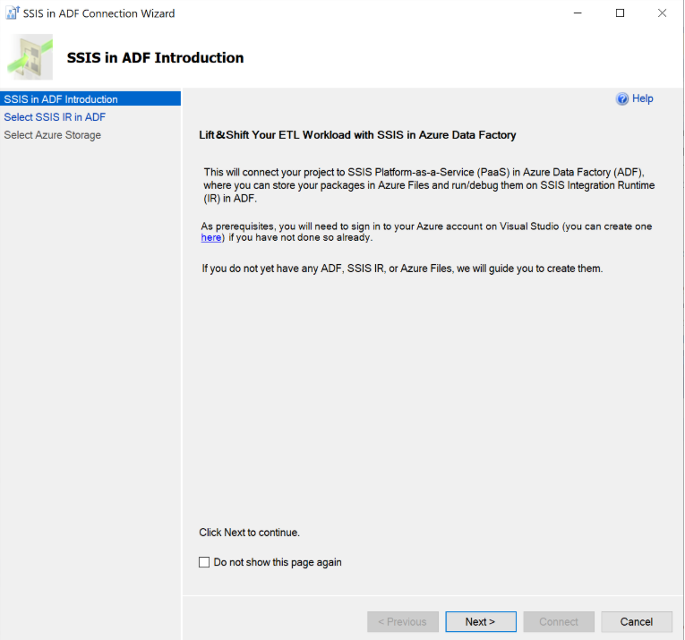
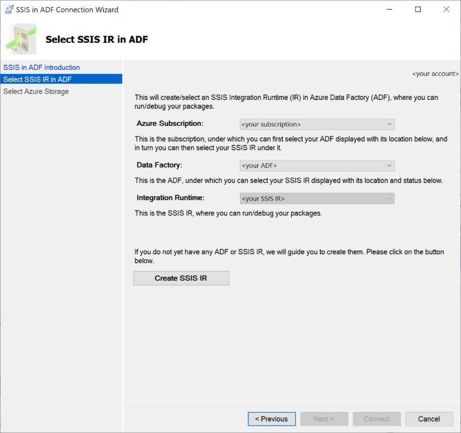
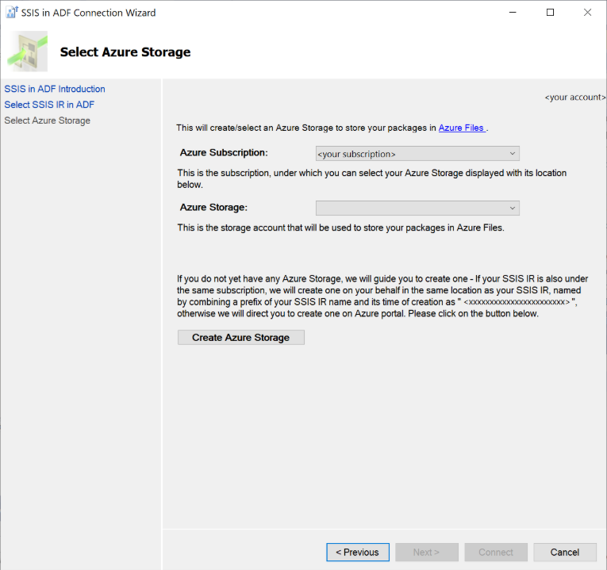
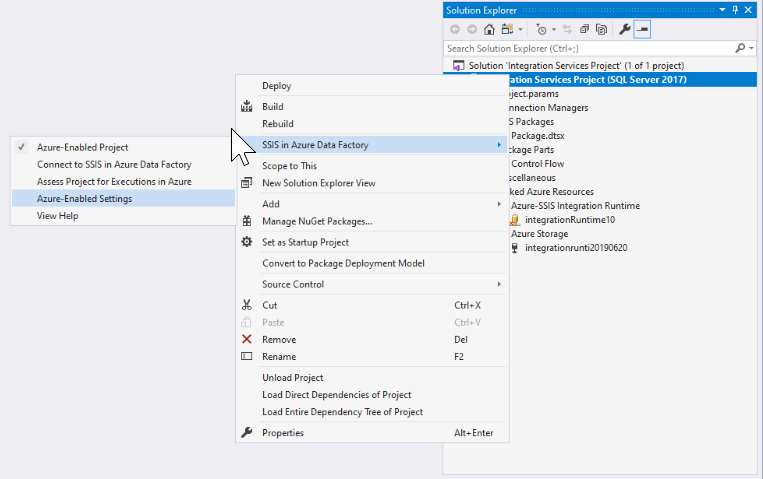
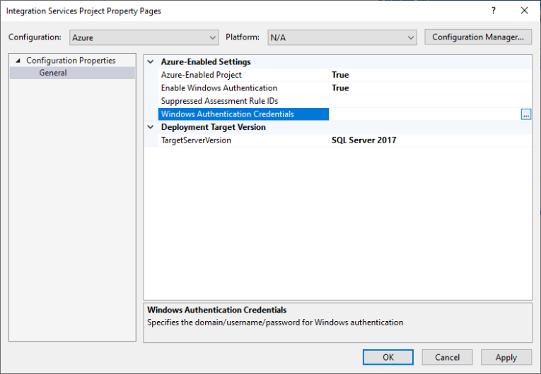
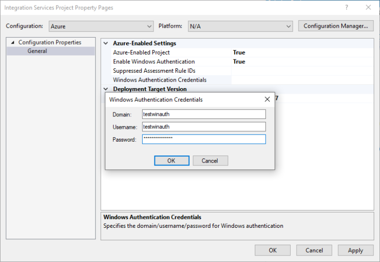
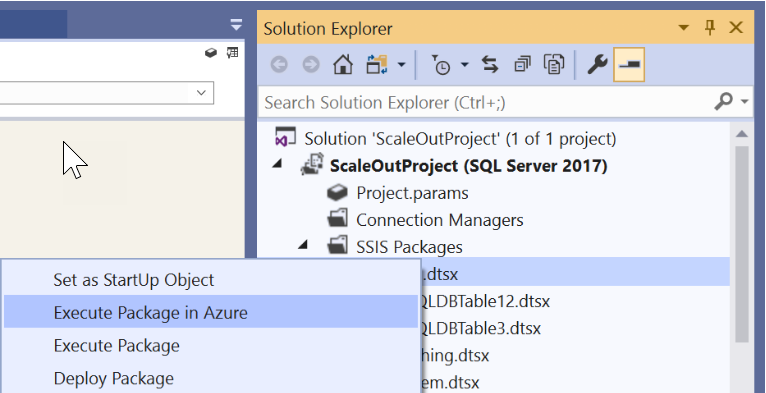

SQL Server Data Tools (SSDT) is typically used to create and deploy SQL Server Integration Services (SSIS) packages. It can be used for both on-premises SSIS packages, and for packages that will be used in Azure through Azure Data Factory. When creating a new SSIS package that is to be used in Azure, you first should select an Azure-enabled Integration Services Project, which will prompt you to connect to an instance of Azure Data Factory.

> [!div class="mx-imgBorder"]
> 

You may already have SSIS packages that you wish to have enabled for Azure. In this case, there is the option to open up the project in SSDT, and then right-click the project and click on **Azure-Enabled Project** menu item under the **SSIS in Azure Data Factory** submenu to launch the **Azure-Enabled Project Wizard**.

This opens up the Azure-Enabled Project Wizard where you can select the Visual Studio configuration to apply package execution settings in Azure. Select the target version supported by the Azure-SSIS Integration Runtime (IR), which is currently SQL Server 2017, and finally connect to the Azure-SSIS IR. By connecting your Azure-enabled projects to SSIS in ADF, you can upload your packages into Azure Files and run them on Azure-SSIS IR. It also provides you with the capability to lift and shift SSIS packages too.

## SSIS in ADF connection wizard

Lifting and shifting SSIS packages is achieved by running the SSIS in ADF Connection Wizard. This is a two-step wizard that takes SSIS projects stored in SSIS, and store them in Azure Files in a storage account that can then be run in an Azure-SSIS Integration Runtime.

On the **SSIS in ADF Introduction** page, review the introduction and click on the **Next** button to continue.

On the **Select SSIS IR in ADF** page, select your existing ADF and Azure-SSIS IR to run packages or create new ones if you do not have any.

On the **Select Azure Storage** page, select your existing Azure Storage account to upload packages into Azure Files or create a new one if you do not have any.

Click on the **Connect** button to complete your connection.

## Executing SSIS packages 

There are pre-execution steps that you should perform before executing an SSIS package. These include a variety of setting such as project settings and authentication settings for the SSIS package. This can be done by performing the following steps

Right-click on the project node in Solution Explorer panel of SSDT to pop up a menu and then selecting the **Azure-Enabled Settings** menu item under the **SSIS in Azure Data Factory** submenu.

Click the **Enable Windows Authentication** drop-down list and choose **True**. Then click the edit button for **Windows Authentication Credentials** option to enter the credentials.

Provide credentials in the **Windows Authentication Credentials** editor.

With these settings configured, you can then execute the packages in Azure from within SSDT by either clicking on the Start button, and then clicking on Execute in Azure. Alternatively right-click on the package node in Solution Explorer panel of SSDT to pop up a menu and select the **Execute Package in Azure** menu item.

