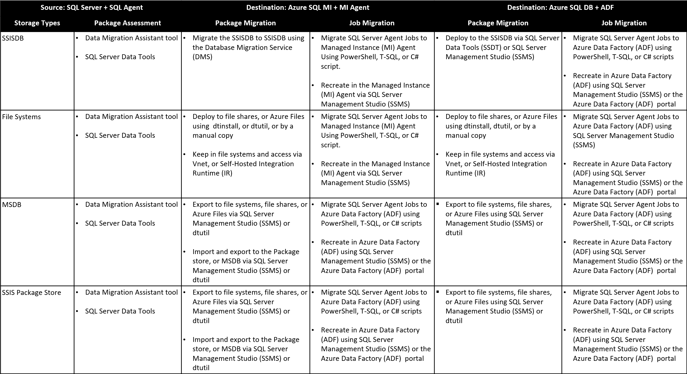
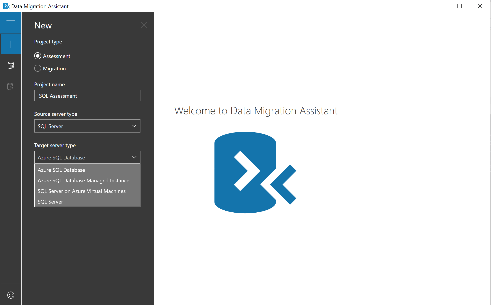
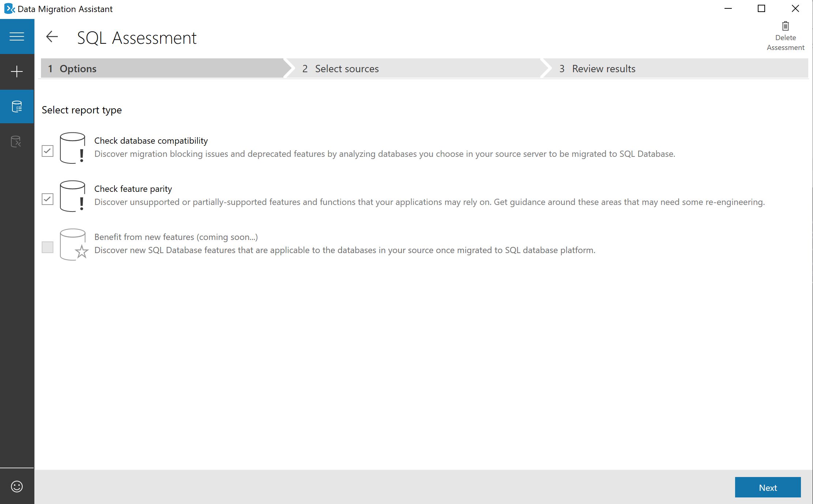
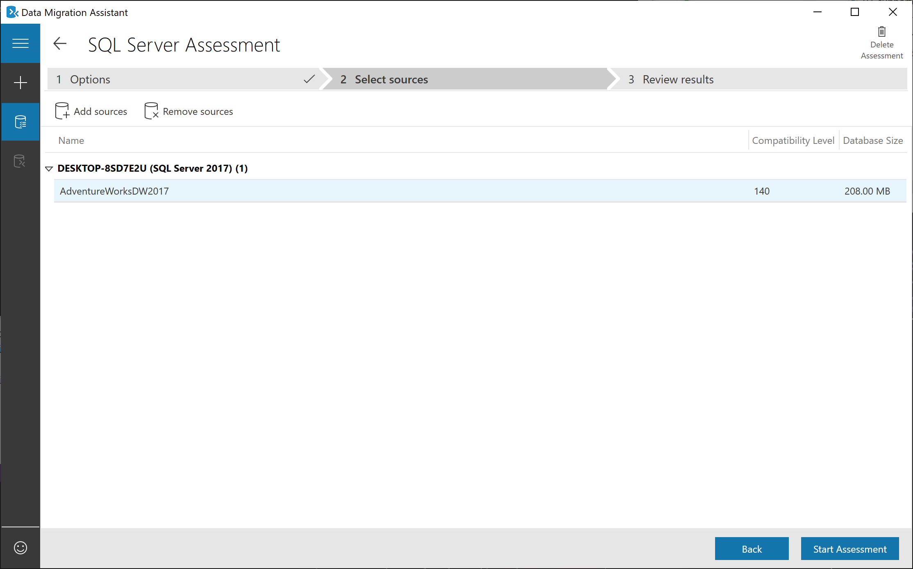
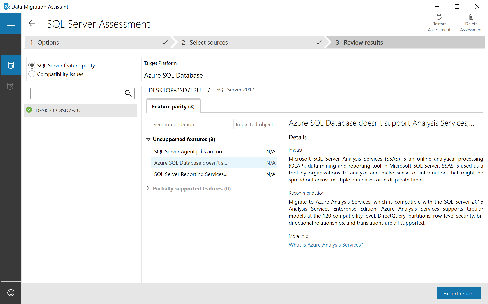
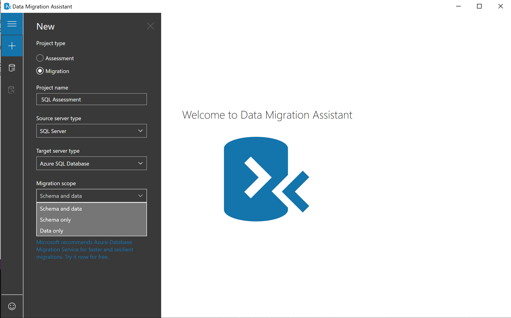

With the Azure-SSIS integration runtime installed and SQL Server Data Tools (SSDT) you have the capability to deploy and manage SSIS packages that you create in the cloud. For some packages, you may be able to rebuild them by redeploying them in the Azure-SSIS runtime. However, there may be some SSIS packages that already exist within your environment that may not be compatible? How should you deal with them?

## Perform assessments of your SSIS packages.

When you migrate your database workloads from SQL Server on premises to Azure SQL database services, you may have to migrate SSIS packages as well. The first step required is to perform an assessment of you current SSIS packages to make sure that they are compatible in Azure.
Fortunately, you can use the Data Migration Assistant (DMA) to perform an assessment of the SSIS packages that exist and identify any compatibility issues with them. The Data Migration Assistant has two main categories of information:
-	Migration blockers: Issues that prevent your existing SSIS packages to run on Azure-SSIS Integration Runtime environments.

-	Information issues: SSIS features within your packages that are only partially supported, or are deprecated.
Regardless of which category of information you receive, the Data Migration Assistant will perform the assessment on a batch of SSIS packages and provide guidance and potential mitigation steps that you can use to address the blockers and issues that are raised.

## Account for SQL Server Agent jobs

Many SSIS packages are scheduled to execute on a recurring basis. To that end, there are job definitions held within the SQL Server Agent that are used to manage the execution of SSIS packages. When you migrate your SSIS packages, you can also migrate the associated jobs within the SQL Server Agent

## Perform a migration of your packages

Before migrating, you must know which Azure SQL database service you are migrating to. This can include migrating to Azure SQL Managed Instance (MI), or Azure SQL Database. Furthermore, when migrating SSIS packages. you have to consider the location of the SSIS packages that you are migrating, as this can impact how you migrate the packages, and which tool you will need to use. There are four types of storage including:
-	SSIS Catalog (also known as SSISDB)
-	File System
-	MSDB database in SQL Server
-	SSIS Package store

Based on this information, you can use the following table as a basis for understanding the tools you can use to perform migration assessments, and to perform the migration itself.

## Microsoft Data Migration Assistant

The Data Migration Assistant helps you upgrade to a modern data platform by detecting compatibility issues that can impact database functionality in your new version of SQL Server or Azure SQL Database. DMA recommends performance and reliability improvements for your target environment and allows you to move your schema, data, and objects from your source server to your target server.

This tool can be helpful to you in identifying any issues that can affect a migration to an Azure SQL data platform. The DMA can run assessment projects that will identify any blocking issues or unsupported features that are currently in use with your on-premises SQL Server. It can also help you understand the new features in the target SQL Server platform that the database can benefit from after a migration. The DMA can also perform migration projects that can migrate an on-premises SQL Server instance to a modern SQL Server instance hosted on-premises or on an Azure virtual machine (VM) that is accessible from your on-premises network.

The Data Migration Assistant replaces all previous versions of SQL Server Upgrade Advisor and should be used for upgrades for most SQL Server versions.

## Supported SQL Server source and targets

The Data Migration Assistant supports the following source and target technologies

**Sources**
- SQL Server 2005
- SQL Server 2008
- SQL Server 2008 R2
- SQL Server 2012
- SQL Server 2014
- SQL Server 2016
- SQL Server 2017 on Windows

**Targets**
- SQL Server 2012
- SQL Server 2014
- SQL Server 2016
- SQL Server 2017 on Windows and Linux
- Azure SQL Database
- Azure SQL Database Managed Instance

## Using the Data Migration Assistant.

On completion of the installation, the Data Migration Assistant opens. The first step is to configure the type of project that you want to run. There are two choices:

1. **Assessment projects**.

    In this configuration, the Data Migration Assistant will identify any blocking issues or unsupported features that are currently in use with your on-premises SQL Server.

    You can then define setting for your assessment project to check database compatibility or feature parity

    

    Set the source database that you would like to perform the check against, and then start the assessment

    

    and then review the results, either in the tool, or exported into a JSON file for later review

    

2. **Migration projects**.

    In this configuration, the Data Migration Assistant will migrate the data, schema, or both to the target services defined in the settings.

    

## Best practices for running Data Migration Assistant

The following list outlines the best practices that you should consider when working with the Data Migration Assistant:

- Don't install and run the Data Migration Assistant directly on the SQL Server host machine.

- Run assessments on production databases during non-peak times.

- Perform the Compatibility issues and New feature recommendations assessments separately to reduce the assessment duration.

- Migrate a server during non-peak times.

- When migrating a database, provide a single share location accessible by the source server and the target server, and avoid a copy operation if possible. A copy operation may introduce delay based on the size of the backup file. The copy operation also increases the chances that a migration will fail because of an extra step. When a single location is provided, Data Migration Assistant bypasses the copy operation.

- Be sure that to provide the correct permissions to the shared folder to avoid migration failures. The correct permissions are specified in the tool. If a SQL Server instance runs under Network Service credentials, give the correct permissions on the shared folder to the machine account for the SQL Server instance.

- Enable encrypt connection when connecting to the source and target servers. Using SSL encryption increases the security of data transmitted across the networks between Data Migration Assistant and the SQL Server instance, which is beneficial especially when migrating SQL logins. If SSL encryption isn't used and the network is compromised by an attacker, the SQL logins being migrated could get intercepted and/or modified on-the-fly by the attacker.

