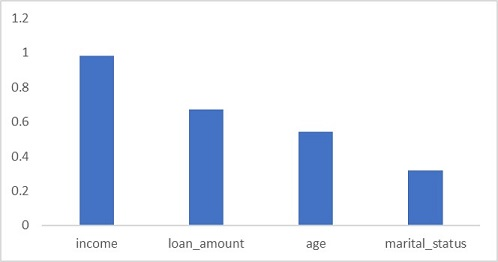

Model explainers use statistical techniques to calculate *feature importance*. This enables you to quantify the relative influence each feature in the training dataset has on label prediction. Explainers work by evaluating a test data set of feature cases and the labels the model predicts for them.

## Global feature importance

Global feature importance quantifies the relative importance of each feature in the test dataset as a whole. It provides a general comparison of the extent to which each feature in the dataset influences prediction.

For example, a binary classification model to predict loan default risk might be trained from features such as loan amount, income, marital status, and age to predict a label of 1 for loans that are likely to be repaid, and 0 for loans that have a significant risk of default (and therefore shouldn't be approved). An explainer might then use a sufficiently representative test dataset to produce the following global feature importance values:

* **income**: 0.98
* **loan amount**: 0.67
* **age**: 0.54
* **marital status** 0.32

It's clear from these values, that in respect to the overall predictions generated by the model for the test dataset, **income** is the most important feature for predicting whether or not a borrower will default on a loan, followed by the **loan amount**, then **age**, and finally **marital status**.

## Local feature importance

Local feature importance measures the influence of each feature value for a specific individual prediction.

For example, suppose Sam applies for a loan, which the machine learning model approves (by predicting that Sam won't default on the loan repayment). You could use an explainer to calculate the local feature importance for Sam's application to determine which factors influenced the prediction. You might get a result like this:

|Feature |Support for 0 |Support for 1|
|:-------|:------------:|------------:|
| loan amount | -0.9 | 0.9|
| income | -0.6 | 0.6 |
| age | 0.2 | -0.2 |
| marital status | -0.1 | 0.1|

Because this is a *classification* model, each feature gets a local importance value for each possible class, indicating the amount of support for that class based on the feature value. Since this is a *binary* classification model, there are only two possible classes (0 and 1). Each feature's support for one class results in correlatively negative level of support for the other.

In Sam's case, the overall support for class 0 is -1.4, and the support for class 1 is correspondingly 1.4; so support for class 1 is higher than for class 0, and the loan is approved. The most important feature for a prediction of class 1 is **loan amount**, followed by **income** - these are the opposite order from their global feature importance values (which indicate that **income** is the most important factor for the data sample as a whole). There could be multiple reasons why local importance for an individual prediction varies from global importance for the overall dataset; for example,  Sam might have a lower income than average, but the loan amount in this case might be unusually small.

For a multi-class classification model, a local importance values for each possible class is calculated for every feature, with the total across all classes always being 0. For example, a model might predict the species of a penguin based on features like its bill length, bill width, flipper length, and weight. Suppose there are three species of penguin, so the model predicts one of three class labels (0, 1, or 2). For an individual prediction, the flipper length feature might have local importance values of 0.5 for class 0, 0.3 for class 1, and -0.8 for class 2 - indicating that the flipper length moderately supports a prediction of class 0, slightly supports a prediction of class 1, and strongly supports a prediction that this particular penguin is ***not*** class 2.

For a regression model, there are no classes so the local importance values simply indicate the level of influence each feature has on the predicted scalar label.
