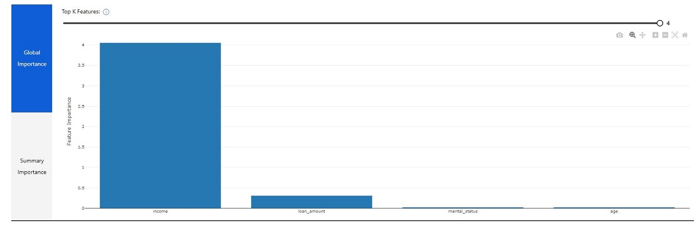
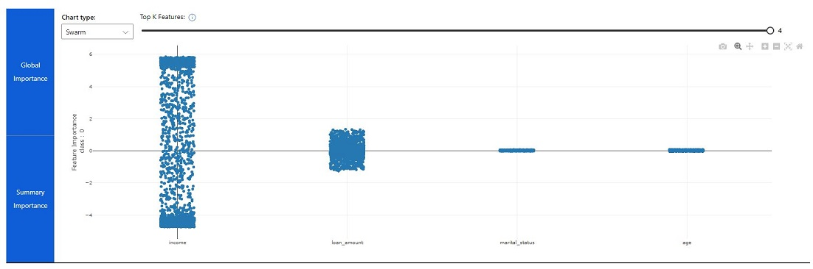

Model explanations in Azure Machine Learning studio include multiple visualizations that you can use to explore feature importance.

> [!NOTE]
> Visualizations are only available for experiment runs that were configured to generate and upload explanations. When using automated machine learning, only the run producing the best model has explanations generated by default.

## Visualizing global feature importance

The first visualization on the **Explanations** tab for a run shows global feature importance.

You can use the slider to show only the top *N* features.

## Visualizing summary importance

Switching to the **Summary Importance** visualization shows the distribution of individual importance values for each feature across the test dataset.

You can view the features as a *swarm* plot (shown above), a *box* plot, or a *violin* plot.

## Visualizing local feature importance

Selecting an individual data point shows the local feature importance for the case to which the data point belongs.

