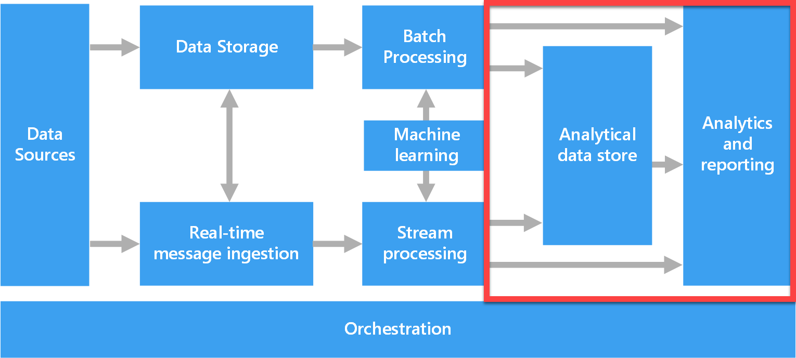

Modern analytics requires tools that can store and transform data from many sources. In this unit, you'll learn about Azure data storage solutions, data ingestion, and data processing.

Before presenting an analytics solution to Relecloud's CEO, the data team needs a clear understanding of where data will be coming from, what forms data will be in, and the anticipated scale and frequency of incoming data. Before conducting structured requirements gathering, you sit down with the team to review key data concepts.

## Azure data storage solutions

Azure Storage accounts are the base storage type within Azure. Azure Storage offers a scalable object store for data objects and file system services in the cloud.

In an analytics solution, data from different sources are combined and prepared for use. Data can be stored as files in a data lake store or in a database. Understanding base storage types within Azure is important for the *data engineer*, while the *data analyst* needs to be familiar with an analytical data store that serves processed data in a format that can be queried using analytical tools. 

Areas outlined in red in the image above highlight the pieces of the analytics solution that data analysts use to make sense of the data.

> [!NOTE]
> Learn more about [data storage in Azure](/training/modules/choose-storage-approach-in-azure/) and [technology choices for analytical data stores](/azure/architecture/data-guide/technology-choices/analytical-data-stores).

## Data ingestion and processing

*Data ingestion* is the process of obtaining and importing data for immediate use or storage in an analytical data store. 

*Data processing* is simply the conversion of raw data to meaningful information through a process. Depending on how data is ingested into your system, you could process each data item as it arrives, or buffer the raw data and process it in groups. Processing data as it arrives is called streaming. Buffering and processing the data in groups is called batch processing.

In *batch processing*, newly arriving data elements are collected into a group. The whole group is then processed at a future time as a batch. Exactly when each group is processed can be determined in many ways. For example, you can process data based on a scheduled time interval (for example, every hour), or it could be triggered when a certain amount of data has arrived. Relecloud's monthly billing process is a good example of batch processing, as account transactions are processed and billed on a monthly basis. 

> [!NOTE]
> Batch processing is the most common type of data processing, best suited for large datasets or data coming from legacy data systems. Batch processing is not suited for rapid analysis and decision making.

In *stream processing*, each new piece of data is processed when it arrives. For example, data ingestion is inherently a streaming process.

Streaming handles data in real time. Unlike batch processing, there's no waiting until the next batch processing interval, and data is processed as individual pieces rather than being processed a batch at a time. Streaming data processing is beneficial in most scenarios where new, dynamic data is generated on a continual basis. 

A fraud department would use stream processing to handle real-time fraud and anomaly detection. 

> [!NOTE]
> Stream processing is ideal for projects that require real-time analysis, and is less suited for projects requiring complex analytics.

While data processing typically occurs upstream of the analytical data store, it's critical that analysts understand how data are ingested and at what frequency, to build the appropriate analytics solution. 

