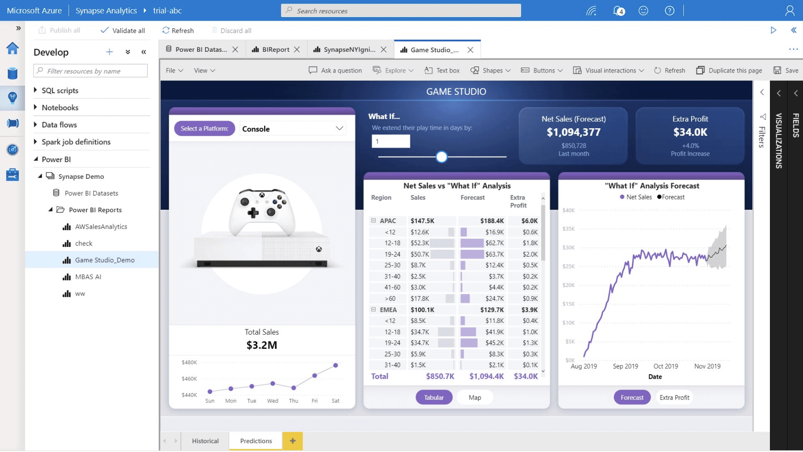

After data ingestion and processing, data are now in a format that can be used for analysis and presentation to decision makers. Presentation of insights for decision making is the end goal of a larger analytics project. Data analysts present findings to decision makers in the form of a data product, like a dashboard or report.

## Azure data analytics and reporting

There are many options for analytics and reporting in Azure, depending on the needs of the business. Analysts can explore and visualize data directly in the Azure ecosystem, using tools like Synapse notebooks in Azure Synapse Analytics. Analysts can also build and deploy solutions for use by others using robust reporting tools like Microsoft Power BI.

## Explore and visualize data in Azure Synapse Analytics

Azure Synapse Analytics provides a suite of tools to process and analyze an organization's data. It incorporates SQL technologies, Transact-SQL query capabilities, and open-source Spark tools to enable you to quickly process very large amounts of data. Data exploration in Azure Synapse Studio may be the first step in the analytics process, where you can profile and examine data.

Data can be explored and visualized directly in Azure Synapse Studio using  the Azure Synapse SQL results pane and using native visuals in Spark notebooks. Simple visualizations of your data make it easier to detect patterns, trends, and outliers, and may help you understand what your next steps in analysis will be.

Synapse Studio provides a SQL script web interface for you to author SQL queries. You can also visualize your SQL script results in a chart by selecting the Chart button.

Synapse notebooks enable you to analyze data across raw formats (CSV, txt, JSON, etc.), processed file formats (parquet, Delta Lake, ORC, etc.), and SQL tabular data files against Spark and SQL.

> [!NOTE]
> Learn more about [large-scale data analytics in Azure Synapse Analytics](/training/modules/explore-azure-synapse-analytics/).

## Visualize data and create reporting solutions using Microsoft Power BI

 Power BI is an enterprise analytics tool that can help you discover and distribute insights from data stored in Azure and beyond. Azure and Power BI can be used together to connect, combine, and analyze your entire data estate. With Power BI, you can create reports with interactive visualizations to drive decision making.

 *Data visualization* in Power BI helps you turn large amounts of granular data into easily understood, visually compelling, and useful business information. The use of Power BI takes the data exploration you may have done in Azure Synapse Analytics a step further. In addition to the enhanced visualization capability, Power BI also provides a platform for secure distribution of dashboards and reports.

Power BI also has native connectors to many Azure data services. Using Power BI, you can connect to data in Azure Synapse Analytics, Azure Databricks, Azure HDInsight, and more.

> [!NOTE]
> Learn more about [analytics and reporting with Power BI](/learn/paths/create-use-analytics-reports-power-bi/).

