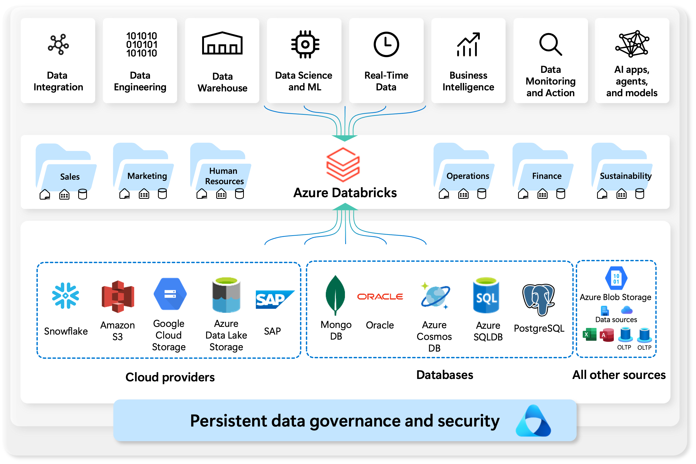

Azure Databricks is a cloud-based data platform that brings together the best of **data engineering, data science, and machine learning** in a single, unified workspace. Built on top of **Apache Spark**, it allows organizations to easily process, analyze, and visualize massive amounts of data in real time.

By connecting to a wide range of **data sources**—from cloud providers like Azure SQL Database, Amazon S3 and Google Cloud Storage, to enterprise systems such as SAP and Oracle—Azure Databricks makes it easy to integrate and transform data from anywhere.

Once data is ingested, teams across **sales, marketing, operations, finance, HR, and sustainability** can use Databricks for advanced analytics, machine learning, business intelligence, and AI-driven insights.

At its core, Azure Databricks helps organizations:

* **Integrate** data from multiple sources
* **Engineer** and transform raw data into usable formats
* **Store and manage** data efficiently with governance and security
* **Apply** real-time analytics, machine learning, and AI models
* **Drive** better business decisions and outcomes

## Data Lakehouse

A **data lakehouse** is a data management approach that blends the strengths of both data lakes and data warehouses. It offers scalable storage and processing, allowing organizations to handle diverse workloads—such as machine learning and business intelligence—without relying on separate, disconnected systems. By centralizing data, a lakehouse supports a single source of truth, reduces duplicate costs, and ensures that information stays up to date.

Many lakehouses follow a layered design pattern where data is gradually improved, enriched, and refined as it moves through different stages of processing. This layered approach—commonly called the **medallion architecture**—organizes data into stages that build on one another, making it easier to manage and use effectively.

The Databricks lakehouse uses two key technologies:

- **Delta Lake**: an optimized storage layer that supports ACID transactions and schema enforcement.
- **Unity Catalog**: a unified, fine-grained governance solution for data and AI.