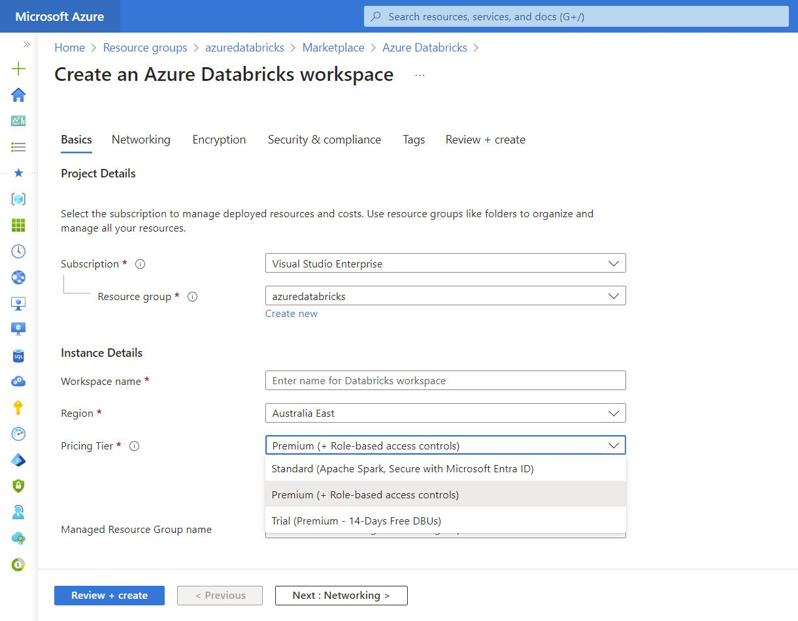
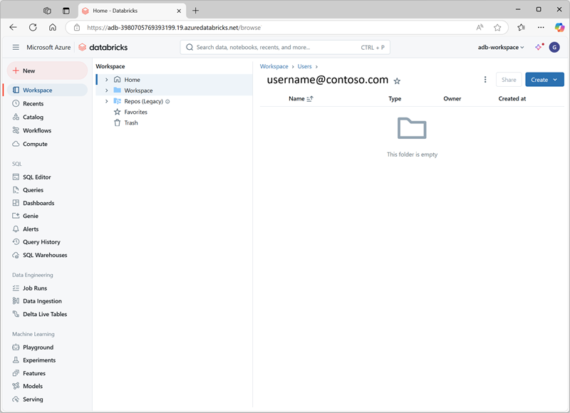

Azure Databricks is a cloud-based data analytics platform that provides a unified environment for data engineering, machine learning, and analytics. Azure Databricks was designed in collaboration with Databricks, whose leadership created Apache Spark. Azure Databricks offers a fast, easy, and collaborative Apache Spark–based analytics service. This platform integrates deeply with Azure’s other services, providing a seamless experience for users with enhanced security, performance, and scalability. It enables data-driven tasks such as data preparation, machine learning, and data science workflows, making it a versatile tool for organizations looking to harness the power of big data.

Key features of Azure Databricks include its native integration with Microsoft Entra ID, and its capability to use other Azure services such as Azure Storage, Azure Data Lake Storage, and Azure Cosmos DB. The platform also offers an interactive workspace that facilitates collaboration among data scientists, data engineers, and business analysts. This collaborative environment supports various programming languages like Python, Scala, R, and SQL, allowing teams to develop and iterate on their data models efficiently. Moreover, Azure Databricks is designed to scale easily, managing both the computational demands of machine learning algorithms and the processing needs of large data sets.

## Creating an Azure Databricks workspace

To use Azure Databricks, you must create an Azure Databricks workspace in your Azure subscription. You can accomplish this by:

- Using the Azure portal user interface
- Using an Azure Resource Manager (ARM) or Bicep template
- Using the New-AzDatabricksWorkspace Azure PowerShell cmdlet
- Using the az databricks workspace create Azure command line interface (CLI) command

When you create a workspace, you must specify one of the following pricing tiers.

- Standard - Core Apache Spark capabilities with Microsoft Entra ID integration.
- Premium - Role-based access controls and other enterprise-level features.
- Trial - A 14-day free trial of a premium-level workspace

## Using the Azure Databricks Portal

After you provision an Azure Databricks workspace, you can use the Azure Databricks portal to work with data and compute resources. The Azure Databricks portal is a web-based user interface where you can create and manage workspace resources, such as Spark clusters, and use notebooks and queries to work with data in files and tables.

