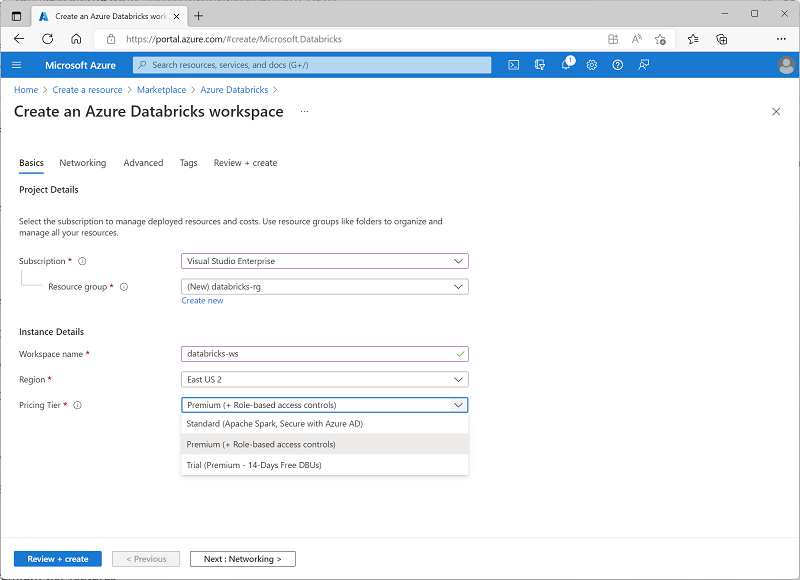

Azure Databricks is a cloud-based distributed platform for data processing built on Apache Spark. Databricks was designed to unify data science, data engineering, and business data analytics on Spark by creating an easy to use environment that enables users to spend more time working effectively with data, and less time focused on managing clusters and infrastructure. As the platform has evolved, it has kept up to date with the latest advances in the Spark runtime and added usability features to support common data workloads in a single, centrally managed interface.

Azure Databricks is hosted on the Microsoft Azure cloud platform, and integrated with Azure services such as Azure Active Directory, Azure Storage, Azure Synapse Analytics, and Azure Machine Learning. Organizations can apply their existing capabilities with the Databricks platform, and build fully integrated data analytics solutions that work with cloud infrastructure used by other enterprise applications.

## Creating an Azure Databricks workspace

To use Azure Databricks, you must create an Azure Databricks *workspace* in your Azure subscription. You can accomplish this by:

- Using the Azure portal user interface.
- Using an Azure Resource Manager (ARM) or Bicep template.
- Using the `New-AzDatabricksWorkspace` Azure PowerShell cmdlet
- Using the `az databricks workspace create` Azure command line interface (CLI) command.

When you create a workspace, you must specify one of the following pricing tiers:

- **Standard** - Core Apache Spark capabilities with Azure AD integration.
- **Premium** - Role-based access controls and other enterprise-level features.
- **Trial** - A 14-day free trial of a premium-level workspace

## Using the Azure Databricks portal

After you've provisioned an Azure Databricks workspace, you can use the Azure Databricks portal to work with data and compute resources. The Azure Databricks portal is a web-based user interface through which you can create and manage workspace resources (such as Spark clusters) and use notebooks and queries to work with data in files and tables.

