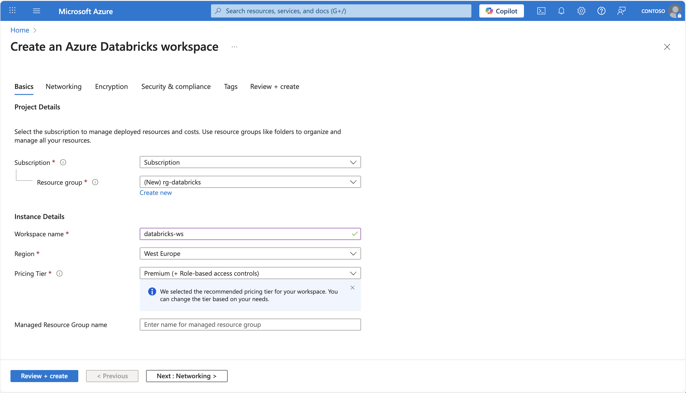

To use Azure Databricks, you must create an Azure Databricks workspace in your Azure subscription. A workspace is an Azure Databricks deployment in a cloud service account. It provides a unified environment for working with Azure Databricks assets for a specified set of users.

You can create an Azure Databricks workspace by:

- Using the Azure portal user interface.
- Using an Azure Resource Manager (ARM), Bicep or Terraform template.
- Using the New-AzDatabricksWorkspace Azure PowerShell cmdlet.
- Using the az databricks workspace create Azure command line interface (CLI) command.

When you create a workspace, you must specify:

- A **workspace name**.
- Select an available **region**. For available regions, see [Azure services available by region](/explore/global-infrastructure/products-by-region/table).
- A **pricing tier**:
  - **Standard** - Core Apache Spark capabilities with Microsoft Entra ID integration.
  - **Premium** - Role-based access controls and other enterprise-level features.
  - **Trial** - A 14-day free trial of a premium-level workspace
- **Managed Resource Group name** (optional): an automatically created resource group where Azure provisions and manages the infrastructure resources needed for your Databricks workspace.



If you decide to create an Azure Databricks deployment using the Azure CLI, this would be the [az databricks workspace](/cli/azure/ext/databricks/databricks/workspace) command to remember:

```
az databricks workspace create
    --resource-group myresourcegroup \
    --name mydatabricksws  \
    --location westus2  \
    --sku standard
```

The equivalent [New-AzDatabricksWorkspace](/powershell/module/az.databricks/new-azdatabricksworkspace) PowerShell cmdlet:

```
New-AzDatabricksWorkspace -Name mydatabricksws -ResourceGroupName myresourcegroup -Location westus2 -ManagedResourceGroupName databricks-group -Sku standard
```

## Navigating the Azure Databricks Workspace UI

After you provision an Azure Databricks workspace, you can use the workspace UI to work with data and compute resources. The workspace UI is a web-based user interface where you can create and manage workspace resources, such as Spark clusters, and use notebooks and queries to work with data in files and tables.


The homepage provides shortcuts to common tasks and workspace objects to you help you get started. You can import data, create a notebook, create a query and configure an AutoML experiment.

The sidebar shows common Databricks categories (Workspace, Recents, Catalog, Jobs & Pipelines, Compute, Marketplace). It then breaks out by product area:

- **SQL**: SQL Editor, Queries, Dashboards, Genie, Alerts, Query History, SQL Warehouses
- **Data Engineering**: Job Runs, Data Ingestion
- **Machine Learning**: Playground, Experiments, Features, Models, Serving

Select **+ New** to:

- **Create workspace objects** such as notebooks, queries, repos, dashboards, alerts, jobs, pipelines, experiments, models, and serving endpoints.
- **Create compute resources** such as clusters, SQL warehouses, and ML endpoints.

Use the top bar to **search** for workspace objects such as notebooks, queries, dashboards, alerts, files, folders, libraries, tables registered in Unity Catalog, jobs, and repos in a single place. You can also access recently viewed objects in the search bar. 

The workspace is available in **multiple languages.** To change the workspace language, select your username in the top navigation bar, select **Settings** and go to the **Preferences** tab.

## Get help from Databricks Assistant

**Databricks Assistant** is an AI-powered pair programmer and support tool that helps you work more efficiently in Databricks by generating, explaining, and fixing code or queries directly in notebooks, dashboards, and files. 


It can assist with a wide range of tasks, including identifying and correcting errors, creating data visualizations, diagnosing job issues, and filtering or analyzing data using natural language prompts. The Assistant can surface relevant guidance from the Azure Databricks documentation. 

By using Unity Catalog metadata, it personalizes its responses based on your organization’s data assets—tables, columns, and descriptions—making it easier to explore and work with your data.