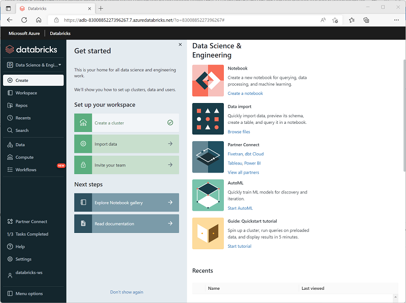
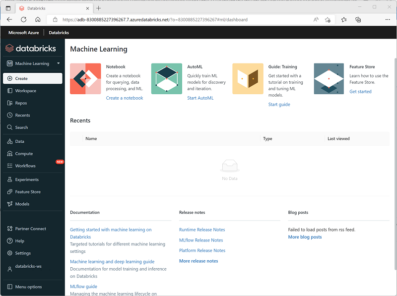
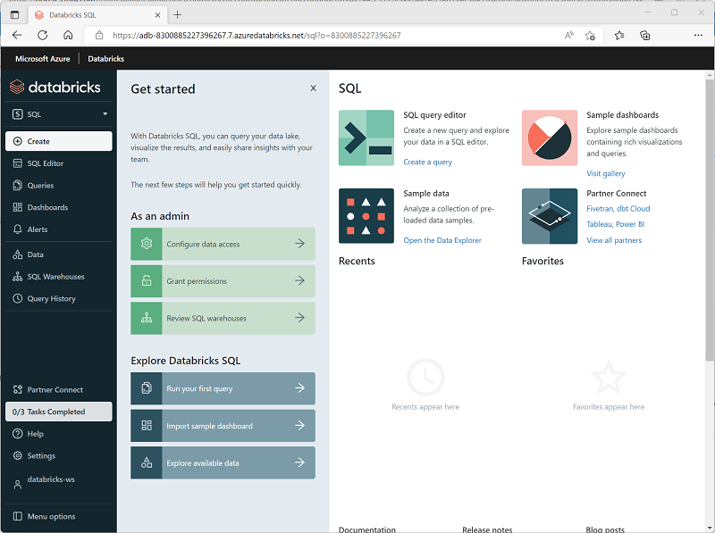

Azure Databricks is a comprehensive platform that offers many data processing capabilities. While you can use the service to support any workload that requires scalable data processing, Azure Databricks particularly supports the following types of data workload:

- Data Science and Engineering
- Machine Learning
- SQL*

*\*SQL workloads are only available in premium tier workspaces.*

## Data Science and Engineering

Azure Databricks provides Apache Spark based ingestion, processing, and analysis of large volumes of data in a [data lakehouse](/azure/databricks/lakehouse). Data engineers, data scientists, and data analysts can use interactive notebooks to run code in Python, Scala, SparkSQL, or other languages to cleanse, transform, aggregate, and analyze data.

## Machine Learning

Azure Databricks supports machine learning workloads that involve data exploration and preparation, training and evaluating machine learning models, and serving models to generate predictions for applications and analyses. Data scientists and ML engineers can use AutoML to quickly train predictive models, or apply their skills with common machine learning frameworks such as SparkML, Scikit-Learn, PyTorch, and Tensorflow. They can also manage the end-to-end machine learning lifecycle with MLFlow.

## Data warehousing

Azure Databricks supports SQL-based querying for data stored in tables in a *SQL Warehouse*. This capability enables data analysts to query, aggregate, summarize, and visualize data using familiar SQL syntax and a wide range of SQL-based data analysis and visualization tools.

> [!NOTE]
> SQL Warehouses are only available in *premium* Azure Databricks workspaces.
