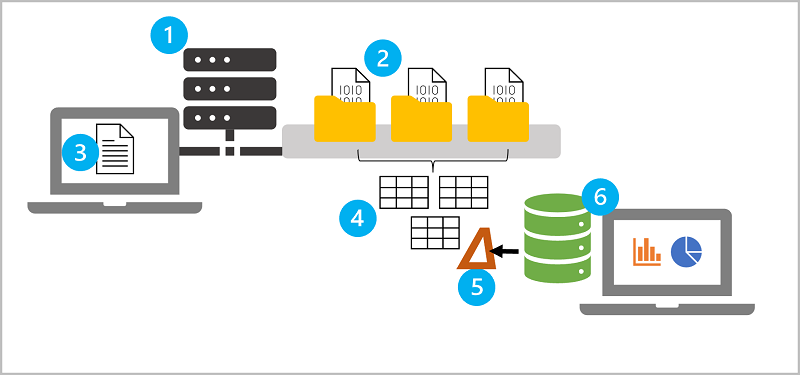

Azure Databricks is an amalgamation of multiple technologies that enable you to work with data at scale. Before using Azure Databricks, there are some key concepts that you should understand.

1. **Apache Spark clusters** - Spark is a distributed data processing solution that makes use of *clusters* to scale processing across multiple compute *nodes*. Each Spark cluster has a *driver* node to coordinate processing jobs, and one or more *worker* nodes on which the processing occurs. This distributed model enables each node to operate on a subset of the job in parallel; reducing the overall time for the job to complete. To learn more about clusters in Azure Databricks, see [Clusters](/azure/databricks/clusters/) in the Azure Databricks documentation.
2. **Databricks File System (DBFS)** - While each cluster node has its own local file system (on which operating system and other node-specific files are stored), the nodes in a cluster have access to a shared, distributed file system in which they can access and operate on data files. The *Databricks File System* (DBFS) enables you to mount cloud storage and use it to work with and persist file-based data. To learn more about DBFS, see [Databricks File System (DBFS)](/azure/databricks/data/databricks-file-system) in the Azure Databricks documentation.
3. **Notebooks** - One of the most common ways for data analysts, data scientists, data engineers, and developers to work with Spark is to write code in *notebooks*. Notebooks provide an interactive environment in which you can combine text and graphics in *Markdown* format with cells containing code that you run interactively in the notebook session. To learn more about notebooks, see [Notebooks](/azure/databricks/notebooks/) in the Azure Databricks documentation.
4. **Metastore** - Azure Databricks supports the use of a *Hive* metastore or *[Unity Catalog](/azure/databricks/connect/unity-catalog)* to define a relational schema of tables over file-based data. The tables can be queried using SQL syntax to access the data in the underlying files. The table definitions and details of the file system locations on which they're based are stored in the metastore, abstracting the data objects that you can use for analytics and data processing from the physical storage where the data files are stored.
5. **Delta Lake** - *Delta Lake* builds on the relational table schema abstraction over files in the data lake to add support for SQL semantics commonly found in relational database systems. Capabilities provided by Delta Lake include transaction logging, data type constraints, and the ability to incorporate streaming data into a relational table. To learn more about Delta Lake, see [Delta Lake Guide](/azure/databricks/delta/) in the Azure Databricks documentation.
6. **SQL Warehouses** - *SQL Warehouses* are relational compute resources with endpoints that enable client applications to connect to an Azure Databricks workspace and use SQL to work with data in tables. The results of SQL queries can be used to create data visualizations and dashboards to support business analytics and decision making. SQL Warehouses are only available in *premium* tier Azure Databricks workspaces. To learn more about SQL Warehouses, see [SQL Warehouses](/azure/databricks/sql/admin/sql-endpoints) in the Azure Databricks documentation.
