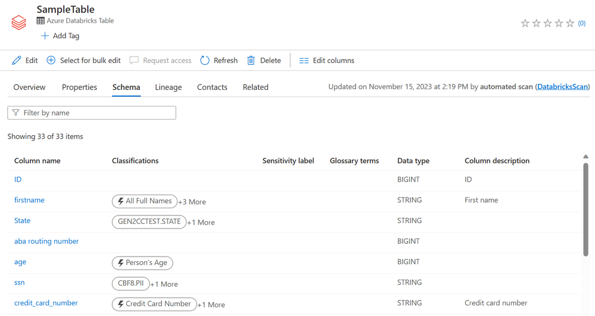

Data governance is critical for ensuring that data within an organization is managed securely, efficiently, and in compliance with regulations. 

In many organizations, data is distributed across databases, data warehouses, data lakes, and even multiple catalogs. It also exists in diverse formats like Parquet, CSV, and Delta Lake. Beyond structured data in tables, there’s also unstructured data in files, along with other assets such as machine learning models, notebooks, and dashboards that require management and governance. This fragmentation creates silos across sources, formats, and asset types.

These governance challenges directly affect the value organizations can derive from data and AI:

- Fragmented governance increases compliance, security, and data quality risks, while also creating operational inefficiencies as teams struggle to maintain a consistent view of their data and AI environments.

- Limited connectivity can result in vendor lock-in and make it harder to adopt new technologies as requirements change. Poor interoperability also complicates collaboration and scaling, often leading to higher costs from using multiple tools and duplicating data across systems.

- A lack of built-in intelligence restricts broader use of data and AI platforms, particularly for nontechnical users. This slows down innovation, delays decision-making, and prevents organizations from fully realizing the benefits of their data and AI investments.

Azure Databricks, combined with Unity Catalog and Microsoft Purview, provides a robust solution for managing and governing data effectively. 

## Unity Catalog 

Unity Catalog provides a centralized way to manage access, discovery, lineage, audit logs, and quality monitoring across data and AI assets within Azure Databricks. It applies consistently across all workspaces in a region.


The **metastore** is the top-level metadata container; it holds information about data assets and the permissions that govern them. You typically have one metastore per region, and multiple workspaces can share that metastore.

Unity Catalog organizes data assets using a structured **three-level hierarchy**:

```sql
catalog.schema.table_or_other_object
```

- **Catalogs** group assets typically aligned to teams or environments.
- **Schemas** (also known as databases) are subdivisions within catalogs, organizing assets more granularly—for example by project or use case.
- **Objects** in schemas include tables (managed or external), views, volumes, functions, and models.

Tables can be either managed or external. With **managed tables**, Unity Catalog handles both governance and storage (always Delta Lake format). With **external tables**, Unity Catalog manages access from Databricks, but data lifecycle/storage is managed externally. This supports multiple formats (Delta, CSV, JSON, Parquet, etc.)

Unity Catalog implements **fine-grained access control** via ANSI SQL commands across multiple levels—metastore, catalog, schema, down to rows and columns. For example, the following command gives the 'finance-team' user group the permission to create new tables in the 'myschema' within the 'mycatalog' database.

```sql
GRANT CREATE TABLE ON SCHEMA mycatalog.myschema TO `finance-team`;
```

Exploring data assets in Unity Catalog is straightforward. You can use the **Catalog Explorer** and a search interface to find what you need. To help you, assets have tags, comments, and even AI-generated descriptions. Once you find a data asset, you can use features like **lineage**, table insights, and Entity Relationship diagrams to get a better understanding of it.

Unity Catalog provides a complete picture of your data's history. It logs access, audit trails, and lineage—right down to the column level.

In most accounts, Unity Catalog is enabled by default when you create a workspace. You can get started using Unity Catalog with the default settings. There are optional configurations that you might want to enable, however. 

## Microsoft Purview

Microsoft Purview is a data governance service that lets you manage and oversee data across on-premises systems, multiple clouds, and SaaS platforms. It includes features such as data discovery, classification, lineage tracking, and access governance.

When integrated with Azure Databricks and Unity Catalog, Purview can discover Lakehouse data and ingest its metadata into the Data Map. This allows you to apply consistent governance across your entire data environment, while acting as a central catalog that brings together metadata from different sources.

With this integration, you can:

- **Scan** Azure Databricks in both public and private networks, powered by the fully managed Microsoft Purview integration runtime.
- Scan the entire **Unity Catalog metastore** or choose to scan only selective catalogs.
- Extract a comprehensive set of Unity Catalog metadata, including details of metastore, catalogs, schemas, tables/views, and columns, etc.
- Automatically **classify** the data based on built-in system classification rules or user-defined custom classification rules to identify sensitive data.
- Get detailed visibility into the **data lineage**, showing how data is transformed and moved across different systems and processes, including within Azure Databricks.
- Run the scan **on-demand** or on a daily/weekly/monthly recurring **schedule**.



In addition, Microsoft Purview can scan the workspace-level **Hive metastore** in Azure Databricks.
