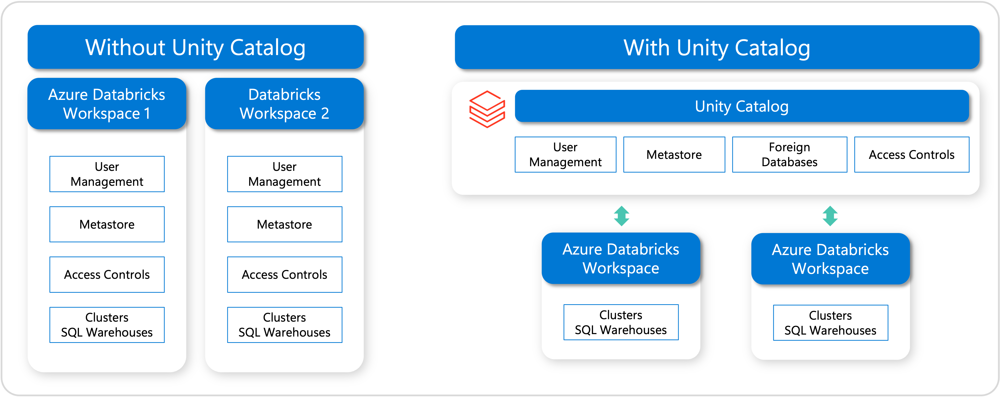

Data governance is critical for ensuring that data within an organization is managed securely, efficiently, and in compliance with regulations. Azure Databricks, combined with Unity Catalog and Microsoft Purview, provides a robust solution for managing and governing data effectively. 

## Data Governance Tools
An overview of how data governance can be implemented using Unity Catalog and Microsoft Purview follows.

### Unity Catalog 

Unity Catalog is a feature within Azure Databricks that offers a unified governance solution for all data and AI assets. It provides a centralized metastore that manages data objects across all workspaces in an organization.

### Microsoft Purview

Microsoft Purview is a unified data governance service that helps you manage and govern your on-premises, multicloud, and software-as-a-service (SaaS) data. It provides capabilities like data discovery, data classification, data lineage, and data access governance.

## Overview of Unity Catalog

Unity Catalog in Azure Databricks is a centralized metastore that manages metadata for all data assets and AI assets across Databricks workspaces. It enables fine-grained security controls and governance policies at scale, making it easier to manage data across multiple teams and projects securely.

### Key Features of Unity Catalog

- **Unified Namespace:** Unity Catalog offers a single namespace for datasets, files, and machine learning models across all workspaces, making it easier to manage and discover assets.

- **Fine-grained Access Control:** It allows administrators to set precise access controls on data using standard SQL GRANT and REVOKE statements, aligning with the principle of least privilege.

- **Data Lineage:** Unity Catalog captures and displays data lineage, which is critical for tracking the flow of data and understanding its transformations over time.

- **Centralized Metadata Management:** Manages all metadata centrally, ensuring that definitions, descriptions, and other metadata are consistent across projects and workspaces.

- **Integration with Databricks SQL:** Unity Catalog is fully integrated with Databricks SQL, allowing for seamless querying and management of data assets without moving data out of the platform.

## Overview of Microsoft Purview

Microsoft Purview offers a suite of data governance tools designed to provide visibility, control, and insights into data usage across an organization. It helps you discover, classify, protect, and monitor data, no matter where it resides.

### Key Features of Microsoft Purview for Azure Databricks

- **Data Discovery and Classification:** Automatically scan and classify data across your Azure Databricks environment using built-in classifiers and also create custom classifiers.

- **Data Lineage:** Provides detailed visibility into the data lineage, showing how data is transformed and moved across different systems and processes, including  within Azure Databricks.

- **Data Map:** Aggregates metadata from various data sources into a searchable catalog, allowing users to understand the data landscape and its relationships.

- **Access and Policy Management:** Allows for the creation of governance policies that enforce how data is accessed and used within Azure Databricks and other integrated systems.

- **Insights and Reporting:** Offers detailed reports on data discovery, sensitivity classification, and access analytics, helping to ensure compliance and optimize data governance strategies.
