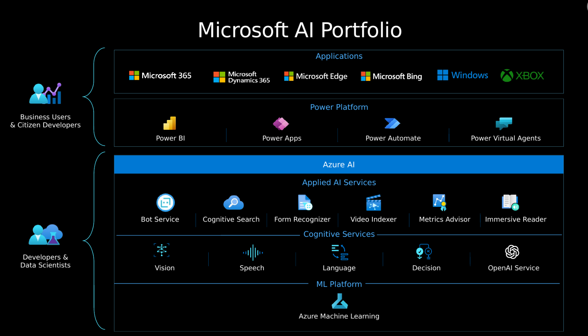

Microsoft has partnered with OpenAI to deliver on three main goals:  
- To utilize Azure's infrastructure, including security, compliance, and regional availability, to help users build enterprise-grade applications.
- To deploy OpenAI AI model capabilities across Microsoft products, including and beyond Azure AI products.
- To use Azure to power all of OpenAI's workloads.  

## Introduction to Azure OpenAI Service

Azure OpenAI Service is a result of the partnership between Microsoft and OpenAI. The service combines Azure's enterprise-grade capabilities with OpenAI's generative AI model capabilities. 

Azure OpenAI is available for Azure users and consists of four components: 
- Pre-trained generative AI models 
- Customization capabilities; the ability to fine-tune AI models with your own data 
- Built-in tools to detect and mitigate harmful use cases so users can implement AI responsibly
- Enterprise-grade security with role-based access control (RBAC) and private networks

Using Azure OpenAI allows you to transition between your work with Azure services and OpenAI, while utilizing Azure's private networking, regional availability, and responsible AI content filtering. 

### Understand Azure OpenAI workloads 

Azure OpenAI supports many common AI workloads and solves for some new ones.

Common AI workloads include machine learning, computer vision, natural language processing, conversational AI, anomaly detection, and knowledge mining. 

Other AI workloads Azure OpenAI supports can be categorized by tasks they support: 

- **Generating Natural Language**
    - *Text completion*: generate and edit text 
    - *Embeddings*: search, classify, and compare text
- **Generating Code**: generate, edit, and explain code
- **Generating Images**: generate and edit images

### Azure OpenAI's relationship to Azure AI services 

Azure's AI services are tools for solving AI workloads and can be categorized into three groupings: Azure's Machine Learning platform, Cognitive Services, and Applied AI Services.   
 
Azure AI Services has five pillars: vision, speech, language, decision, and the Azure OpenAI Service. The services you choose to use depend on what you need to accomplish. In particular, there are several overlapping capabilities between the Cognitive Service's Language service and OpenAI's service, such as translation, sentiment analysis, and keyword extraction. 

While there's no strict guidance on when to use a particular service, Azure's existing Language service can be used for widely known use-cases that require minimal tuning (the process of optimizing a model's performance). Azure OpenAI's service may be more beneficial for use-cases that require highly customized generative models, or for exploratory research. 

>[!NOTE]
>Pricing is different for Azure OpenAI and Azure Cognitive Service for Language. [Learn more here](https://azure.microsoft.com/pricing/details/cognitive-services/openai-service?azure-portal=true).

When making business decisions about what type of model to use, it's important to understand how time and compute needs factor into machine learning training. In order to produce an effective machine learning model, the model needs to be trained with a substantial amount of cleaned data. The 'learning' portion of training requires a computer to identify an algorithm that best fits the data. The complexity of the task the model needs to solve for and the desired level of model performance all factor into the time required to run through possible solutions for a best fit algorithm. 
