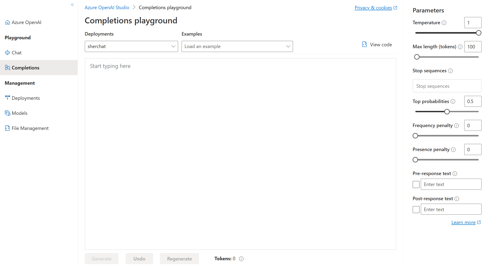
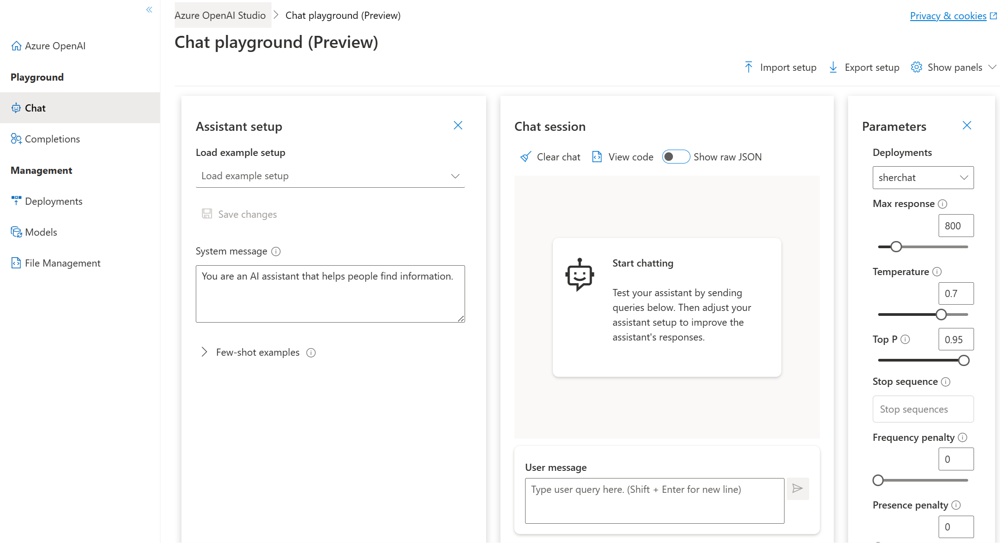

Currently you need to [apply](https://aka.ms/oaiapply?azure-portal=true) for access to Azure OpenAI. Once granted access, you can use the service by creating an Azure OpenAI resource, like you would for other Azure services. Once the resource is created, you can use the service through REST APIs, Python SDK, or the web-based interface in the Azure OpenAI Studio.  

>[!NOTE]
>To learn more about the basics of APIs, check out this infographic on [how Azure APIs work](https://github.com/MicrosoftLearning/AI-900-AIFundamentals/raw/main/instructions/infographics/ai900_how_auzre_api_works.pdf).

## Azure OpenAI Studio

In the [Azure OpenAI Studio](https://oai.azure.com/portal?azure-portal=true), you can build AI models and deploy them for public consumption in software applications. Azure OpenAI's capabilities are made possible by specific generative AI models. Different models are optimized for different tasks; some models excel at summarization and providing general unstructured responses, and others are built to generate code or unique images from text input.

These Azure OpenAI models include:
- **GPT-4** models that represent the latest generative models for natural language and code.
- **GPT-3.5** models that can generate natural language and code responses based on prompts.
- **Embeddings** models that convert text to numeric vectors for analysis - for example comparing sources of text for similarity.
- **DALL-E** models that generate images based on natural language descriptions.

Azure OpenAI's AI models can all be trained and customized with fine-tuning. We won't go into custom models here, but you can learn more on the [fine-tuning your model](/azure/ai-services/openai/how-to/fine-tuning?pivots=programming-language-studio?azure-portal=true) Azure documentation.

> [!IMPORTANT]
> Generative AI models *always* have a *probability* of reflecting true values. Higher performing models, such as models that have been fine-tuned for specific tasks, do a better job of returning responses that reflect true values. It is important to review the output of generative AI models. 

#### Playgrounds 

In the Azure OpenAI Studio, you can experiment with OpenAI models in playgrounds. In the *Completions* playground, you can type in prompts, configure parameters, and see responses without having to code.

In the *Chat* playground, you can use the assistant setup to instruct the model about how it should behave. The assistant will try to mimic the responses you include in tone, rules, and format you've defined in your system message.

