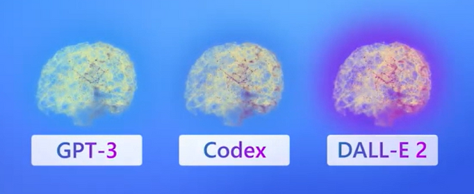

Currently you need to [apply](https://aka.ms/oaiapply?azure-portal=true) for access to Azure OpenAI. Once granted access, you can access the service by creating an Azure OpenAI resource, like you would for other Azure services. Once the resource is created, you can use the service through REST APIs, Python SDK, or the web-based interface in the Azure OpenAI Studio.  

>[!NOTE]
>To learn more about the basics of APIs, check out this infographic on [how Azure APIs work](https://github.com/MicrosoftLearning/AI-900-AIFundamentals/raw/main/instructions/infographics/ai900_how_auzre_api_works.pdf).

## Azure Open AI Studio

In the Azure OpenAI Studio, you can build AI models and deploy them for public consumption in software applications. Azure OpenAI's capabilities are made possible by a few specific generative AI models. Different models are optimized for different tasks; some models excel at simple summarization tasks, some are great at general unstructured responses, and still others are built to generate unique images from text input.

These OpenAI models fall into a few main families:
- Generative Pre-trained Transformer (GPT)
- Codex
- DALL-E

[Embeddings](/azure/cognitive-services/openai/concepts/understand-embeddings?azure-portal=true) are also available on Azure OpenAI. Embedding models are specifically created to be good at a particular task. 

Azure OpenAI's AI models can all be trained and customized with fine-tuning. We won't go into custom models here, but you can learn more on the [fine-tuning your model](/azure/cognitive-services/openai/how-to/fine-tuning?pivots=programming-language-studio?azure-portal=true) Azure documentation.

> [!IMPORTANT]
> Generative AI models *always* have a *probability* of reflecting true values. Higher performing models, such as models that have been fine-tuned for specific tasks, do a better job of returning responses that reflect true values. It is important to review the output of generative AI models. Additionally, the models provided by Azure OpenAI are trained on data prior to October 2019 and do not browse the internet, so they may not have knowledge of current events. 

#### Playground 

In the Azure OpenAI Studio, you can experiment with OpenAI models in a text box user interface called the GPT-3 Playground. You can type in prompts, and see responses without having to code.  

