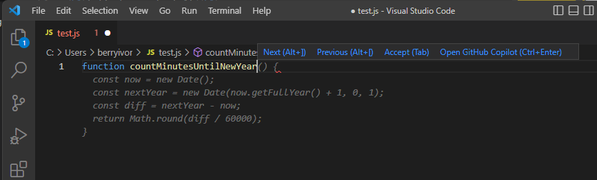

GPT models are able to take natural language or code snippets and translate them into code. The OpenAI GPT models are proficient in over a dozen languages, such as C#, JavaScript, Perl, PHP, and is most capable in Python.

GPT models have been trained on both natural language and billions of lines of code from public repositories. The models are able to generate code from natural language instructions such as code comments, and can suggest ways to complete code functions.

For example, given the prompt "Write a for loop counting from 1 to 10 in Python," the following answer is provided:

```python
for i in range(1,11):
    print(i)
```

GPT models can help developers code faster, understand new coding languages, and focus on solving bigger problems in their application. Developers can break down their goals into simpler tasks and use GPT to help build out those tasks using known patterns.

## Examples of code generation

Part of the training data for GPT-3 included programming languages, so it's no surprise that GPT models can answer programming questions if asked. What's unique about the Codex model family is that it's more capable across more languages than GPT models.

Code generation goes beyond just writing code from natural language prompts. Given the following code, it can generate unit tests:

```python
# Python 3
def mult_numbers(a, b):
  return a * b

# Unit test
def
```

GPT builds out unit tests for our function:

```python
# Python 3
def mult_numbers(a, b):
  return a * b

# Unit test
def test_mult_numbers():
  assert mult_numbers(3, 4) == 12
  assert mult_numbers(0, 10) == 0
  assert mult_numbers(4, 0) == 0

# Unit test
def test_mult_numbers_negative():
  assert mult_numbers(-1, 10) == -10
  assert mult_numbers(10, -1) == -10
```

GPT can also summarize functions that are already written, explain SQL queries or tables, and convert a function from one programming language into another.

When interacting with GPT models, you can specify libraries or language specific tags to make it clear to Codex what we want. For example, we can provide this prompt formatted as an HTML comment: `<!-- build a page titled "Let's Learn about AI" -->`, and get this as a result:

```html
<html>
<head>
<title>Let's Learn about AI</title>
<link rel="stylesheet" type="text/css" href="css/styles.css">
</head>
<body>
<div class="wrapper">
<div class="header">
<h1>Let's Learn about AI</h1>
</div>
<div class="nav">
<ul>
<li><a href="index.php">Home</a></li>
<li><a href="about.php">About</a></li>
<li><a href="resources.php">Resources</a></li>
<li><a href="contact.php">Contact</a></li>
</ul>
</div>
<div class="content">
<h2>Contact</h2>
<p>
<!-- build a form to contact the site owner -->
<form action="contact.php" method="post">
<label for="name">Name:</label>
<input type="text" name="name" id="name" required>
<label for="email">Email:</label>
<input type="email" name="email" id="email" required>
<label for="subject">Subject:</label>
<input type="text" name="subject" id="subject" required>
<label for="message">Message:</label>
<textarea name="message" id="message" required></textarea>
<input type="submit" value="Send">
</form>
</p>
</div>
<div class="footer">
<p>Let's Learn about AI</p>
</div>
</div>
</body>
</html>
```

## GitHub Copilot

OpenAI partnered with GitHub to create GitHub Copilot, which they call an AI pair programmer. GitHub Copilot integrates the power of OpenAI Codex into a plugin for developer environments like Visual Studio Code.

Once the plugin is installed and enabled, you can start writing your code, and GitHub Copilot starts automatically suggesting the remainder of the function based on code comments or the function name. For example, we have only a function name in the file, and the gray text is automatically suggested to complete it.



GitHub Copilot offers multiple suggestions for code completion, which you can tab through using keyboard shortcuts. When given informative code comments, it can even suggest a function name along with the complete function code.


