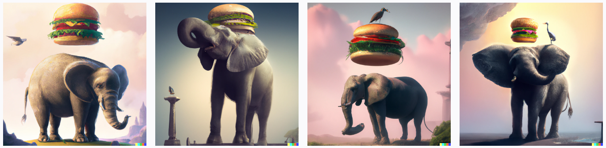
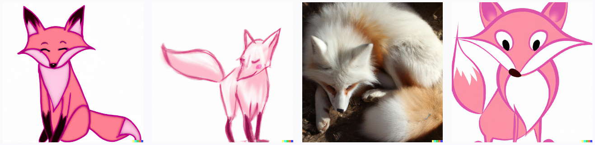
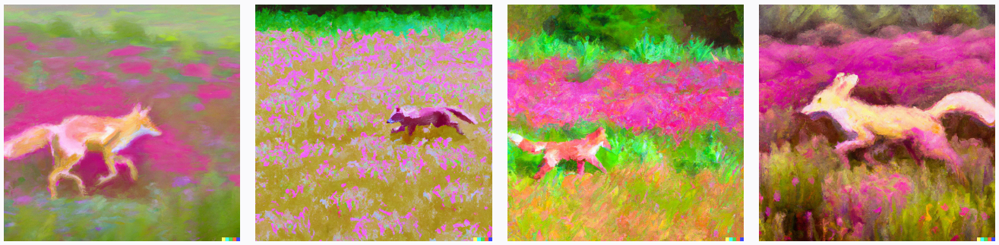
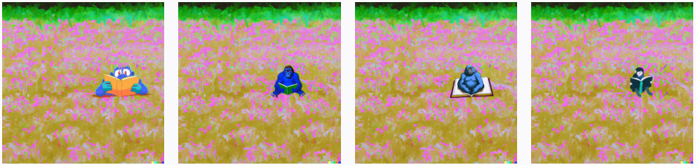
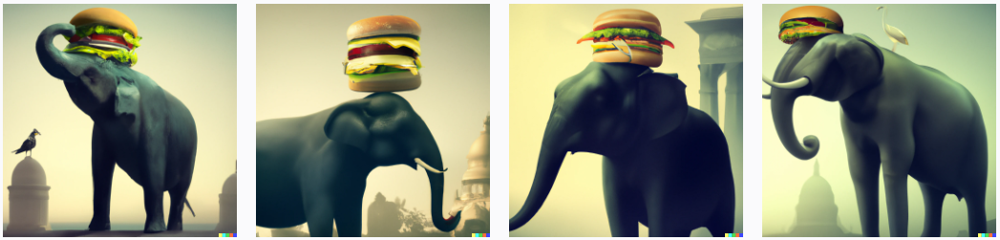

Image generation models can take a prompt, a base image, or both, and create something new. These generative AI models can create both realistic and artistic images, change the layout or style of an image, and create variations on a provided image.

## DALL-E

In addition to natural language capabilities, generative AI models can edit and create images. The model that works with images is called DALL-E. Much like GPT models, subsequent versions of DALL-E are appended onto the name, such as DALL-E 2. Image capabilities generally fall into the three categories of image creation, editing an image, and creating variations of an image. 

## Image generation

Original images can be generated by providing a text prompt of what you would like the image to be of. The more detailed the prompt, the more likely the model will provide a desired result.

With DALL-E, you can even request an image in a particular style, such as "a dog in the style of Vincent van Gogh". Styles can be used for edits and variations as well.

For example, given the prompt "an elephant standing with a burger on top, style digital art", the model generates digital art images depicting exactly what is asked for.

When asked for something more generic like "a pink fox", the images generated are more varied and simpler while still fulfilling what is asked for.

However when we make the prompt more specific, such as "a pink fox running through a field, in the style of Monet", the model creates much more similar detailed images.

## Editing an image

When provided an image, DALL-E can edit the image as requested by changing its style, adding or removing items, or generating new content to add. Edits are made by uploading the original image and specifying a transparent mask that indicates what area of the image to edit. Along with the image and mask, a prompt indicating what is to be edited instructs the model to then generate the appropriate content to fill the area.

When given one of the above images of a pink fox, a mask covering the fox, and the prompt of "blue gorilla reading a book in a field", the model creates edits of the image based on the provided input.

## Image variations

Image variations can be created by providing an image and specifying how many variations of the image you would like. The general content of the image will stay the same, but aspects will be adjusted such as where subjects are located or looking, background scene, and colors may change.

For example, if I upload one of the images of the elephant wearing a burger as a hat, I get variations of the same subject.

>[!NOTE]
>Access to DALL-E is currently granted on an invite basis only.
