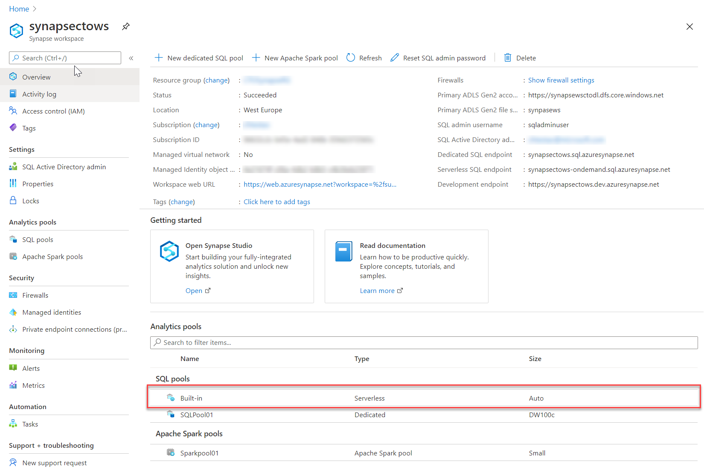

Azure Synapse Analytics is an integrated analytics service that accelerates time to insight across data warehouses and big data analytics systems. At its core, Azure Synapse brings together the best of SQL technologies used in enterprise data warehousing, Spark technologies used for big data, and Pipelines for data integration with extract, transform and load or extract, load, and transform (ETL/ELT) frameworks. Azure Synapse Analytics has a web-based studio that provides a single place for management, monitoring, coding, and security. Azure Synapse Analytics features deep integration with other Azure services such as Power BI, CosmosDB, and AzureML.

Azure Synapse SQL is a distributed query system that enables enterprises to implement data warehousing and data virtualization scenarios using standard T-SQL experiences familiar to data engineers. It also expands the capabilities of SQL to address streaming and machine learning scenarios.

Azure Synapse SQL offers both serverless and dedicated resource models, offering consumption and billing options to fit your needs. 

Every Azure Synapse Analytics workspace comes with built-in serverless SQL pool that you can use to query data in the lake.

Serverless SQL pool provides a pay per query endpoint to query the data in your data lake. It enables you to access your data through the following functionalities:

- A familiar T-SQL syntax to query data in place without the need to copy or load data into a specialized store.
- Integrated connectivity via the T-SQL interface that offers a wide range of business intelligence and ad-hoc querying tools, including the most popular drivers.

Serverless SQL pool is a distributed data processing system, built for large-scale data, and computational functions. It enables you to analyze your Big Data in seconds to minutes, depending on the workload. Thanks to built-in query execution fault-tolerance, the system provides high reliability and success rates even for long-running queries involving large data sets.

With serverless SQL pool, there's no infrastructure to setup or clusters to maintain. A built-in endpoint for this service is provided within every Azure Synapse workspace, so you can start querying data as soon as the workspace is created.

There is no charge for resources reserved, you are only being charged for the data processed by queries you run, hence this model is a true pay-per-use model.
