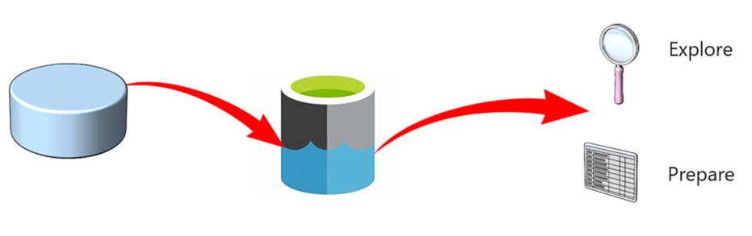
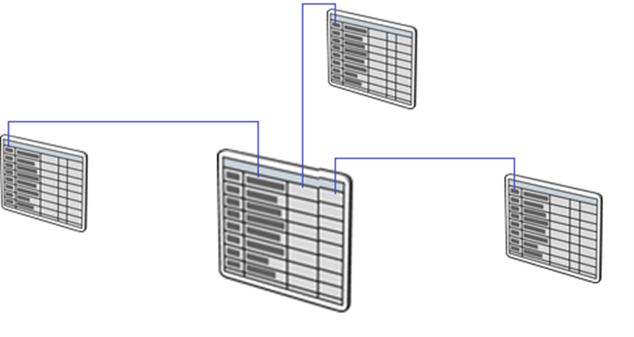

Serverless SQL pool acts and behaves like a regular SQL Server. So, all clients that can connect to SQL Server can connect to serverless SQL pool as well. This enables plethora of use cases. In general, serverless SQL pool is an analytics system and it’s not recommended to be used for OLTP type of workloads. Workloads that require millisecond response times and are looking to pinpoint a single row in a data set are not good fit for serverless SQL pool.

When it comes to analytics workloads, there are three major use cases:

## Data exploration 

Data exploration enables you to browse the data lake and get initial insights about the data, and is easily achievable with Azure Synapse Studio. Using this tool you can browse through the files, right click, and select TOP 100  rows just as you would do with a table in SQL Server. Once you are familiar with a data set, you can apply projections, filtering, grouping, and most of the operation over the data as if the data were in a regular SQL Server table.

## Data transformation 

Azure Synapse Analytics provides great data transformations capabilities with Synapse Spark, however if you are skilled in SQL you might find data transformation easier to achieve. Serverless SQL pool enables you to execute a SELECT statement over the data in the lake and store the results back to the data lake in a specified format.

## Logical data warehouse

Once you are familiar with the data you are interested in, you can start creating objects (such as VIEWs and External Tables) that provide you with a SQL metadata layer over the data in the lake. Once these objects are created, any tool that can connect to serverless SQL pool will see these objects as regular SQL Server objects. Clients don’t even know that the underlying data is in the data lake. This makes serverless SQL pool a powerful lightweight layer between the data lake and a client.   Given that serverless SQL pool heavily relies on SQL Server, huge number of clients is supported. You can connect from BI tools like Power BI or Azure Analysis Service, from integration tools like Synapse Pipelines or Azure Data Factory, but also you can programmatically connect using any of the popular languages like C# or Python.

