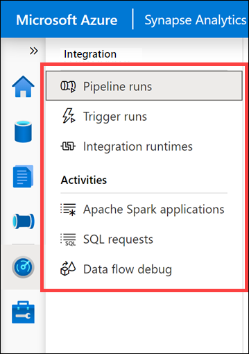
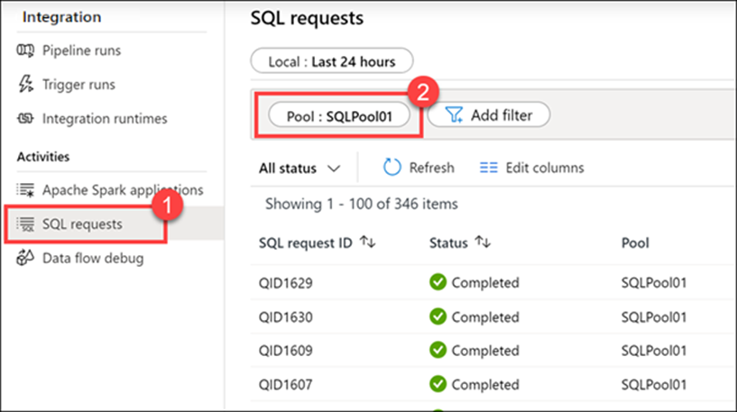
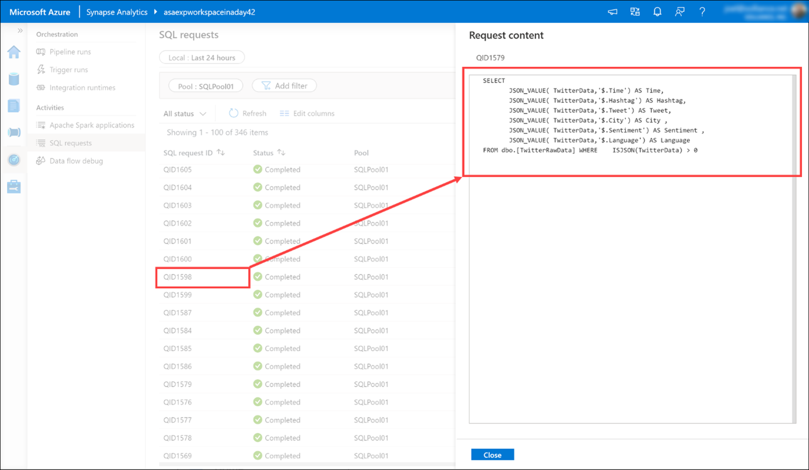

Use the Monitor hub to view pipeline and trigger runs, view the status of the various integration runtimes that are running, view Apache Spark jobs, SQL requests, and data flow debug activities.

1.	Select the **Monitor** hub.
 
    > [!div class="mx-imgBorder"]
    > 

    The Monitor hub is your first stop for debugging issues and gaining insight on resource usage. You can see a history of all the activities taking place in the workspace and which ones are active now.

2.	Show each of the monitoring categories grouped under Integration and Activities.

    

    - **Pipeline runs** shows all pipeline run activities. You can view the run details, including inputs and outputs for the activities, and any error messages that occurred. You can also come here to stop a pipeline, if needed.
    - **Trigger runs** shows you all pipeline runs caused by automated triggers. You can create triggers that run on a recurring schedule or tumbling window. You can also create event-based triggers that execute a pipeline any time a blob is created or deleted in a storage container.
    - **Integration runtimes** shows the status of all self-hosted and Azure integration runtimes.
    - **Apache Spark applications** shows all the Spark applications that are running or have run in your workspace.
    - **SQL requests** shows all SQL scripts executed either directly by you or another user, or executed in other ways, like from a pipeline run.
    - **Data flow debug** shows active and previous debug sessions. When you author a data flow, you can enable the debugger and execute the data flow without needing to add it to a pipeline and trigger an execute. Using the debugger speeds up and simplifies the development process. Since the debugger requires an active Spark cluster, it can take a few minutes after you enable the debugger before you can use it.

3.	Select **SQL requests (1)**, then switch to the **SQLPool01 (2)** pool to see the list of SQL requests.
 
    

4.	Hover over a SQL request, then select the **Request content** icon to view the SQL request that was sent to the SQL pool. You may need to try a few before you find one with interesting content.
 
    
 
5.  You can view more details. 

    
