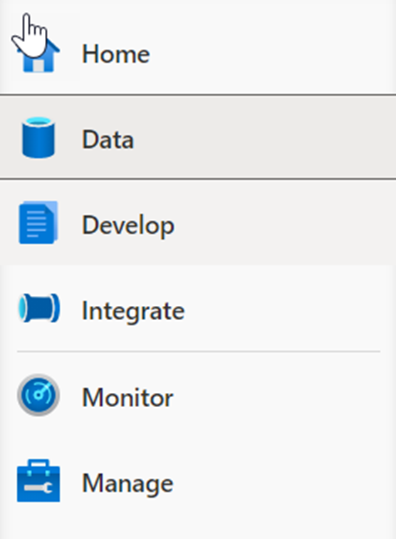
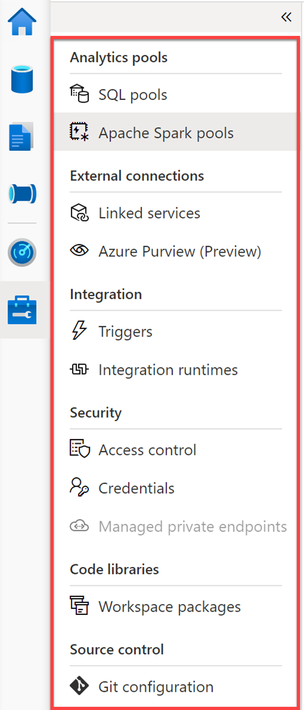

The Manage hub enables you to perform some of the same actions we saw in the Azure portal, such as managing SQL and Spark pools. However, there is a lot more you can do in this hub that you cannot do anywhere else, such as managing Linked Services and integration runtimes, and creating pipeline triggers.

1.	Select the Manage hub.
 
    > [!div class="mx-imgBorder"]
    > 

2.	Show each of the management categories grouped under Analytics pools, External connections, Integration, and Security.
 
    

    - **SQL pools**. Lists the provisioned SQL pools and on-demand SQL serverless pools for the workspace. You can add new pools or hover over a SQL pool to **pause** or **scale** it. You should pause a SQL pool when it's not being used to save costs.
    - **Apache Spark pools**. Lets you manage your Spark pools by configuring the auto-pause and auto-scale settings. You can provision a new Apache Spark pool from this blade.
    - **Linked services**. Enables you to manage connections to external resources. Here you can see linked services for our data lake storage account, Azure Key Vault, Power BI, and Synapse Analytics. **Task**: Select **+ New** to show how many types of linked services you can add.
    - **Triggers**. Provides you a central location to create or remove pipeline triggers. Alternatively, you can add triggers from the pipeline.
    - **Integration runtimes**. Lists the IR for the workspace, which serves as the compute infrastructure for data integration capabilities, like those provided by pipelines. **Task**: Hover over the integration runtimes to show the monitoring, code, and delete (if applicable) links. Click on a **code link** to show how you can modify the parameters in JSON format, including the TTL (time to live) setting for the IR.
    - **Access control**. This is where you go to add and remove users to one of three security groups: workspace admin, SQL admin, and Apache Spark for Azure Synapse Analytics admin.
    - **Managed private endpoints**. This is where you manage private endpoints, which use a private IP address from within a virtual network to connect to an Azure service or your own private link service. Connections using private endpoints listed here provide access to Synapse workspace endpoints (SQL, SqlOndemand and Dev).
