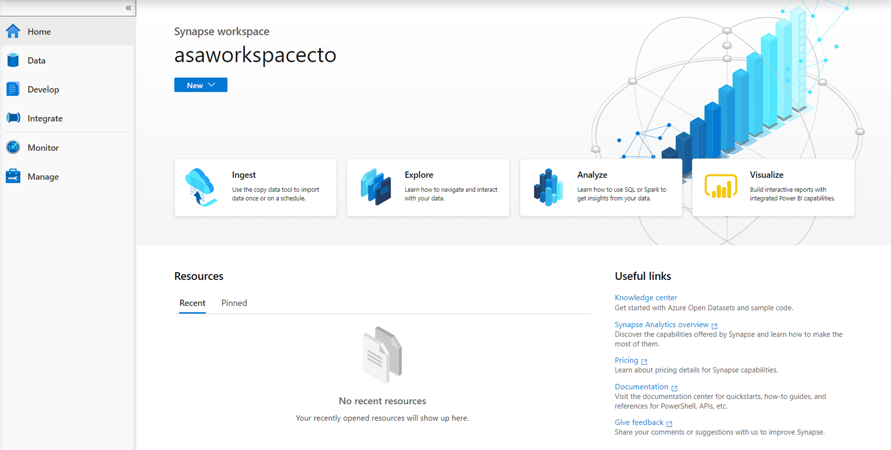

Azure Synapse Studio is the primary tool to use to interact with the many components that exist in the service. It organizes itself into hubs, as seen on the left-hand side of the Azure Synapse Studio UI, which allows you to perform a wide range of activities against your data.
 
> [!div class="mx-imgBorder"]
> 

The following hubs are available within Azure Synapse Studio.

## Home

The home hub contains short cuts that enable you to ingest, explore, analyze, and visualize your data. These provide shortcuts to tools such as the Copy Data Tool for ingesting data, to connecting to a Power BI workspace for visualization. You will also find links to resources that such as the documentation and pricing page. It will also list any resources you recently accessed, or pinned as favorite.

## Data

The data hub can be accessed by either clicking on the Explore link in the home hub, or by selecting data on the left of the application. In this hub, you can access your provisioned SQL pool databases and SQL serverless databases in your workspace, as well as external data sources, such as storage accounts and other linked services. You also can preview data tables and data files.

## Develop

The Develop hub is where you manage SQL scripts, Synapse notebooks, data flows, and Power BI reports. It can also be accessed by clicking on the Analyze icon in the home page.

## Integrate

Manage data integration pipelines within the Integrate hub. If you are familiar with Azure Data Factory, then you will feel at home in this hub. The pipeline creation experience is the same as in Azure Data Factory, which gives you another powerful integration built into Synapse Analytics, removing the need to use Azure Data Factory separately for data movement and transformation pipelines.

## Monitor

Use the Monitor hub to view pipeline and trigger runs, view the status of the various integration runtimes that are running, view Apache Spark jobs, SQL requests, and data flow debug activities. If you want to see the status of a job or activity, this is where you want to go.

The Monitor hub is your first stop for debugging issues and gaining insight on resource usage. You can see a history of all the activities taking place in the workspace and which ones are active now.

## Manage
The Manage hub enables you to perform some of the same actions we saw in the Azure portal, such as managing SQL and Spark pools. However, there is a lot more you can do in this hub that you cannot do anywhere else, such as managing Linked Services and integration runtimes, and creating pipeline triggers.
