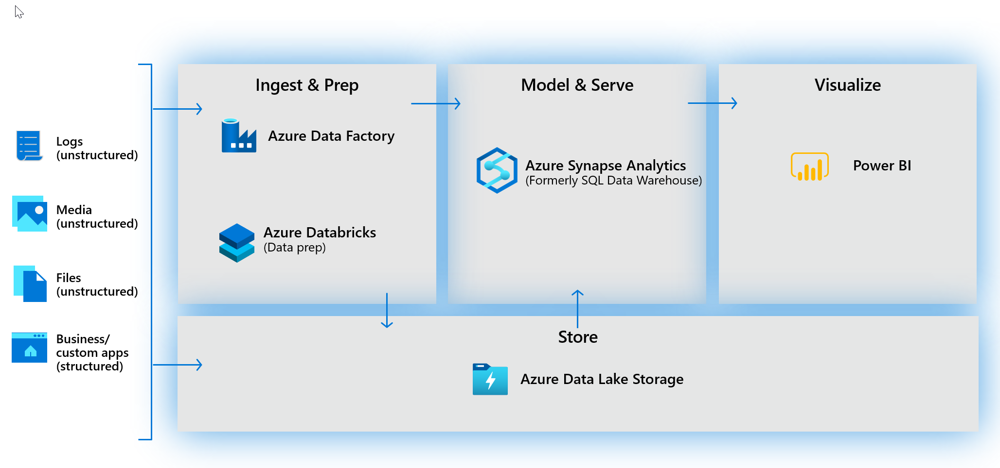

When thinking about usage patterns that customers are using today to maximize the value of their data, a modern data warehouse lets you bring together all your data at scale easily, so you get to the insights through analytics dashboards, operational reporting, or advanced analytics for your users.

The process of building a modern data warehouse typically consists of:

-	Data Ingestion and Preparation.
-	Making the data ready for consumption by analytical tools.
-	Providing access to the data, in a shaped format so that it can easily be consumed by data visualization tools. 

Prior to the release of Azure Synapse Analytics, this would be achieved in the following way.

## Data ingestion and preparation

At the foundation, customers build a data lake to store all their data and different data types with Azure Data Lake Store Gen2. 

To ingest data, customers can do so code-free with over 100 data integration connectors with Azure Data Factory. Data Factory empowers customers to do code-free ETL/ELT, including preparation and transformation. 

And while a lot of our customers are currently heavily invested in the SQL Server Integration Services packages (SSIS), they created, they can leverage these without having to rewrite those packages in Azure Data Factory.

Whether the data is an on-premises data sources, other Azure services, or other cloud services, customers can seamlessly author, monitor, and manage their big data pipelines with a visual environment that is easy to use. 

Another option for data preparation is Azure Databricks - to shape the data formats and prep it using a Notebook—making internal collaboration on data more streamlined and efficient. 
 
> [!div class="mx-imgBorder"]
> 

## Making the data ready for consumption by analytical tools

At the heart of a modern data warehouse, and cloud scale analytical solution was Azure Synapse Analytics (Formerly SQL Data Warehouse).  This implemented a Massively Parallel Processing that brings together enterprise data warehousing and Big Data analytics. 

## Providing access to the data, that it can easily be consumed by data visualization tools 

Power BI enables customers to build visualizations on massive amounts of data and ensure that data insights are available to everyone across their organization. 

Power BI supports an enormous set of data sources, which can be queried live, or be used to model and ingest, for detailed analysis and visualization. 

Brought together with AI capabilities, it’s a powerful tool to build and deploy dashboards in the enterprise, through rich visualizations, and features like natural language querying. 

With the release of Azure Synapse Analytics, you have a choice. You can either use Azure Synapse exclusively, which works very well for green field projects, but for organizations with existing investments in Azure with Azure Data Factory, Azure Databricks and Power BI, you can take a hybrid approach and combine them with Azure Synapse Analytics.
 
> [!div class="mx-imgBorder"]
> 
