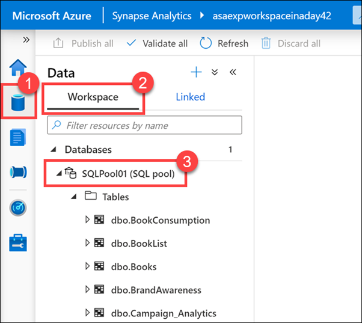
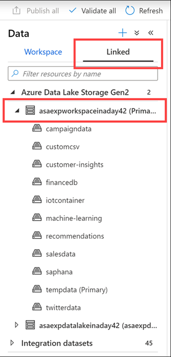
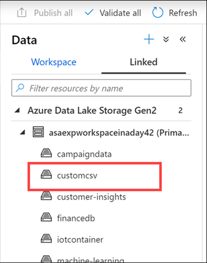
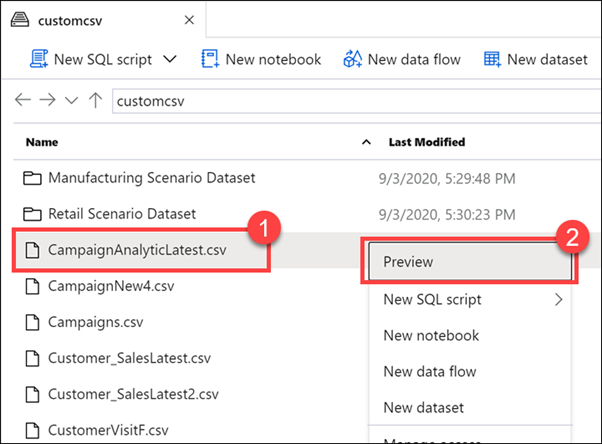
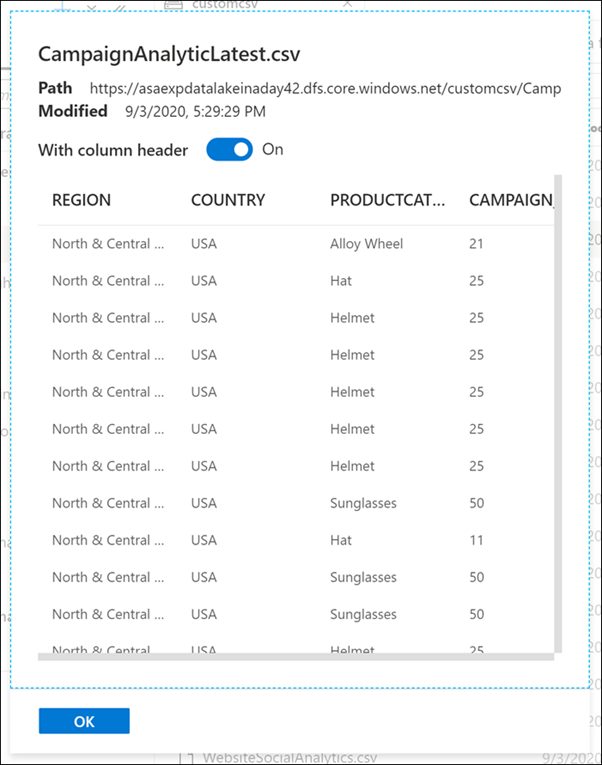

The data hub provides you with the ability to interact and explore with source data, and linked services as shown in the following steps.

1.	On the left-hand side of Azure Synapse Studio, click the **Data** hub.
 
    > [!div class="mx-imgBorder"]
    > 

    The Data hub is where you access your provisioned SQL pool databases and SQL serverless databases in your workspace, as well as external data sources, such as storage accounts and other linked services.

2.	Under the **Workspace (2)** tab of the **Data hub (1)**, expand the **SQLPool01 (3)** SQL pool underneath **Databases**.
 
    

3.	Expand **Tables** and **Programmability/Stored procedures**.

    The **tables** listed under the SQL pool store data from multiple sources, such as SAP Hana, Twitter, Azure SQL Database, and external files copied over from an orchestration pipeline. Synapse Analytics gives us the ability to combine these data sources for analytics and reporting, all in one location.

    You will also see familiar database components, such as **stored procedures**. You can execute the stored procedures using T-SQL scripts, or execute them as part of an orchestration pipeline.

4.	Select the **Linked** tab, expand the **Azure Data Lake Storage Gen2** group, then expand the **primary storage** for the workspace.
 
    > [!div class="mx-imgBorder"]
    > 

    Every Synapse workspace has a primary ADLS Gen2 account associated with it. This serves as the **data lake**, which is a great place to store flat files, such as files copied over from on-premises data stores, exported data or data copied directly from external services and applications, telemetry data, etc. Everything is in one place.

    In our example, we have several containers that hold files and folders that we can explore and use from within our workspace. Here you can see marketing campaign data, CSV files, finance information imported from an external database, machine learning assets, IoT device telemetry, SAP Hana data, and tweets, just to name a few.

    Now that we have all this data in once place, we can start previewing some of it right here, right now.

    Let's look at Campaign data.

5.	Select the **customcsv** storage container.
 
    

    Let’s preview Campaign data to understand new campaign names.

6.	Right-click on the **CampaignAnalyticsLatest.csv** file **(1)**, then select **Preview (2)**.
 
    

    The file explorer capabilities allow you to quickly find files and perform actions on them, like preview file contents, generate new SQL scripts or notebooks to access the file, create a new data flow or dataset, and manage the file.
 
    
