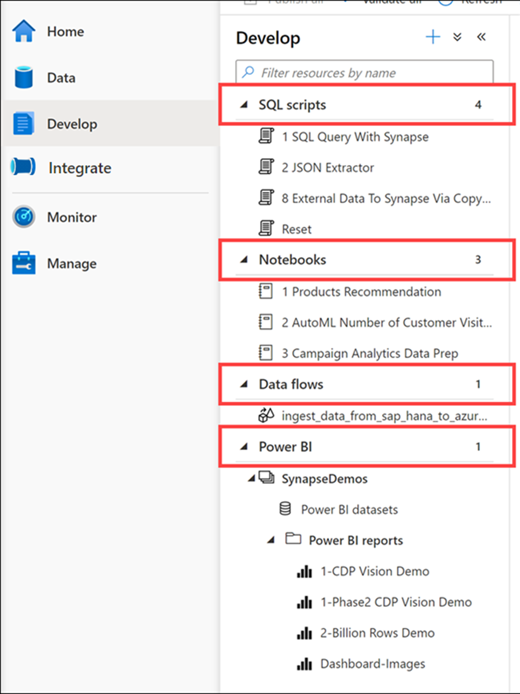

The Develop hub is where you manage SQL scripts, Synapse notebooks, data flows, and Power BI reports. 

1.	Select the **Develop** hub.
 
    > [!div class="mx-imgBorder"]
    > 

    The Develop hub is where you manage SQL scripts, Synapse notebooks, data flows, and Power BI reports.

1.	Expand each of the groups under the Develop menu.
 
    > [!div class="mx-imgBorder"]
    > 

    The Develop hub in our sample environment contains examples of the following artifacts:

    - **SQL scripts** contains T-SQL scripts that you publish to your workspace. Within the scripts, you can execute commands against any of the provisioned SQL pools or on-demand SQL serverless pools to which you have access.
    - **Notebooks** contains Synapse Spark notebooks used for data engineering and data science tasks. When you execute a notebook, you select a Spark pool as its compute target.
    - **Data flows** are powerful data transformation workflows that use the power of Apache Spark but are authored using a code-free GUI.
    - **Power BI** reports can be embedded here, giving you access to the advanced visualizations they provide without ever leaving the Synapse workspace.
