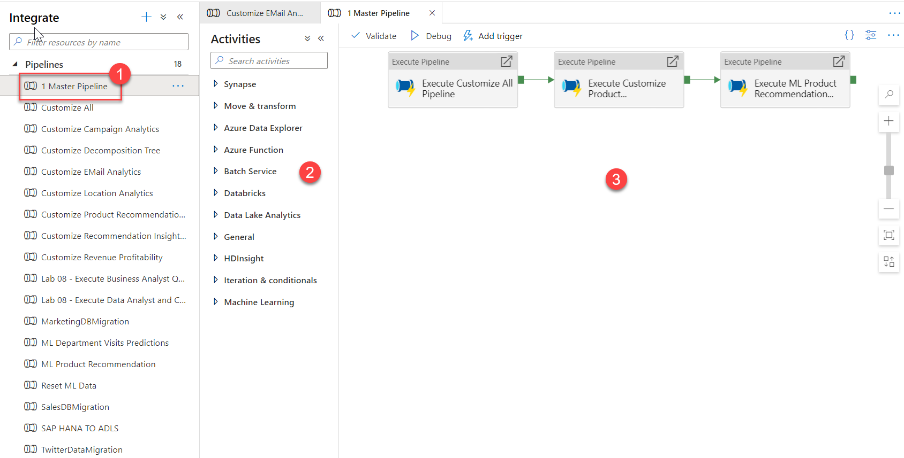

Manage data integration pipelines within the Integrate hub.

1.	Select the **Integrate** hub.
 
    > [!div class="mx-imgBorder"]
    > 

    Manage integration pipelines within the Integrate hub. If you are familiar with Azure Data Factory, then you will feel at home in this hub. The pipeline creation experience is the same as in ADF, which gives you another powerful integration built into Synapse Analytics, removing the need to use Azure Data Factory for data movement and transformation pipelines.

2.	Expand Pipelines and select **1 Master Pipeline (1)**. Point out the **Activities (2)** that can be added to the pipeline, and show the **pipeline canvas (3)** on the right.
 
    > [!div class="mx-imgBorder"]
    > 

    This Synapse workspace contains 16 pipelines that enable us to orchestrate data movement and transformation steps over data from several sources.

    The **Activities** list contains many activities that you can drag and drop onto the pipeline canvas on the right.

    Expand a few activity categories to show what's available, such as Notebook, Spark, and SQL pool stored procedure activities under Synapse.
