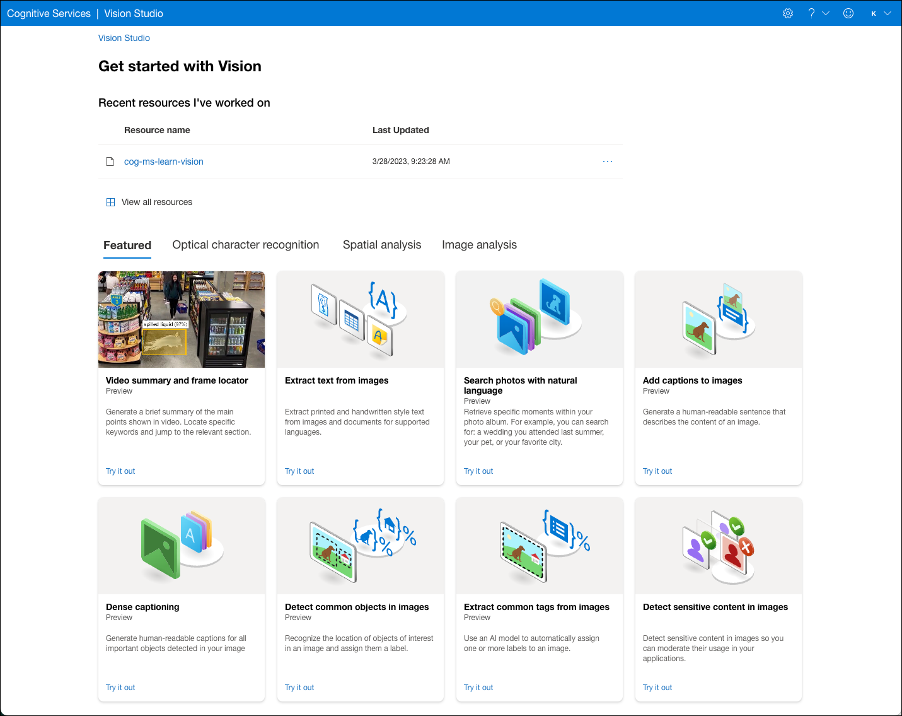

## What is Vision Studio?

Vision Studio is Azure Computer Vision's newest tool, which provides a unified portal experience for exploring, building, and integrating functionality from Image Analysis 4.0 using a set of UI-based components. The platform features a host of demo experiences accessible from a web browser. It allows developers to explore and interact with existing Vision capabilities to understand how specific operations work.

Using Studio, you can experiment with the services and learn what they offer without writing any code. To use [Vision Studio](https://portal.vision.cognitive.azure.com/), you need an Azure subscription for authentication and a Cognitive Services resource to begin.

## Try-it-out experiences

Vision Studio provides access to many try-it-out experiences for the different capabilities available through Vision and Image Analysis 4.0. These experiences use prebuilt, pre-configured models for performing various computer vision tasks. The try-it-out experiences allow you to upload images and receive JSON and text responses, helping you test the features and observe return values quickly using a no-code approach.

Demo experiences are provided for the following capabilities, broken down by category:

**Optical character recognition**:

- _Extract text from images_: Extract printed and handwritten text from images and documents

**Spatial analysis**:

- _Video summary and frame locator_: Generate a summary of the main points shown in a video, locate specific keywords, and jump to the relevant section of the video
- Count people in an area: Analyze real-time video to count the number of people in a designated zone
- Detect when people cross a line: Analyze real-time streaming video to detect when a person crosses a line
- Detect when people enter/exit a zone: Analyze real-time streaming video to detect when a person enters or exits an area
- Monitor social distancing: Analyze real-time streaming video to determine if people violate a distance rule

**Image analysis**:

- Search photos with natural language: Retrieve specific moments within a photo album based on vectorized text and image queries
- Add captions to images: Generate human-readable English sentences that describe the content of an image
- Dense captioning: Generate human-readable English phrases for all important objects within an image
- Detect common objects in images: Recognize objects of interested in an image and record their location using bounding boxes
- Extract common tags from images: Automatically assign one or more labels to an image based on its content
- Detect sensitive content in images: Moderate usage of images by detecting sensitive content
