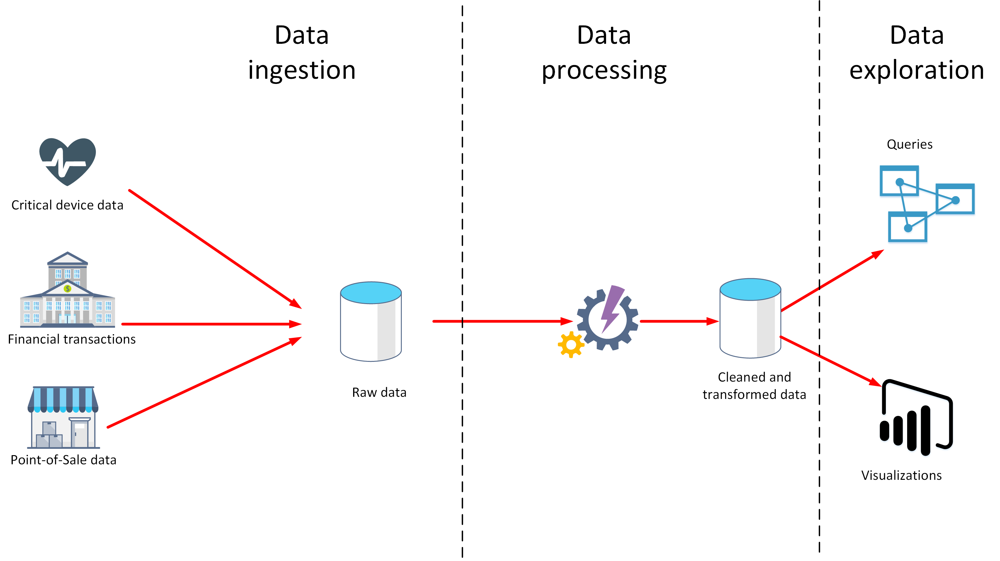
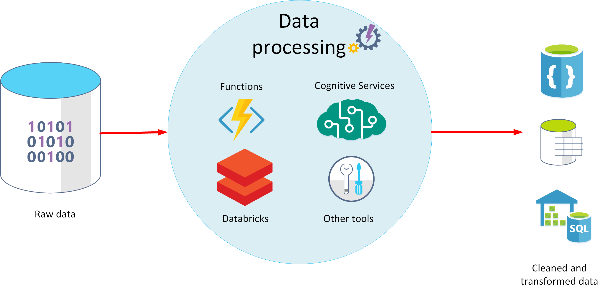
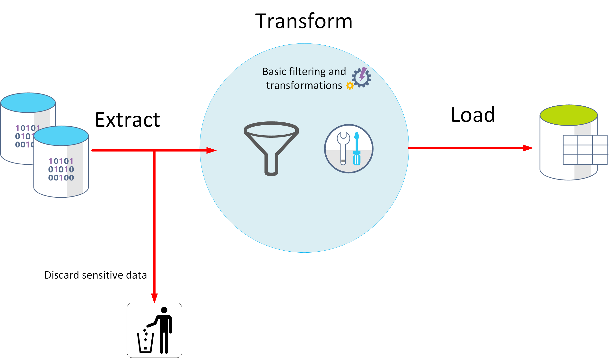
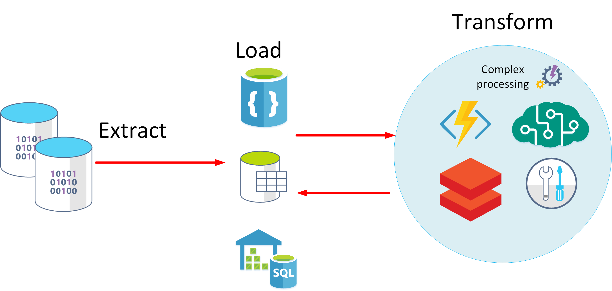

Data analytics is concerned with taking data and finding meaningful information and inferences from it. This could be as wide ranging as selecting the ideal range of products for a retailer, or selecting the best vaccine candidates for a biotechnology company.

For example, in a company data analytics could be concerned with taking the data that your organization produces, and using it to establish a picture of how your organization is performing, and what you can do to maintain business performance. Data analytics could help you to identify strengths and weaknesses in your organization, and enable you to make appropriate business decisions.

The data a company uses can come from many sources. There could be a mass of historical data to comb through, and fresh data continuing to arrive all the time. This data could be the result of customer purchases, bank transactions, stock price movements, real-time weather data, monitoring devices, or even cameras. In a data analytics solution, you combine this data and construct a data warehouse that you can use to ask (and answer) questions about your business operations. Building a data warehouse requires that you can capture the data that you need and *wrangle* it into an appropriate format. You can then use analysis tools and visualizations to examine the information, and identity trends and their causes.

> [!NOTE]
> *Wrangling* is the process by which you transform and map raw data into a more useful format for analysis. It can involve writing code to capture, filter, clean, combine, and aggregate data from many sources.

In this unit, you'll learn about two important stages in data analytics: data ingestion, and data processing. The diagram below shows how these stages fit together. 

> [!div class="mx-imgBorder"]
> 

## What is data ingestion?

Data ingestion is the process of obtaining and importing data for immediate use or storage in a database. The data can arrive as a continuous stream, or it may come in batches, depending on the source. The purpose of the ingestion process is to capture this data and store it. This raw data can be held in a repository such as a database management system, a set of files, or some other type of fast, easily accessible storage.

The ingestion process might also perform filtering. For example, ingestion might reject suspicious, corrupt, or duplicated data. Suspicious data might be data arriving from an unexpected source. Corrupt or duplicated data could be due to a device error, transmission failure, or tampering.

It may also be possible to perform some transformations at this stage, converting data into a standard form for later processing. For example, you might want to reformat all date and time data to use the same date and time representations, and convert all measurement data to use the same units. However, these transformations must be quick to perform. Don't attempt to run any complex calculations or aggregations on the data at this stage.

## What is data processing?

The data processing stage occurs after the data has been ingested and collected. 
Data processing takes the data in its raw form, cleans it, and converts it into a more meaningful format (tables, graphs, documents, and so on). The result is a database of data that you can use to perform queries and generate visualizations, giving it the form and context necessary to be interpreted by computers and used by employees throughout an organization.

> [!NOTE]
> Data cleaning is a generalized term that encompasses a range of actions, such as removing anomalies, and applying filters and transformations that would be too time-consuming to run during the ingestion stage.

The aim of data processing is to convert the raw data into one or more business models. A business model describes the data in terms of meaningful business entities, and may aggregate items together and summarize information. The data processing stage could also generate predictive or other analytical models from the data. Data processing can be complex, and may involve automated scripts, and tools such as Azure Databricks, Azure Functions, and Azure Cognitive Services to examine and reformat the data, and generate models. A data analyst could use machine learning to help determine future trends based on these models.

> [!div class="mx-imgBorder"]
> 

## What is ELT and ETL?

The data processing mechanism can take two approaches to retrieving the ingested data, processing this data to transform it and generate models, and then saving the transformed data and models. These approaches are known as ETL and ELT.

ETL stands for *Extract, Transform, and Load*. The raw data is retrieved and transformed before being saved. The extract, transform, and load steps can be performed as a continuous pipeline of operations. It is suitable for systems that only require simple models, with little dependency between items. For example, this type of process is often used for basic data cleaning tasks, deduplicating data, and reformatting the contents of individual fields.

> [!div class="mx-imgBorder"]
> 

An alternative approach is *ELT*. ELT is an abbreviation of *Extract, Load, and Transform*. The process differs from ETL in that the data is stored before being transformed. The data processing engine can take an iterative approach, retrieving and processing the data from storage, before writing the transformed data and models back to storage. ELT is more suitable for constructing complex models that depend on multiple items in the database, often using periodic batch processing.

> [!div class="mx-imgBorder"]
> 

ELT is a scalable approach that is suitable for the cloud because it can make use of the extensive processing power available. The more stream-oriented approach of ETL places more emphasis on throughput. However, ETL can filter data before it's stored. In this way, ETL can help with data privacy and compliance, removing sensitive data before it arrives in your analytical data models.

Azure provides several options that you can use to implement the ELT and ETL approaches. For example, if you are storing data in Azure SQL Database, you can use SQL Server Integration Services. Integration Services can extract and transform data from a wide variety of sources such as XML data files, flat files, and relational data sources, and then load the data into one or more destinations.

This is a simple table showing the advantages of ETL and ELT in most cases.

:::image type="content" source="../media/2-etl-vs-elt.png" alt-text="ETL versus ELT":::

Another more generalized approach is to use Azure Data Factory. Azure Data Factory is a cloud-based data integration service that allows you to create data-driven workflows for orchestrating data movement and transforming data at scale. Using Azure Data Factory, you can create and schedule data-driven workflows (called pipelines) that can ingest data from disparate data stores. You can build complex ETL processes that transform data visually with data flows, or by using compute services such as *Azure HDInsight Hadoop*, *Azure Databricks*, and *Azure SQL Database*.