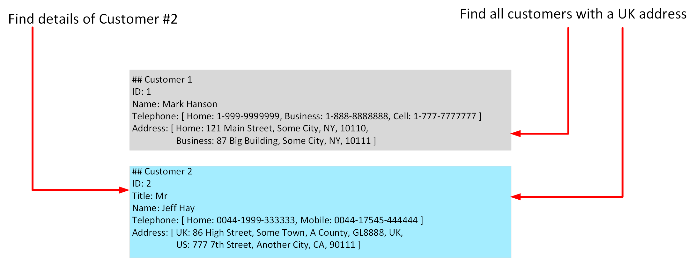

Relational databases are an excellent tool for storing and retrieving data that has a well-known structure, containing fields that you can define in advance. In some situations, you might not have the required knowledge of the structure of your data, in advance of it arriving in your database, to record it as a neat set of rows and columns in a tabular format. This is a common scenario in systems that consume data from a wide variety of sources, such as data ingestion pipelines. In these situations, a non-relational database can prove extremely useful.

In this unit, you'll look in more detail at the common characteristics of non-relational databases. You'll learn how they enable you to capture data quickly, and model data that can vary in structure.

## What are the characteristics of non-relational data?

You use a database to model some aspect of the real-world. Entities in the real-world often have highly variable structures. For example, in an ecommerce database that stores information about customers, how many telephone numbers does a customer have? A customer might have a landline and a mobile number, but some customers might have a business number, an additional home number, and maybe several mobile numbers. Similarly, the addresses of customers might not always follow the same format; addresses for customers in different states and regions might contain different elements, such as zip codes or postal codes.

In another scenario, if you are ingesting data rapidly, you want to capture the data and save it very quickly. Processing the data and manipulating it into a set of rows in different tables in a relational database might not be appropriate at this point; you can perform these tasks at a later date. At the time of ingestion, you simply need to store the data in its original state and format.

A key aspect of non-relational databases is that they enable you to store data in a very flexible manner. Non-relational databases don't impose a schema on data. Instead, they focus on the data itself rather than how to structure it. This approach means that you can store information in a natural format, that mirrors the way in which you would consume, query and use it.

In a non-relational system, you store the information for entities in collections or containers rather than relational tables. Two entities in the same collection can have a different set of fields rather than a regular set of columns found in a relational table. The lack of a fixed schema means that each entity must be self-describing. Often this is achieved by labeling each field with the name of the data that it represents. For example, a non-relational collection of customer entities might look like this:

```text
## Customer 1
ID: 1
Name: Mark Hanson
Telephone: [ Home: 1-999-9999999, Business: 1-888-8888888, Cell: 1-777-7777777 ]
Address: [ Home: 121 Main Street, Some City, NY, 10110,
           Business: 87 Big Building, Some City, NY, 10111 ] 

## Customer 2
ID: 2
Title: Mr
Name: Jeff Hay
Telephone: [ Home: 0044-1999-333333, Mobile: 0044-17545-444444 ]
Address: [ UK: 86 High Street, Some Town, A County, GL8888, UK,
           US: 777 7th Street, Another City, CA, 90111 ] 
```

In this example, fields are prefixed with a name. Fields might also have multiple subfields, also with names. In the example, multiple subfields are denoted by enclosing them between square brackets.

Adding a new customer is a matter of inserting an entity with its fields labeled in a meaningful way. An application that queries this data must be prepared to parse the information in the entity that it retrieves. 

The data retrieval capabilities of a non-relational database can vary. Each entity should have a unique key value. The entities in a collection are usually stored in key-value order. In the example above, the unique key is the ID field. The simplest type of non-relational database enables an application to either specify the unique key, or a range of keys as query criteria. In the customers example, the database would enable an application to query customers by ID only. Filtering data on other fields would require scanning the entire collection of entities, parsing each entity in turn, and then applying any query criteria to each entity to find any matches. In the example below, a query that fetches the details of a customer by ID can quickly identify which entity to retrieve. A query that attempts to find all customers with a UK address would have to iterate through every entity, and for each entity examine each field in turn. If the database contains many millions of entities, this query could take a considerable time to run.

> [!div class="mx-imgBorder"]
> 

More advanced non-relational systems support indexing, in a similar manner to an index in a relational database. Queries can then use the index to identify and fetch data based on non-key fields. Non-relational systems such as Azure Cosmos DB (a non-relational database management system available in Azure), support indexing even when the structure of the indexed data can vary from record to record. For more information, read [Indexing in Azure Cosmos DB - Overview](https://docs.microsoft.com/azure/cosmos-db/index-overview). 

When you design a non-relational database, it's important to understand the capabilities of the database management system and the types of query it will have to support. 

> [!NOTE]
> Non-relational databases often provide their own proprietary language for managing and querying data. This language may be procedural (follow a set of commands, in order), or it may be similar to SQL; it depends on how the database is implemented by the database management system.

## Identify non-relational database use cases

Non-relational databases are highly suitable for the following scenarios:

- *IoT and telematics*. These systems typically ingest large amounts of data in frequent bursts of activity. Non-relational databases can store this information very quickly. The data can then be used by analytics services such as Azure Machine Learning, Azure HDInsight, and Microsoft Power BI. Additionally, you can process the data in real-time using Azure Functions that are triggered as data arrives in the database.

- *Retail and marketing*. Microsoft uses CosmosDB for its own ecommerce platforms that run as part of Windows Store and Xbox Live. It's also used in the retail industry for storing catalog data and for event sourcing in order processing pipelines.

- *Gaming*. The database tier is a crucial component of gaming applications. Modern games perform graphical processing on mobile/console clients, but rely on the cloud to deliver customized and personalized content like in-game stats, social media integration, and high-score leaderboards. Games often require single-millisecond latencies for reads and write to provide an engaging in-game experience. A game database needs to be fast and be able to handle massive spikes in request rates during new game launches and feature updates.

- *Web and mobile applications*. A non-relational database such as Azure Cosmos DB is commonly used within web and mobile applications, and is well suited for modeling social interactions, integrating with third-party services, and for building rich personalized experiences. The Cosmos DB SDKs (software development kits) can be used to build rich iOS and Android applications using the popular Xamarin framework.

A relational database restructures the data into a fixed format that is designed to answer specific queries. When data needs to be ingested very quickly, or the query is unknown and unconstrained, a relational database can be less suitable than a non-relational database.
