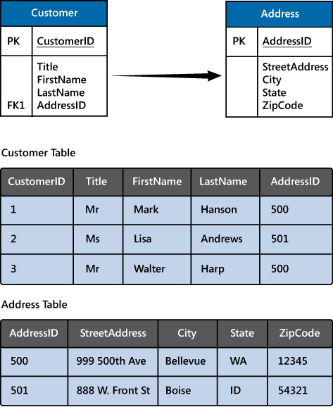
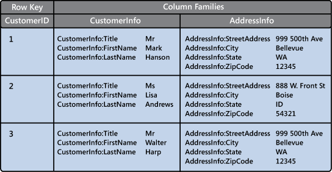
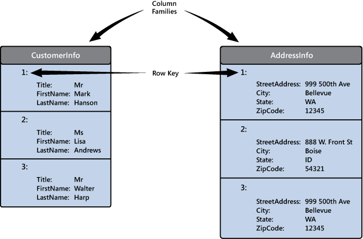

Non-relational data is an all-encompassing term that means *anything not structured as a set of tables*. There are many different types of non-structured data, and the information is used for a wide variety of purposes. Consequently, there are many different types of non-relational database management systems, each oriented towards a specific set of scenarios.

In this unit, you'll learn about some of the most common types of non-relational databases.

## What is NoSQL?

You might see the term *NoSQL* when reading about non-relational databases. NoSQL is a rather loose term that simply means non-relational. There's some debate about whether it's intended to imply *Not SQL*, or *Not Only SQL*; some non-relational databases support a version of SQL adapted for documents rather than tables (examples include Azure Cosmos DB).

NoSQL (non-relational) databases generally fall into four categories: key-value stores, document databases, column family databases, and graph databases. The following sections discuss these types of NoSQL databases.

## What is a key-value store?

A key-value store is the simplest (and often quickest) type of NoSQL database for inserting and querying data. Each data item in a key-value store has two elements, a key and a value. The key uniquely identifies the item, and the value holds the data for the item. The value is *opaque* to the database management system. Items are stored in key order. 

> [!NOTE]
> The term *opaque* means that the database management system just sees the value as an unstructured block. Only the application understands how the data in the value is structured and what fields it contains. The opposite of *opaque* is *transparent*. If the data is transparent, the database management system understands how the fields in the data are organized. A relational table is an example of a transparent structure.

> [!div class="mx-imgBorder"]
> 

A query specifies the keys to identify the items to be retrieved. You can't search on values. An application that retrieves data from a key-value store is responsible for parsing the contents of the values returned.

Write operations are restricted to inserts and deletes. If you need to update an item, you must retrieve the item, modify it in memory (in the application), and then write it back to the database, overwriting the original (effectively a delete and an insert).

The focus of a key-value store is the ability to read and write data very quickly. Search capabilities are secondary. A key-value store is an excellent choice for data ingestion, when a large volume of data arrives as a continual stream and must be stored immediately.

Azure Table storage is an example of a key-value store. Cosmos DB also implements a key-value store using the [**Table API**](https://docs.microsoft.com/azure/cosmos-db/table-introduction).

## What is a document database?

A document database represents the opposite end of the NoSQL spectrum from a key-value store. In a document database, each document has a unique ID, but the fields in the documents are transparent to the database management system. Document databases typically store data in JSON format, as described in the previous unit, or they could be encoded using other formats such as XML, YAML, JSON, BSON. Documents could even be stored as plain text. The fields in documents are exposed to the storage management system, enabling an application to query and filter data by using the values in these fields.

Typically, a document contains the entire data for an entity. What items constitute an entity are application-specific. For example, an entity could contain the details of a customer, an order, or a combination of both. A single document may contain information that would be spread across several relational tables in an RDBMS (relational database management system).

A document store does not require that all documents have the same structure. This free-form approach provides a great deal of flexibility. Applications can store different data in documents as business requirements change.

> [!div class="mx-imgBorder"]
> 

An application can retrieve documents by using the document key. The key is a unique identifier for the document. Some document databases create the document key automatically. Others enable you to specify an attribute of the document to use as the key. The application can also query documents based on the value of one or more fields. Some document databases support indexing to facilitate fast lookup of documents based on one or more indexed fields.

Some document database management systems support in-place updates, enabling an application to modify the values of specific fields in a document without rewriting the entire document. Other document database management systems (such as Cosmos DB) can only read and write entire documents. In these cases, an update replaces the entire document with a new version. This approach helps to reduce fragmentation in the database, which can, in turn, improve performance.

Most document databases will ingest large volumes of data more rapidly than a relational database, but aren't as optimal as a key-value store for this type of processing. The focus of a document database is its query capabilities.

Azure Cosmos DB implements a document database approach in its Core (SQL) API.

## What is a column family database?

A column family database organizes data into rows and columns. Examples of this structure include ORC and Parquet files, described in the previous unit. 

In its simplest form, a column family database can appear very similar to a relational database, at least conceptually. The real power of a column family database lies in its denormalized approach to structuring sparse data.

For example, if you need to store information about customers and their addresses in a relational database (ignoring the need to maintain historical data as described in the previous section), you might design a schema similar to that shown below. This diagram also shows some sample data. In this example, customer 1 and customer 3 share the same address, and the schema ensures that this address information is not duplicated. This is a standard way of implementing a one-to-many relationship.

> [!div class="mx-imgBorder"]
> 

The relational model supports a very generalized approach to implementing this type of relationship, but to find the address of any given customer an application needs to run a query that joins two tables. If this is the most common query performed by the application, then the overhead associated with performing this join operation can quickly become significant if there are a large number of requests and the tables themselves are large.

The purpose of a column family database is to efficiently handle situations such as this. You can think of a column family database as holding tabular data comprising rows and columns, but you can divide the columns into groups known as column-families. Each column family holds a set of columns that are logically related together. The image below shows one way of structuring the same information as the previous image, by using a column family database to group the data into two column-families holding the customer name and address information. Other ways of organizing the columns are possible, but you should implement your column-families to optimize the most common queries that your application performs. In this case, queries that retrieve the addresses of customers can fetch the data with fewer reads than would be required in the corresponding relational database; these queries can fetch the data directly from the **AddressInfo** column family.

> [!div class="mx-imgBorder"]
> 

The illustration above is conceptual rather than physical, and is intended to show the logical structure of the data rather than how it might be physically organized. Each row in a column family database contains a key, and you can fetch the data for a row by using this key. 

In most column family databases, the column-families are stored separately. In the previous example, the CustomerInfo column family might be held in one area of physical storage and the AddressInfo column family in another, in a simple form of vertical partitioning. You should really think of the structure in terms of column-families rather than rows. The data for a single entity that spans multiple column-families will have the same row key in each column family. As an alternative to the conceptual layout shown previously, you can visualize the data shown as the following pair of physical structures.

> [!div class="mx-imgBorder"]
> 

The most widely used column family database management system is Apache Cassandra. Azure Cosmos DB supports the column-family approach through the Cassandra API.

## What is a graph database?

Graph databases enable you to store entities, but the main focus is on the relationships that these entities have with each other. A graph database stores two types of information: nodes that you can think of as instances of entities, and edges, which specify the relationships between nodes. Nodes and edges can both have properties that provide information about that node or edge (like columns in a table). Additionally, edges can have a direction indicating the nature of the relationship.

The purpose of a graph database is to enable an application to efficiently perform queries that traverse the network of nodes and edges, and to analyze the relationships between entities. The image below shows an organization's personnel database structured as a graph. The entities are the employees and the departments in the organization, and the edges indicate reporting lines and the department in which employees work. In this graph, the arrows on the edges show the direction of the relationships.

> [!div class="mx-imgBorder"]
> 

A structure such as this makes it straightforward to conduct inquiries such as "Find all employees who directly or indirectly work for Sarah" or "Who works in the same department as John?" For large graphs with lots of entities and relationships, you can perform very complex analyses very quickly, and many graph databases provide a query language that you can use to traverse a network of relationships efficiently. You can often store the same information in a relational database, but the SQL required to query this information might require many expensive recursive join operations and nested subqueries.

Azure Cosmos DB supports graph databases using the [**Gremlin API**](https://docs.microsoft.com/azure/cosmos-db/graph-introduction). The Gremlin API is a standard language for creating and querying graphs.
