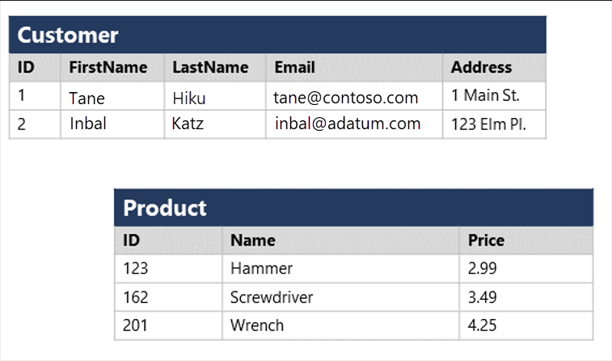

Data is a collection of facts such as numbers, descriptions, and observations used to record information. Data structures in which this data is organized often represents *entities* that are important to an organization (such as customers, products, sales orders, and so on). Each entity typically has one or more *attributes*, or characteristics (for example, a customer might have a name, an address, a phone number, and so on).

You can classify data as *structured*, *semi-structured*, or *unstructured*.

## Structured data

Structured data is data that adheres to a fixed *schema*, so all of the data has the same fields or properties. Most commonly, the schema for structured data entities is *tabular* - in other words, the data is represented in one or more tables that consist of rows to represent each instance of a data entity, and columns to represent attributes of the entity. For example, the following image shows tabular data representations for *Customer* and *Product* entities.

> [!div class="mx-imgBorder"]
> 

Structured data is often stored in a database in which multiple tables can reference one another by using key values in a *relational* model; which we'll explore in more depth later.

## Semi-structured data

*Semi-structured* data is information that has some structure, but which allows for some variation between entity instances. For example, while most customers may have an email address, some might have multiple email addresses, and some might have none at all.

One common format for semi-structured data is *JavaScript Object Notation* (JSON). The example below shows a pair of JSON documents that represent customer information. Each customer document includes address and contact information, but the specific fields vary between customers.

```json
// Customer 1
{
  "firstName": "Joe",
  "lastName": "Jones",
  "address":
  {
    "streetAddress": "1 Main St.",
    "city": "New York",
    "state": "NY",
    "postalCode": "10099"
  },
  "contact":
  [
    {
      "type": "home",
      "number": "555 123-1234"
    },
    {
      "type": "email",
      "address": "joe@litware.com"
    }
  ]
}

// Customer 2
{
  "firstName": "Samir",
  "lastName": "Nadoy",
  "address":
  {
    "streetAddress": "123 Elm Pl.",
    "unit": "500",
    "city": "Seattle",
    "state": "WA",
    "postalCode": "98999"
  },
  "contact":
  [
    {
      "type": "email",
      "address": "samir@northwind.com"
    }
  ]
}

```

> [!NOTE]
> JSON is just one of many ways in which semi-structured data can be represented. The point here is not to provide a detailed examination of JSON syntax, but rather to illustrate the flexible nature of semi-structured data representations.

## Unstructured data

Not all data is structured or even semi-structured. For example, documents, images, audio and video data, and binary files might not have a specific structure. This kind of data is referred to as *unstructured* data.

> [!div class="mx-imgBorder"]
> 

## Data stores

Organizations typically store data in structured, semi-structured, or unstructured format to record details of entities (for example, customers and products), specific events (such as sales transactions), or other information in documents, images, and other formats. The stored data can then be retrieved for analysis and reporting later.

There are two broad categories of data store in common use:

- File stores
- Databases

We'll explore both of these types of data store in subsequent topics.
