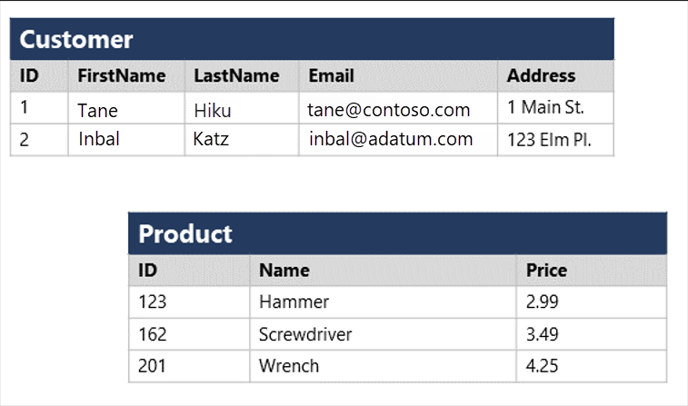
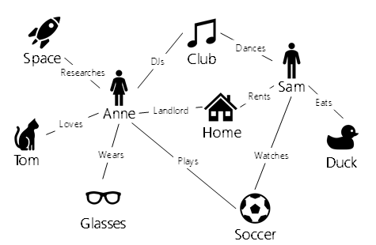
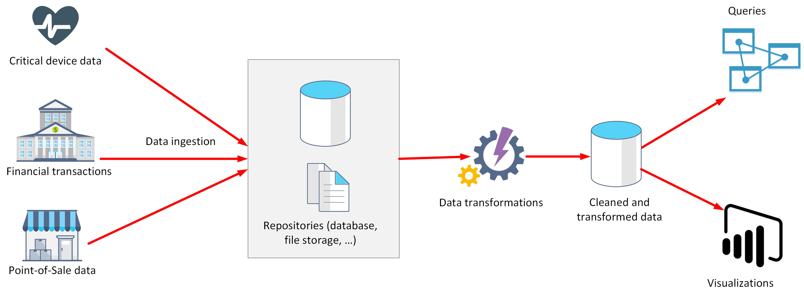

Data is now easier to collect and cheaper to host, making it accessible to nearly every business. Data solutions include software technologies and platforms that can help facilitate the collection, analysis, and storage of valuable information. Every business would like to grow their revenues and make larger profits. In this competitive market, data is a valuable asset. When analyzed properly, data provides a wealth of useful information and inform critical business decisions.  

## What is data?

Data is a collection of facts such as numbers, descriptions, and observations used in decision making. You can classify data as structured, semi-structured, or unstructured.

Structured data is typically tabular data that is represented by rows and columns in a database. Databases that hold tables in this form are called *relational databases* (the mathematical term *relation* refers to an organized set of data held as a table). Each row in a table has the same set of columns. The image below illustrates an example showing two tables in an ecommerce database. The first table contains the details of customers for an organization, and the second holds information about products that the organization sells.

> [!div class="mx-imgBorder"]
> 

*Semi-structured* data is information that doesn't reside in a relational database but still has some structure to it. Examples include documents held in *JavaScript Object Notation* (JSON) format. The example below shows a pair of documents representing customer information. In both cases, each customer document includes child documents containing the name and address, but the fields in these child documents vary between customers.

```json
## Document 1 ##
{
  "customerID": "103248",
  "name": 
  { 
    "first": "AAA", 
    "last": "BBB" 
  },
  "address": 
  {
    "street": "Main Street",
    "number": "101",
    "city": "Acity",
    "state": "NY" 
  },
  "ccOnFile": "yes",
  "firstOrder": "02/28/2003"
}

## Document 2 ##
{
  "customerID": "103249",
  "name": 
  { 
    "title": "Mr",
    "forename": "AAA", 
    "lastname": "BBB" 
  },
  "address": 
  {
    "street": "Another Street",
    "number": "202",
    "city": "Bcity",
    "county": "Gloucestershire",
    "country-region": "UK" 
  },
  "ccOnFile": "yes"
}
```

There are other types of semi-structured data as well. Examples include *key-value* stores and *graph* databases. 

A key-value store is similar to a relational table, except that each row can have any number of columns.
The image below shows an example of key-value data.

:::image type="content" source="../media/2-key-value.png" alt-text="Key-value data":::

You can use a graph database to store and query information about complex relationships. A graph contains nodes (information about objects), and edges (information about the relationships between objects). The image below shows an example of how you might structure the data in a graph database.

> [!div class="mx-imgBorder"]
> 

Not all data is structured or even semi-structured. For example, audio and video files, and binary data files might not have a specific structure. They're referred to as *unstructured* data.

## How is data defined, stored, and accessed in cloud computing?

Depending on the type of data such as structured, semi-structured, or unstructured, data will be stored differently. Structured data is typically stored in a relational database such as SQL Server or Azure SQL Database. Azure SQL Database is a service that runs in the cloud. You can use it to create and access relational tables. The service is managed and run by Azure, you just specify that you want a database server to be created. The act of setting up the database server is called *provisioning*.

You can provision other services as well in Azure. For example, if you want to store unstructured data such as video or audio files, you can use Azure Blob storage (*Blob* is an acronym for Binary Large Object). If you want to store semi-structured data such as documents, you can use a service such as Azure Cosmos DB.

After your service is provisioned, the service needs to be configured so that users can be given access to the data. You can typically define several levels of access.

- *Read-only* access means the users can read data but can't modify any existing data or create new data.

- *Read/write* access gives users the ability to view and modify existing data. 

- *Owner* privilege gives full access to the data including managing the security like adding new users and removing access to existing users.

You can also define which users should be allowed to access the data in the first place. If the data is sensitive (or secret), you may want to restrict access to a few select users.

In the example where you're a data analyst for a large consumer organization you have decided to give read-only access to the whole management team. The management team have no need to modify data, but have security clearance to see any data. Read-write access is given to the app that salespeople use to record sales. The individual users won't need to access the system directly, but will make edits via their app. Data analysts and data managers will have owner privileges because they need to manage the access of other users and administer the system.

## Describe data processing solutions

Data processing solutions often fall into one of two broad categories: analytical systems, and transaction processing systems.

### What is a transactional system?

A transactional system is often what most people consider the primary function of business computing. A transactional system records *transactions*. A transaction could be financial, such as the movement of money between accounts in a banking system, or it might be part of a retail system, tracking payments for goods and services from customers. Think of a transaction as a small, discrete, unit of work.

Transactional systems are often high-volume, sometimes handling many millions of transactions in a single day. The data being processed has to be accessible very quickly. The work performed by transactional systems is often referred to as Online Transactional Processing (OLTP).

To support fast processing, the data in a transactional system is often divided into small pieces. For example, if you're using a relational system each table involved in a transaction only contains the columns necessary to perform the transactional task. In the bank transfer example, a table holding information about the funds in the account might only contain the account number and the current balance. Other tables not involved in the transfer operation would hold information such as the name and address of the customer, and the account history. Splitting tables out into separate groups of columns like this is called *normalized*. The next unit discusses this process in more detail. Normalization can enable a transactional system to cache much of the information required to perform transactions in memory, and speed throughput.

While normalization enables fast throughput for transactions, it can make querying more complex. Queries involving normalized tables will frequently need to join the data held across several tables back together again. This can make it difficult for business users who might need to examine the data.

### What is an analytical system?

In contrast to systems designed to support OLTP, an analytical system is designed to support business users who need to query data and gain a *big picture* view of the information held in a database.

Analytical systems are concerned with capturing raw data, and using it to generate insights. An organization can use these insights to make business decisions. For example, detailed insights for a manufacturing company might indicate trends enabling them to determine which product lines to focus on, for profitability.

Most analytical data processing systems need to perform similar tasks: data ingestion, data transformation, data querying, and data visualization. The image below illustrates the components in a typical data processing system.

> [!div class="mx-imgBorder"]
> 

- **Data Ingestion**: Data ingestion is the process of capturing the raw data. This data could be taken from control devices measuring environmental information such as temperature and pressure, point-of-sale devices recording the items purchased by a customer in a supermarket, financial data recording the movement of money between bank accounts, and weather data from weather stations. Some of this data might come from a separate OLTP system. To process and analyze this data, you must first store the data in a repository of some sort. The repository could be a file store, a document database, or even a relational database.

- **Data Transformation/Data Processing**: The raw data might not be in a format that is suitable for querying. The data might contain anomalies that should be filtered out, or it may require transforming in some way. For example, dates or addresses might need to be converted into a standard format. After data is ingested into a data repository, you may want to do some cleaning operations and remove any questionable or invalid data, or perform some aggregations such as calculating profit, margin, and other Key Performance Metrics (KPIs). KPIs are how businesses are measured for growth and performance.

- **Data Querying**: After data is ingested and transformed, you can query the data to analyze it. You may be looking for trends, or attempting to determine the cause of problems in your systems. Many database management systems provide tools to enable you to perform ad-hoc queries against your data and generate regular reports.

- **Data Visualization**: Data represented in tables such as rows and columns, or as documents, aren't always intuitive. Visualizing the data can often be  useful as a tool for examining data. You can generate charts such as bar charts, line charts, plot results on geographical maps, pie charts, or illustrate how data changes over time. Microsoft offers visualization tools like Power BI to provide rich graphical representation of your data. 