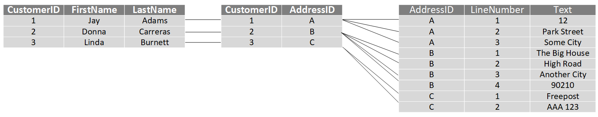
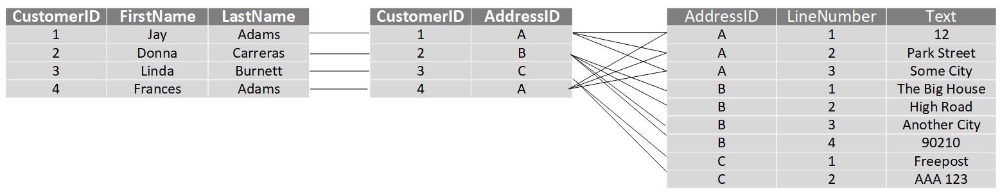

You can categorize data in many different ways, depending not only on how it's structured, but also on how the data is used. In this unit, you'll learn about the characteristics of different types of data.

## Describe the characteristics of relational and non-relational data

Relational databases provide probably the most well-understood model for holding data. The simple structure of tables and columns makes them easy to use initially, but the rigid structure can cause some problems. For example, in a database holding customer information, how do you handle customers that have more than one address? Do you add columns to hold the details for each  address? If so, how many of these columns should you add? If you allow for three addresses, what happens if a customer has only one address? What do you store in the *spare* columns? What then happens if you suddenly have a customer with four addresses? Similarly, what information do you store in an address (street name, house number, city, zip code)? What happens if a house has a name rather than a number, or is located somewhere that doesn't use zip codes?

You can solve these problems by using a process called [*normalization*](https://docs.microsoft.com/office/troubleshoot/access/database-normalization-description). Typically, the end result of the normalization process is that your data is split into a large number of narrow, well-defined tables (a *narrow* table is a table with few columns), with references from one table to another, as shown in the image below. However, querying the data often requires reassembling information from multiple tables by joining the data back together at run-time (illustrated by the lines in the diagram). These types of queries can be expensive.

> [!div class="mx-imgBorder"]
> 

Non-relational databases enable you to store data in a format that more closely matches the original structure. For example, in a document database, you could store the details of each customer in a single document, as shown by the example in the previous unit. Retrieving the details of a customer, including the address, is a matter of reading a single document. There are some disadvantages to using a document database though. If two customers cohabit and have the same address, in a relational database you would only need to store the address information once. In the diagram below, Jay and Frances Adams both share the same address. 

> [!div class="mx-imgBorder"]
> 

In a document database, the address would be duplicated in the documents for Jay and Francis Adams. This duplication not only increases the storage required, but can also make maintenance more complex (if the address changes, you must modify it in two documents).

```json
## Document for Jay Adams ##
{
  "customerID": "1",
  "name": 
  { 
    "firstname": "Jay", 
    "lastname": "Adams" 
  },
  "address": 
  {
    "number": "12",
    "street": "Park Street",
    "city": "Some City",
  }
}

## Document for Frances Adams ##
{
  "customerID": "4",
  "name": 
  { 
    "firstname": "Francis", 
    "lastname": "Adams" 
  },
  "address": 
  {
    "number": "12",
    "street": "Park Street",
    "city": "Some City",
  }
}
```

## Describe transactional workloads

Relational and non-relational databases are suited to different workloads. A primary use of relational databases is to handle transaction processing.

A transaction is a sequence of operations that are *atomic*. This means that either all operations in the sequence must be completed successfully, or if something goes wrong, all operations run so far in the sequence must be undone. Bank transfers are a good example; you deduct funds from one account and credit the equivalent funds to another account. If the system fails after deducting the funds, they must be reinstated in the original account (they mustn't be lost). You can then attempt to perform the transfer again. Similarly, you shouldn't be able to credit an account twice with the same funds.

Each database transaction has a defined beginning point, followed by steps to modify the data within the database. At the end, the database either commits the changes to make them permanent, or rolls back the changes to the starting point, when the transaction can be tried again. 

A transactional database must adhere to the ACID (Atomicity, Consistency, Isolation, Durability) properties to ensure that the database remains consistent while processing transactions.

- *Atomicity* guarantees that each transaction is treated as a single *unit*, which either succeeds completely, or fails completely. If any of the statements constituting a transaction fails to complete, the entire transaction fails and the database is left unchanged. An atomic system must guarantee atomicity in each and every situation, including power failures, errors, and crashes.

- *Consistency* ensures that a transaction can only take the data in the database from one valid state to another. A consistent database should never *lose* or *create* data in a manner that can't be accounted for. In the bank transfer example described earlier, if you add funds to an account, there must be a corresponding deduction of funds somewhere, or a record that describes where the funds have come from if they have been received externally. You can't suddenly create (or lose) money.

- *Isolation* ensures that concurrent execution of transactions leaves the database in the same state that would have been obtained if the transactions were executed sequentially. A concurrent process can't see the data in an inconsistent state (for example, the funds have been deducted from one account, but not yet credited to another.)

- *Durability* guarantees that once a transaction has been committed, it will remain committed even if there's a system failure such as a power outage or crash.

Database systems that process transactional workloads are inherently complex. They need to manage concurrent users possibly attempting to access and modify the same data at the same time, processing the transactions in isolation while keeping the database consistent and recoverable. Many systems implement relational consistency and isolation by applying locks to data when it is updated. The lock prevents another process from reading the data until the lock is released. The lock is only released when the transaction commits or rolls back. Extensive locking can lead to poor performance, while applications wait for locks to be released.

Distributed databases are widely used in many organizations. A distributed database  is a database in which data is stored across different physical locations. It may be held in multiple computers located in the same physical location (for example, a datacenter), or may be dispersed over a network of interconnected computers. When compared to non-distributed database systems, any data update to a distributed database will take time to apply across multiple locations. If you require transactional consistency in this scenario, locks may be retained for a very long time, especially if there's a network failure between databases at a critical point in time. To counter this problem, many distributed database management systems relax the strict isolation requirements of transactions and implement *"eventual consistency."* In this form of consistency, as an application writes data, each change is recorded by one server and then propagated to the other servers in the distributed database system asynchronously. While this strategy helps to minimize latency, it can lead to temporary inconsistencies in the data. Eventual consistency is ideal where the application doesn't require any ordering guarantees. Examples include counts of shares, likes, or non-threaded comments in a social media system.

## Describe analytical workloads

Analytical workloads are typically read-only systems that store vast volumes of historical data or business metrics, such as sales performance and inventory levels. Analytical workloads are used for data analysis and decision making. Analytics are generated by aggregating the facts presented by the raw data into summaries, trends, and other kinds of *“Business information.”*

Analytics can be based on a snapshot of the data at a given point in time, or a series of snapshots. Decision makers usually don't require all the details of every transaction. They want the bigger picture.

An example of analytical information is a report on monthly sales. As the head of sales department, you may not need to see all daily transactions that took place (transactional information), but you definitely would like a monthly sales report to identify trends and to make decisions (analytical information).

Transactional information, however, is an integral part of analytical information. If you don't have good records of daily sales, you can't compile a useful report to identify trends. That’s why efficient handling of transactional information is very important.
