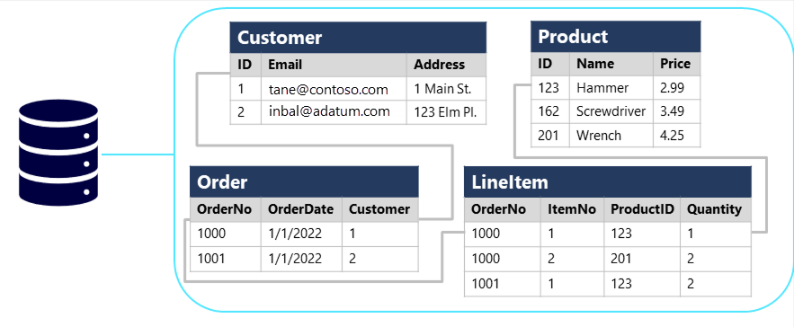
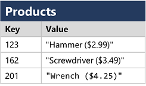
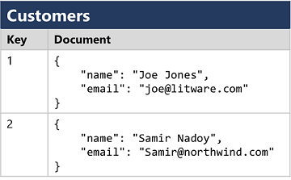
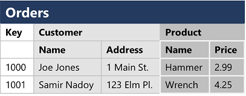
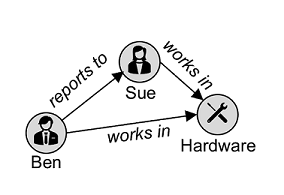

A database is used to define a central system in which data can be stored and queried. In a simplistic sense, the file system on which files are stored is a kind of database; but when we use the term in a professional data context, we usually mean a dedicated system for managing data records rather than files.

## Relational databases

Relational databases are commonly used to store and query structured data. The data is stored in tables that represent entities, such as customers, products, or sales orders. Each instance of an entity is assigned a *primary key* that uniquely identifies it; and these keys are used to reference the entity instance in other tables. For example, a customer's primary key can be referenced in a sales order record to indicate which customer placed the order. This use of keys to reference data entities enables a relational database to be *normalized*; which in part means the elimination of duplicate data values so that, for example, the details of an individual customer are stored only once; not for each sales order the customer places. The tables are managed and queried using Structured Query Language (SQL), which is based on an ANSII standard, so it's similar across multiple database systems.

> [!div class="mx-imgBorder"]
> 

## Non-relational databases

Non-relational databases are data management systems that don’t apply a relational schema to the data. Non-relational databases are often referred to as NoSQL database, even though some support a variant of the SQL language.

There are four common types of Non-relational database commonly in use.

- **Key-value databases** in which each record consists of a unique key and an associated value, which can be in any format.

  > [!div class="mx-imgBorder"]
  > 

- **Document databases**, which are a specific form of key-value database in which the value is a JSON document (which the system is optimized to parse and query)

  > [!div class="mx-imgBorder"]
  > 

- **Column family databases**, which store tabular data comprising rows and columns, but you can divide the columns into groups known as column-families. Each column family holds a set of columns that are logically related together.

  > [!div class="mx-imgBorder"]
  > 

- **Graph databases**, which store entities as nodes with links to define relationships between them.

  > [!div class="mx-imgBorder"]
  > 
