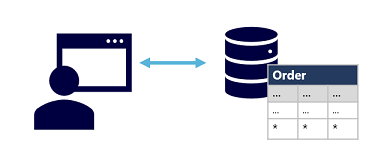

A transactional data processing system is  what most people consider the primary function of business computing. A transactional system records *transactions* that encapsulate specific events that the organization wants to track. A transaction could be financial, such as the movement of money between accounts in a banking system, or it might be part of a retail system, tracking payments for goods and services from customers. Think of a transaction as a small, discrete, unit of work.

Transactional systems are often high-volume, sometimes handling many millions of transactions in a single day. The data being processed has to be accessible very quickly. The work performed by transactional systems is often referred to as Online Transactional Processing (OLTP).

> [!div class="mx-imgBorder"]
> 

OLTP solutions rely on a database system in which data storage is optimized for both read and write operations in order to support transactional workloads in which data records are created, retrieved, updated, and deleted (often referred to as *CRUD* operations). These operations are applied transactionally, in a way that ensures the integrity of the data stored in the database. To accomplish this, OLTP systems enforce transactions that support so-called ACID semantics:

- **Atomicity** – each transaction is treated as a single unit, which succeeds completely or fails completely. For example, a transaction that involved debiting funds from one account and crediting the same amount to another account must complete both actions. If either action can't be completed, then the other action must fail.
- **Consistency** – transactions can only take the data in the database from one valid state to another. To continue the debit and credit example above, the completed state of the transaction must reflect the transfer of funds from one account to the other.
- **Isolation** – concurrent transactions cannot interfere with one another, and must result in a consistent database state. For example, while the transaction to transfer funds from one account to another is in-process, another transaction that checks the balance of these accounts must return consistent results - the balance-checking transaction can't retrieve a value for one account that reflects the balance *before* the transfer, and a value for the other account that reflects the balance *after* the transfer.
- **Durability** – when a transaction has been committed, it will remain committed. After the account transfer transaction has completed, the revised account balances are persisted so that even if the database system were to be switched off, the committed transaction would be reflected when it is switched on again.

OLTP systems are typically used to support live applications that process business data - often referred to as *line of business* (LOB) applications.