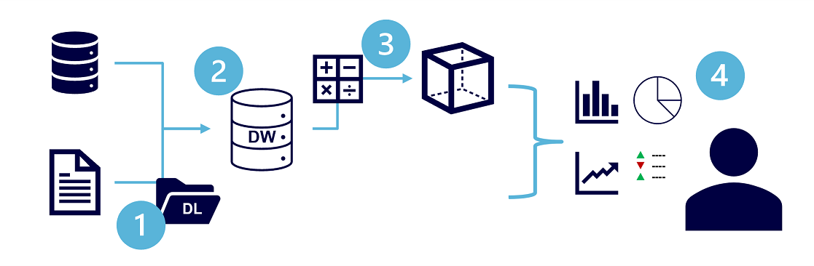

Analytical data processing typically uses read-only (or read-*mostly*) systems that store vast volumes of historical data or business metrics. 
Analytics can be based on a snapshot of the data at a given point in time, or a series of snapshots.

The specific details for an analytical processing system can vary between solutions, but a common architecture for enterprise-scale analytics looks like this:

> [!div class="mx-imgBorder"]
> 

1. Data files may be stored in a central data lake for analysis.
2. An extract, transform, and load (ETL) process copies data from files and OLTP databases into a data warehouse that is optimized for read activity. Commonly, a data warehouse schema is based on *fact* tables that contain numeric values you want to analyze (for example, sales amounts), with related *dimension* tables that represent the entities by which you want to measure them (for example, customer or product),
3. Data in the data warehouse may be aggregated and loaded into an online analytical processing (OLAP) model, or *cube*. Aggregated numeric values (*measures*) from fact tables are calculated for intersections of *dimensions* from dimension tables. For example, sales revenue might be totaled by date, customer, and product.
4. The data in the data lake, data warehouse, and analytical model can be queried to produce reports, visualizations, and dashboards.

*Data lakes* are common in modern data analytical processing scenarios, where a large volume of file-based data must be collected and analyzed.

*Data warehouses* are an established way to store data in a relational schema that is optimized for read operations – primarily queries to support reporting and data visualization. The data warehouse schema may require some denormalization of data in an OLTP data source (introducing some duplication to make queries perform faster).

An OLAP model is an aggregated type of data storage that is optimized for analytical workloads. Data aggregations are across dimensions at different levels, enabling you to *drill up/down* to view aggregations at multiple hierarchical levels; for example to find total sales by region, by city, or for an individual address. Because OLAP data is pre-aggregated, queries to return the summaries it contains can be run quickly.

Different types of user might perform data analytical work at different stages of the overall architecture. For example:
- Data scientists might work directly with data files in a data lake to explore and model data.
- Data Analysts might query tables directly in the data warehouse to produce complex reports and visualizations.
- Business users might consume pre-aggregated data in an analytical model in the form of reports or dashboards.
