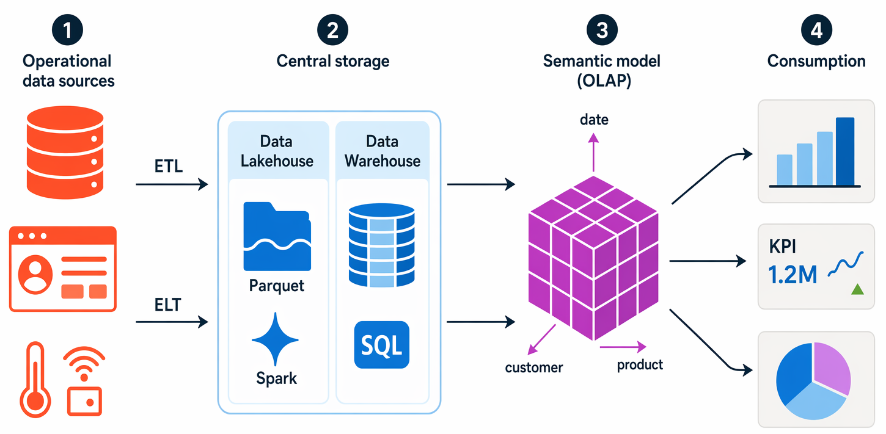
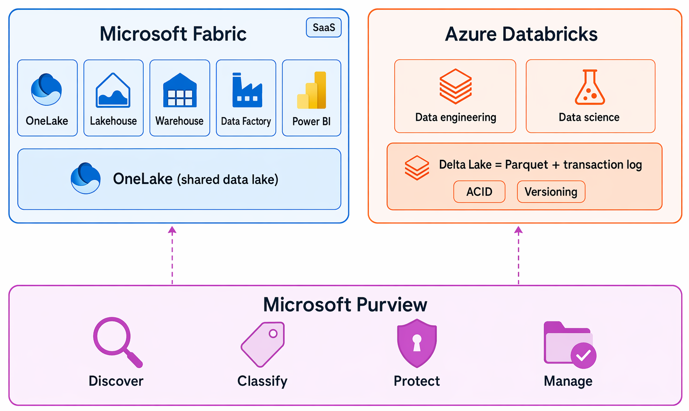
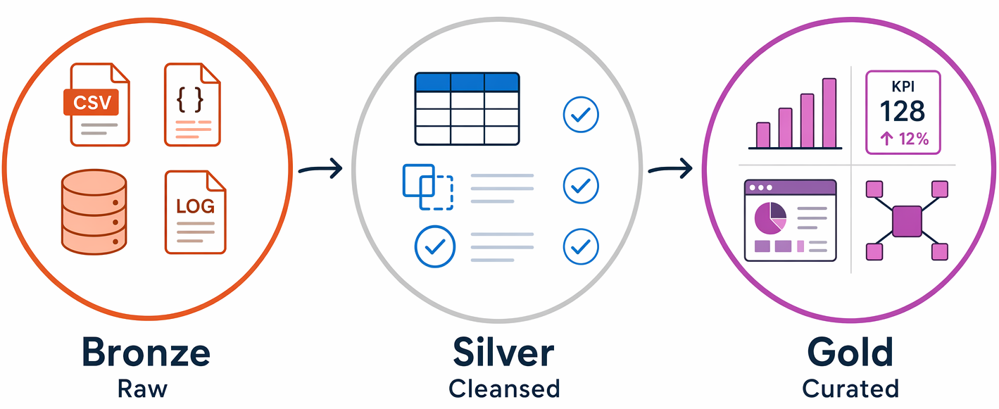

::: zone pivot="video"

>[!VIDEO https://learn-video.azurefd.net/vod/player?id=aec2592d-3a77-4dec-8e61-320c010e7623]

> [!TIP]
> See the **Text and images** tab for more details!

::: zone-end

::: zone pivot="text"

Analytical data processing typically uses read-only (or read-*mostly*) systems that store vast volumes of historical data or business metrics. 
Analytics can be based on a snapshot of the data at a given point in time, or a series of snapshots.

The specific details for an analytical processing system can vary between solutions, but a common architecture for enterprise-scale analytics looks like this:

> [!div class="mx-imgBorder"]
> 

1. Operational data is extracted, transformed, and loaded (**ETL**) into a data lake for analysis—or extracted and loaded first with transformations applied afterward, a pattern called **ELT** that's common in modern lakehouses.

2. Data is loaded into a schema of tables - typically in a *data lakehouse* with tabular abstractions over files in the data lake, or a *data warehouse* with a fully relational SQL engine.

3. Data in the data warehouse may be aggregated and loaded into an online analytical processing (OLAP) model—today more commonly called a *semantic model* (and historically a *cube*). Aggregated numeric values (*measures*) from fact tables are calculated for intersections of *dimensions* from dimension tables. For example, sales revenue might be totaled by date, customer, and product. Power BI semantic models are the most common example you'll meet.

4. The data in the data lake, data warehouse, and analytical model can be queried to produce reports, visualizations, and dashboards.

*Data lakes* are common in large-scale data analytical processing scenarios, where a large volume of file-based data must be collected and analyzed.

*Data warehouses* are an established way to store data in a relational schema that's optimized for read operations – primarily queries to support reporting and data visualization. 

*Data Lakehouses* are a more recent innovation that combines the flexible and scalable storage of a data lake with the relational querying semantics of a data warehouse. The table schema may require some denormalization of data in an OLTP data source (introducing some duplication to make queries perform faster).

An OLAP model (or *semantic model*) is an aggregated type of data storage that's optimized for analytical workloads. Data aggregations are across dimensions at different levels, enabling you to *drill up/down* to view aggregations at multiple hierarchical levels; for example, to find total sales by region, by city, or for an individual address. Because the data is preaggregated, queries to return the summaries it contains can be run quickly.

Different types of user might perform data analytical work at different stages of the overall architecture. For example:

- Data scientists might work directly with data files in a data lake to explore and model data.
- Data Analysts might query tables directly in the data warehouse to produce complex reports and visualizations.
- Business users might consume preaggregated data in an analytical model in the form of reports or dashboards.

## Modern analytics platforms

Azure provides several managed services that cover the full analytics pipeline — from ingesting raw data through to interactive reports. Two "all-in-one" platforms bring most of these capabilities together in a single workspace. **Microsoft Fabric** and **Azure Databricks** are those two platforms; a third service, **Microsoft Purview**, focuses on data governance across all your sources. You don't need to be familiar with any of these services yet — the following descriptions give you a high-level sense of what each one does.

**Microsoft Fabric** is a unified software as a service (SaaS) analytics platform that brings storage, data engineering, data warehousing, and reporting capabilities together in a single workspace. **Azure Databricks** is a cloud analytics platform built for large-scale data engineering and data science, using **Delta Lake**—Parquet plus a transaction log that enables versioning and ACID transactions—as its standard storage format. **Microsoft Purview** provides unified data security, governance, and compliance, helping you discover, classify, protect, and manage data across all your data sources.

> [!div class="mx-imgBorder"]
> 

## Organizing data with the medallion architecture

A common pattern for organizing data in a lakehouse is the **medallion architecture**, which uses three layers:

- **Bronze**: raw data ingested as-is from source systems, with no transformations applied, preserving the original records for reprocessing.
- **Silver**: cleansed and conformed data, with duplicates removed and data types standardized.
- **Gold**: aggregated, business-ready data modeled for specific reporting and analytics use cases.

> [!div class="mx-imgBorder"]
> 

Teams use this pattern because it creates clear quality boundaries at each layer, and you can always reprocess data from the original Bronze records if requirements change.

Both Fabric and Databricks include Copilot experiences that let you explore data using natural language.

::: zone-end
