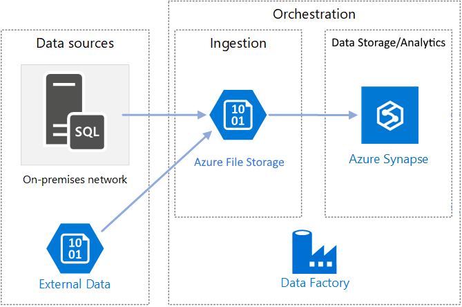
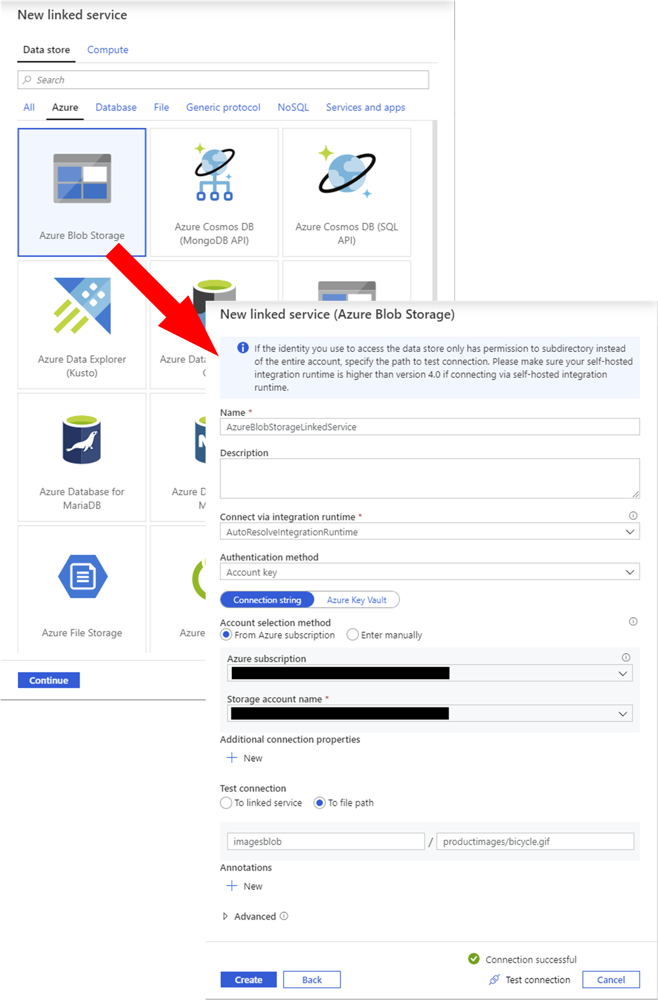
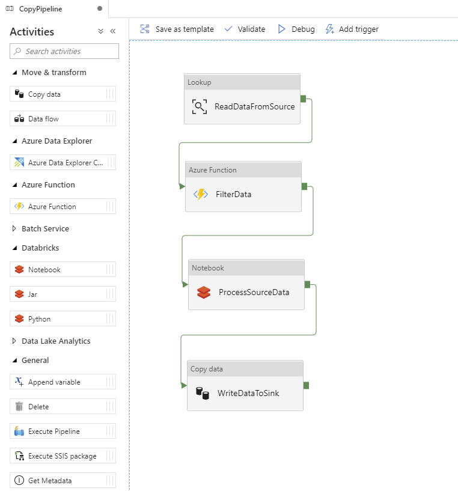
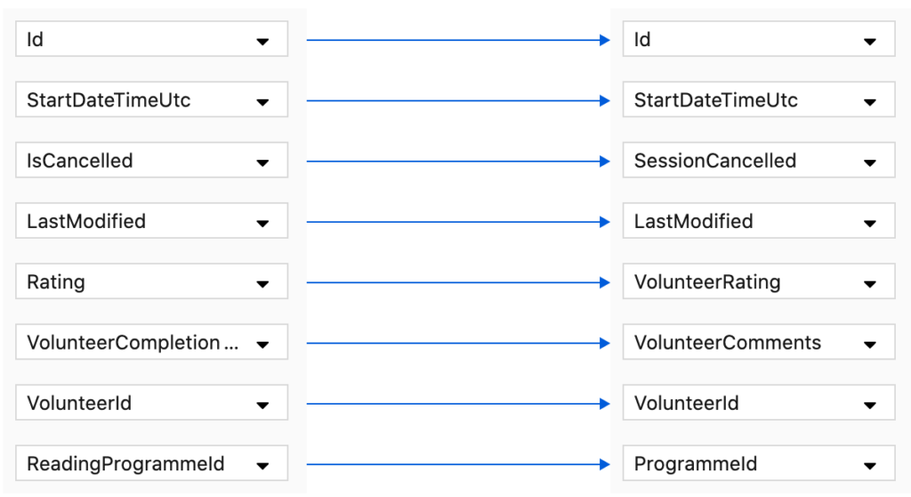
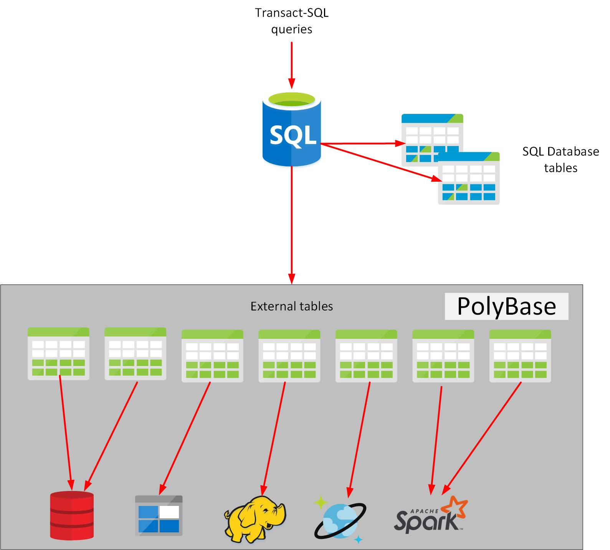

Data ingestion is the first part of any data warehousing solution. It is arguably the most important part. If you lose any data at this point, then any resulting information can be inaccurate, failing to represent the facts on which you might base your business decisions. In a big data system, data ingestion has to be fast enough to capture the large quantities of data that may be heading your way, and have enough compute power to process this data in a timely manner. 
 
 Azure provides several services you can use to ingest data. These services can operate with almost any source. In this unit, you'll examine some of the more popular tools used with Azure: Azure Data Factory, PolyBase, SQL Server Integration Services, and Azure Databricks.

## Ingest data using Azure Data Factory

Azure Data Factory is a data ingestion and transformation service that allows you to load raw data from many different sources, both on-premises and in the cloud. As it ingests the data, Data Factory can clean, transform, and restructure the data, before loading it into a repository such as a data warehouse. Once the data is in the data warehouse, you can analyze it.

Data Factory contains a series of interconnected systems that provide a complete end-to-end platform for data engineers. You can load static data, but you can also ingest streaming data. Loading data from a stream offers a real-time solution for data that arrives quickly or that changes rapidly. Using streaming, you can use Azure Data Factory to continually update the information in a data warehouse with the latest data.

Data Factory provides an *orchestration* engine. Orchestration is the process of directing and controlling other services, and connecting them together, to allow data to flow between them. Data Factory uses orchestration to combine and automate sequences of tasks that use different services to perform complex operations.

> [!div class="mx-imgBorder"]
> 

Azure Data Factory uses a number of different resources: linked services, datasets, and pipelines. The following sections describe how Data Factory uses these resources.

### Understand linked services

Data Factory moves data from a data source to a destination. A linked service provides the information needed for Data Factory to connect to a source or destination. For example, you can use an Azure Blob Storage linked service to connect a storage account to Data Factory, or the Azure SQL Database linked service to connect to a SQL database. 

The information a linked service contains varies according to the resource. For example, to create a linked service for Azure Blob Storage, you provide information such as the name of the Azure subscription that owns the storage account, the name of the storage account, and the information necessary to authenticate against the storage account. To create a linked service to a different resource, such as Azure SQL Database, you specify the database server name, the database name, and the appropriate credentials.

The image below shows the graphical user interface provided by Azure Data Factory for creating linked services.

> [!div class="mx-imgBorder"]
> 

### Understand datasets

A dataset in Azure Data Factory represents the data that you want to ingest (input) or store (output). If your data has a structure, a dataset specifies how the data is structured. Not all datasets are structured. Blobs held in Azure Blob storage are an example of unstructured data.

A dataset connects to an input or an output using a linked service. For example, if you're reading and processing data from Azure Blob storage, you'd create an input dataset that uses a Blob Storage linked service to specify the details of the storage account. The dataset would specify which blob to ingest, and the format of the information in the blob (binary data, JSON, delimited text, and so  on). If you're using Azure Data Factory to store data in a table in a SQL database, you would define an output dataset that uses a SQL Database linked service to connect to the database, and specifies which table to use in that database. 

> [!div class="mx-imgBorder"]
> 

### Understand pipelines

A pipeline is a logical grouping of activities that together perform a task. The activities in a pipeline define actions to perform on your data. For example, you might use a copy activity to transform data from a source dataset to a destination dataset. You could include activities that transform the data as it is transferred, or you might combine data from multiple sources together. Other activities enable you to incorporate processing elements from other services. For example, you might use an *Azure Function* activity to run an Azure Function to modify and filter data, or an *Azure Databricks Notebook* activity to run a notebook that performs more advanced processing. 

> [!div class="mx-imgBorder"]
> 

Pipelines don't have to be linear. You can include logic activities that repeatedly perform a series of tasks while some condition is true using a *ForEach* activity, or follow different processing paths depending on the outcome of previous processing using an *If Condition* activity.  

Sometimes when ingesting data, the data you're bringing in can have different column names and data types to those required by the output. In these cases, you can use a mapping to transform your data from the input format to the output format. The screenshot below shows the mapping canvas for the *Copy Data* activity. It illustrates how the columns from the input data can be mapped to the data format required by the output.

> [!div class="mx-imgBorder"]
> 

You can run a pipeline manually, or you can arrange for it to be run later using a trigger. A trigger enables you to schedule a pipeline to occur according to a planned schedule (every Saturday evening, for example), or at repeated intervals (every few minutes or hours), or when an event occurs such as the arrival of a file in Azure Data Lake Storage, or the deletion of a blob in Azure Blob Storage.

## Ingest data using PolyBase

PolyBase is a feature of SQL Server and Azure Synapse Analytics that enables you to run Transact-SQL queries that read data from external data sources. PolyBase makes these external data sources appear like tables in a SQL database. Using PolyBase, you can read data managed by Hadoop, Spark, and Azure Blob Storage, as well as other database management systems such as Cosmos DB, Oracle, Teradata, and MongoDB.

> [!NOTE]
> Spark is a parallel-processing engine that supports large-scale analytics.

PolyBase enables you to transfer data from an external data source into a table, as well as copy data from an external data source in Azure SYnapse Analytics or SQL Server. You can also run queries that join tables in a SQL database with external data, enabling you to perform analytics that span multiple data stores. 

> [!NOTE]
> Azure SQL Database does not support PolyBase.

> [!div class="mx-imgBorder"]
> 

Azure Data Factory provides PolyBase support for loading data. For instance, Data Factory can directly invoke PolyBase on your behalf if your data is in a PolyBase-compatible data store.

## Ingest data using SQL Server Integration Services

SQL Server Integration Services (SSIS) is a platform for building enterprise-level data integration and data transformations solutions. You can use SSIS to solve complex business problems by copying or downloading files, loading data warehouses, cleaning and mining data, and managing SQL database objects and data. SSIS is part of Microsoft SQL Server.

SSIS can extract and transform data from a wide variety of sources such as XML data files, flat files, and relational data sources, and then load the data into one or more destinations.

SSIS includes a rich set of built-in tasks and transformations, graphical tools for building packages, and the Integration Services Catalog database, where you store, run, and manage packages. A package is an organized collection of connections, control flow elements, data flow elements, event handlers, variables, parameters, and configurations, that you assemble using either the graphical design tools that SQL Server Integration Services provides, or build programmatically. You then save the completed package to SQL Server, the Integration Services Package Store, or the file system.

You can use the graphical SSIS tools to create solutions without writing a single line of code. You can also program the extensive Integration Services object model to create packages programmatically and code custom tasks and other package objects.

SSIS is an on-premises utility. However, Azure Data factory allows you to run your existing SSIS packages as part of a pipeline in the cloud. This allows you to get started quickly without having to rewrite your existing transformation logic. 

The SSIS Feature Pack for Azure is an extension that provides  components that connect to Azure services, transfer data between Azure and on-premises data sources, and process data stored in Azure. The components in the feature pack support transfer to or from Azure storage, Azure Data Lake, and Azure HDInsight. Using these components, you can perform large-scale processing of ingested data.

> [!div class="mx-imgBorder"]
> 

## Ingest data using Azure Databricks

Azure Databricks is an analytics platform optimized for the Microsoft Azure cloud services platform. Databricks is based on Spark, and is integrated with Azure to  streamline workflows. It provides an interactive workspace that enables collaboration between data scientists, data engineers, and business analysts.

Databricks can process data held in many different types of storage, including Azure Blob storage, Azure Data Lake Store, Hadoop storage, flat files, SQL databases, and data warehouses, and Azure services such as Cosmos DB. Databricks can also process streaming data. For example, you could capture data being streamed from sensors and other devices.

You write and run Spark code using *notebooks*. A notebook is like a program that contains a series of steps (called *cells*). A notebook can contain cells that read data from one or more data sources, process the data, and write the results out to a data store. The scalability of Azure Databricks makes it an ideal platform for performing complex data ingestion and analytics tasks.

Azure Data Factory can incorporate Azure Databricks notebooks into a pipeline. A pipeline can pass parameters to a notebook. These parameters can specify which data to read and analyze. The notebook can save the results, which the Azure Data Factory pipeline can use in subsequent activities.